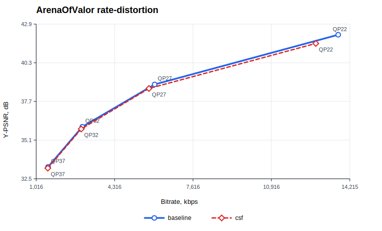
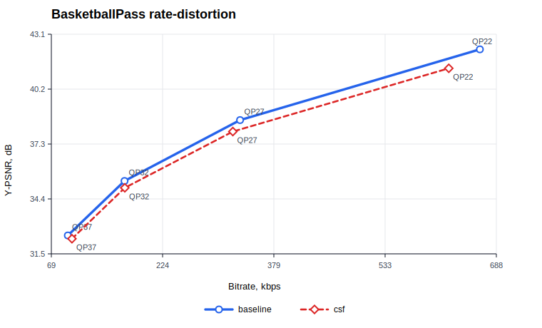
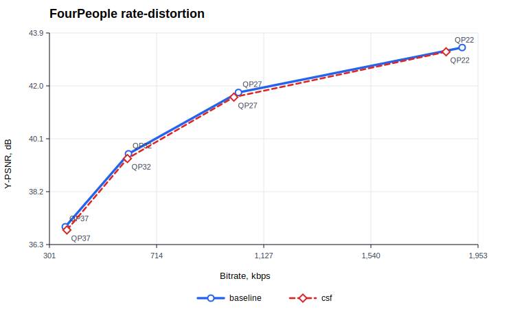
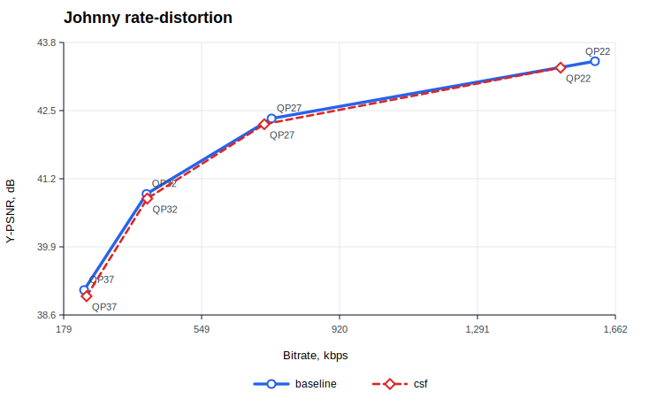
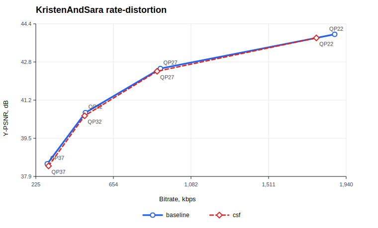
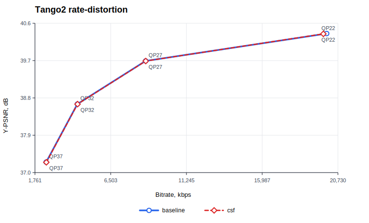

# VVenC CSF Scaling List Test Suite

<p align="center">
  <a href="#english">English</a> |
  <a href="#українська">Українська</a>
</p>

<p align="center">
  <a href="https://github.com/For2natop1ua/vvenc_csf_tests/blob/master/LICENSE">
    
  </a>
  <a href="https://www.python.org/downloads/">
    
  </a>
  <a href="https://github.com/For2natop1ua/vvenc_csf_tests/actions">
    
  </a>
  <a href="https://github.com/For2natop1ua/vvenc_csf_tests/releases">
    
  </a>
</p>

<a id="english"></a>

## VVenC CSF validation and RD analysis toolkit

This repository contains a compact validation suite for a **CSF Scaling List** modification in VVenC. It compares a baseline encode against `--CSFScalingList 1`, decodes the generated bitstreams with `vvdecapp.exe`, checks reconstruction hashes, collects bitrate/PSNR metrics, calculates BD-rate, and renders SVG RD charts.

The goal is to verify that the encoder-side CSF modification is controllable, decoder-compatible, and measurable through a reproducible local test flow.

## What It Checks

| Check | Purpose |
| --- | --- |
| Smoke encode/decode | Confirms baseline and CSF encoding paths work |
| Regression | Confirms `--CSFScalingList 0` preserves baseline behavior |
| Cross-check | Confirms CSF bitstreams decode with `vvdecapp.exe` |
| QP sweep | Runs QP 22, 27, 32, 37 for RD analysis |
| Metrics and BD-rate | Reports bitrate, PSNR-Y, encoding time, and BD-rate |
| SVG reports | Produces readable RD charts with numeric axes |

## Project Layout

```text
vvenc_csf_tests/
├── binaries/        # local vvencFFapp.exe and vvdecapp.exe
├── docs/charts/     # SVG charts from the latest full analysis
├── image_sets/      # deterministic PNG image sets for visual metrics
├── metrics/         # metrics, BD-rate, Markdown/SVG report generation
├── sequences/       # raw YUV test sequences
├── tests/           # smoke, regression, cross-check, QP sweep
├── tools/           # matrix dump, image benchmark, partition-map helpers
├── utils/           # process runner, checks, console helpers
├── config.py        # paths, sequence metadata, QP/frame defaults
├── run_all.py       # main entry point
└── requirements.txt
```

## Requirements

| Component | Notes |
| --- | --- |
| Python | Python 3.10 or newer |
| Encoder | `binaries/vvencFFapp.exe` or a local build from the [CSF VVenC branch](https://github.com/For2natop1ua/vvenc/tree/feature-branch) |
| Decoder | `binaries/vvdecapp.exe` or a build from [Fraunhofer HHI VVdeC](https://github.com/fraunhoferhhi/vvdec) |
| Test sequences | Raw YUV files listed below |

`config.py` uses local binaries by default. A different build can be selected with environment variables:

```powershell
$env:VVENC_ENCODER=(Resolve-Path .\binaries\vvencFFapp.exe).Path
$env:VVENC_CSF_ENCODER=(Resolve-Path .\binaries\vvencFFapp.exe).Path
$env:VVDEC_DECODER=(Resolve-Path .\binaries\vvdecapp.exe).Path
```

## Quick Start

```powershell
py -3 -m venv .venv
.\.venv\Scripts\pip.exe install -r requirements.txt
.\.venv\Scripts\python.exe run_all.py quick
```

Full RD run:

```powershell
.\.venv\Scripts\python.exe run_all.py all
```

Optional sequence/QP/frame override:

```powershell
.\.venv\Scripts\python.exe run_all.py all --sequences BasketballPass FourPeople --qps 22,27,32,37 --frames 33
```

Research helpers:

```powershell
.\.venv\Scripts\python.exe tools\dump_csf_matrices.py --output docs\matrices
.\.venv\Scripts\python.exe tools\generate_synthetic_images.py --output image_sets\synthetic\png
.\.venv\Scripts\python.exe tools\image_csf_benchmark.py --root results\image_synthetic --png-dir image_sets\synthetic\png --qps 22,27,32,37
```

## Test Sequences

The raw YUV files used for this run match the **JVET-T2010** checksums.

| Sequence | Class | Resolution | FPS | Bit depth | MD5 |
| --- | --- | ---: | ---: | ---: | --- |
| `Tango2` | A1 | 3840x2160 | 60 | 10 | `0471a59c423b7059c5c6c8b395e864a9` |
| `ArenaOfValor` | F | 1920x1080 | 60 | 8 | `26ca111ff83ecf4e9c9e3de3dc7d1fe4` |
| `BasketballPass` | D | 416x240 | 50 | 8 | `bfd9abbdc677790130dc4023b4e409f0` |
| `FourPeople` | E | 1280x720 | 60 | 8 | `4ce5d72311b32acce62614f63225fba5` |
| `Johnny` | E | 1280x720 | 60 | 8 | `be83259b3ccdada2213fbd8dea20bf6e` |
| `KristenAndSara` | E | 1280x720 | 60 | 8 | `aa3931974e34deba15a1018ba3bf5e0c` |

## Latest Full Run

The values below are from `results/runs/20260518-183743_all`.

| Metric | Expected Direction | Observed Result | Comment |
| --- | --- | --- | --- |
| Bitrate at the same QP | May increase or decrease by roughly 1-10% | `-6.87%` to `+6.24%`, average `-1.30%` | Content and QP dependent |
| PSNR-Y | Some decrease is acceptable for perceptual scaling | `-1.001 dB` to `-0.002 dB`, average `-0.199 dB` | CSF is not optimized directly for PSNR |
| WPSNR / MS-SSIM | Expected to improve for perceptual metrics | Not measured in this run | Add metric collection before making a final perceptual claim |
| Encoding time | Close to baseline | `-2.10%` to `+5.10%`, average `+1.98%` | Wall time contains platform noise |
| Decoder compatibility | 100% successful decoding | `48/48` QP sweep checks passed encode/decode/MD5 | Reconstructed and decoded YUV files match |

### BD-rate, CSF vs baseline

| Sequence | BD-rate |
| --- | ---: |
| `ArenaOfValor` | `+3.00%` |
| `BasketballPass` | `+9.39%` |
| `FourPeople` | `+3.24%` |
| `Johnny` | `+4.00%` |
| `KristenAndSara` | `+3.06%` |
| `Tango2` | `+0.33%` |

## RD Charts

| ArenaOfValor | BasketballPass |
| --- | --- |
|  |  |

| FourPeople | Johnny |
| --- | --- |
|  |  |

| KristenAndSara | Tango2 |
| --- | --- |
|  |  |

## Interpretation

The implementation is correct from a validation standpoint: the CSF path is controlled by an explicit CLI option, the disabled mode preserves baseline behavior, all produced bitstreams decode successfully, and reconstruction hashes match decoded output. The positive PSNR-based BD-rate shows the objective PSNR cost of the current CSF scaling list on this test set. A final perceptual conclusion should include WPSNR, MS-SSIM, or another target perceptual metric.

## License

This test suite is distributed under the [MIT License](LICENSE).

---

<a id="українська"></a>

# VVenC CSF Scaling List Test Suite

<p align="center">
  <a href="#english">English</a> |
  <a href="#українська">Українська</a>
</p>

## Інструмент перевірки CSF-модифікації та RD-аналізу для VVenC

Цей репозиторій містить компактний набір тестів для модифікації **CSF Scaling List** у VVenC. Він порівнює baseline-кодування з режимом `--CSFScalingList 1`, декодує bitstream через `vvdecapp.exe`, перевіряє MD5 реконструкцій, збирає bitrate/PSNR метрики, рахує BD-rate та генерує SVG RD-графіки.

Мета проєкту - перевірити, що енкодерна CSF-модифікація керується окремим параметром, сумісна з декодером і може бути відтворювано виміряна локальним тестовим контуром.

## Що перевіряється

| Перевірка | Призначення |
| --- | --- |
| Smoke encode/decode | Підтверджує роботу baseline та CSF шляхів кодування |
| Regression | Підтверджує, що `--CSFScalingList 0` зберігає baseline-поведінку |
| Cross-check | Підтверджує декодування CSF bitstream через `vvdecapp.exe` |
| QP sweep | Запускає QP 22, 27, 32, 37 для RD-аналізу |
| Метрики та BD-rate | Показує bitrate, PSNR-Y, час кодування та BD-rate |
| SVG-звіти | Генерує читабельні RD-графіки з числовими осями |

## Структура

```text
vvenc_csf_tests/
├── binaries/        # локальні vvencFFapp.exe та vvdecapp.exe
├── docs/charts/     # SVG-графіки з останнього повного аналізу
├── image_sets/      # детерміновані PNG-набори для visual metrics
├── metrics/         # метрики, BD-rate, Markdown/SVG звіти
├── sequences/       # raw YUV тестові послідовності
├── tests/           # smoke, regression, cross-check, QP sweep
├── tools/           # дамп матриць, image benchmark, helpers для partition map
├── utils/           # запуск процесів, перевірки, службовий вивід
├── config.py        # шляхи, metadata послідовностей, QP/frames defaults
├── run_all.py       # головна точка запуску
└── requirements.txt
```

## Вимоги

| Компонент | Примітка |
| --- | --- |
| Python | Python 3.10 або новіший |
| Енкодер | `binaries/vvencFFapp.exe` або локальна збірка з [CSF-гілки VVenC](https://github.com/For2natop1ua/vvenc/tree/feature-branch) |
| Декодер | `binaries/vvdecapp.exe` або збірка з [Fraunhofer HHI VVdeC](https://github.com/fraunhoferhhi/vvdec) |
| Тестові послідовності | Raw YUV файли з таблиці нижче |

`config.py` за замовчуванням використовує локальні бінарники. Іншу збірку можна підставити через змінні середовища:

```powershell
$env:VVENC_ENCODER=(Resolve-Path .\binaries\vvencFFapp.exe).Path
$env:VVENC_CSF_ENCODER=(Resolve-Path .\binaries\vvencFFapp.exe).Path
$env:VVDEC_DECODER=(Resolve-Path .\binaries\vvdecapp.exe).Path
```

## Швидкий старт

```powershell
py -3 -m venv .venv
.\.venv\Scripts\pip.exe install -r requirements.txt
.\.venv\Scripts\python.exe run_all.py quick
```

Повний RD-прогін:

```powershell
.\.venv\Scripts\python.exe run_all.py all
```

Можна обмежити sequence, QP або кількість кадрів:

```powershell
.\.venv\Scripts\python.exe run_all.py all --sequences BasketballPass FourPeople --qps 22,27,32,37 --frames 33
```

Дослідницькі утиліти:

```powershell
.\.venv\Scripts\python.exe tools\dump_csf_matrices.py --output docs\matrices
.\.venv\Scripts\python.exe tools\generate_synthetic_images.py --output image_sets\synthetic\png
.\.venv\Scripts\python.exe tools\image_csf_benchmark.py --root results\image_synthetic --png-dir image_sets\synthetic\png --qps 22,27,32,37
```

## Тестові послідовності

Використані raw YUV файли відповідають MD5-хешам із **JVET-T2010**.

| Sequence | Class | Resolution | FPS | Bit depth | MD5 |
| --- | --- | ---: | ---: | ---: | --- |
| `Tango2` | A1 | 3840x2160 | 60 | 10 | `0471a59c423b7059c5c6c8b395e864a9` |
| `ArenaOfValor` | F | 1920x1080 | 60 | 8 | `26ca111ff83ecf4e9c9e3de3dc7d1fe4` |
| `BasketballPass` | D | 416x240 | 50 | 8 | `bfd9abbdc677790130dc4023b4e409f0` |
| `FourPeople` | E | 1280x720 | 60 | 8 | `4ce5d72311b32acce62614f63225fba5` |
| `Johnny` | E | 1280x720 | 60 | 8 | `be83259b3ccdada2213fbd8dea20bf6e` |
| `KristenAndSara` | E | 1280x720 | 60 | 8 | `aa3931974e34deba15a1018ba3bf5e0c` |

## Останній повний прогін

Значення нижче взяті з `results/runs/20260518-183743_all`.

| Метрика | Очікуваний напрямок зміни | Фактичний результат | Коментар |
| --- | --- | --- | --- |
| Бітрейт при тому ж QP | Може зрости або впасти приблизно на 1-10% | від `-6.87%` до `+6.24%`, середнє `-1.30%` | Залежить від вмісту та QP |
| PSNR-Y | Зниження допустиме для perceptual scaling | від `-1.001 dB` до `-0.002 dB`, середнє `-0.199 dB` | CSF не оптимізує PSNR напряму |
| WPSNR / MS-SSIM | Очікуване покращення для perceptual-метрик | не вимірювались цим прогоном | Потрібно додати збір цих метрик перед фінальним твердженням |
| Час кодування | Близько до baseline | від `-2.10%` до `+5.10%`, середнє `+1.98%` | Wall time має платформний шум |
| Сумісність із декодером | 100% успішне декодування | `48/48` QP sweep перевірок пройшли encode/decode/MD5 | reconstructed та decoded YUV збігаються |

### BD-rate, CSF vs baseline

| Sequence | BD-rate |
| --- | ---: |
| `ArenaOfValor` | `+3.00%` |
| `BasketballPass` | `+9.39%` |
| `FourPeople` | `+3.24%` |
| `Johnny` | `+4.00%` |
| `KristenAndSara` | `+3.06%` |
| `Tango2` | `+0.33%` |

## RD-графіки

| ArenaOfValor | BasketballPass |
| --- | --- |
|  |  |

| FourPeople | Johnny |
| --- | --- |
|  |  |

| KristenAndSara | Tango2 |
| --- | --- |
|  |  |

## Висновок

Реалізація коректна з точки зору валідації: CSF-шлях керується явним CLI-параметром, вимкнений режим зберігає baseline-поведінку, всі bitstream успішно декодуються, а MD5 реконструкцій збігається з decoded output. Додатний PSNR-based BD-rate показує об'єктивну PSNR-вартість поточного CSF scaling list на цьому тестовому наборі. Для фінального perceptual-висновку потрібно додати WPSNR, MS-SSIM або іншу цільову perceptual-метрику.

## Ліцензія

Тестовий набір поширюється під [MIT License](LICENSE).
