# Image Benchmark Report

This report expands the root README with the exact binaries, commands, CSV outputs, charts, and partition-map evidence used in the image benchmark. Results are organized by codec: VVenC and VTM 23.0 use the same image sets and QP points, but their reports are stored under separate directories.

## Binaries

| File | Purpose |
| --- | --- |
| `binaries/vvenc/vvenc_default[.exe]` | Clean upstream/default VVenC encoder without CSF. Local build from [fraunhoferhhi/vvenc](https://github.com/fraunhoferhhi/vvenc) |
| `binaries/vvenc/vvenc_csf[.exe]` | Modified VVenC encoder. CSF is enabled with `--CSFScalingList 1`. Local build from the [CSF VVenC branch](https://github.com/ooplisko/vvenc/tree/feature-branch) |
| `binaries/vvenc/vvenc_default_trace[.exe]` | Default encoder built with `VVENC_ENABLE_TRACING=ON` for partition maps only. Local build from [fraunhoferhhi/vvenc](https://github.com/fraunhoferhhi/vvenc) |
| `binaries/vvenc/vvenc_csf_trace[.exe]` | CSF encoder built with `VVENC_ENABLE_TRACING=ON` for partition maps only. Local build from the [CSF VVenC branch](https://github.com/ooplisko/vvenc/tree/feature-branch) |
| `binaries/vvenc/vvdecapp[.exe]` | VVdeC decoder used to verify VVenC bitstreams. Local build from [Fraunhofer HHI VVdeC](https://github.com/fraunhoferhhi/vvdec) |
| `binaries/vtm/vtm18/baseline/EncoderApp[.exe]` | Clean VTM 18.0 encoder used only by the historical Kodak validation against Duan et al. anchors. |
| `binaries/vtm/vtm18/baseline/DecoderApp[.exe]` | Clean VTM 18.0 decoder used only by the historical Kodak validation. |
| `binaries/vtm/vtm23/baseline/EncoderApp[.exe]` | Clean VTM 23.0 encoder built from `VVCSoftware_VTM` tag `VTM-23.0`. |
| `binaries/vtm/vtm23/baseline/DecoderApp[.exe]` | Clean VTM 23.0 decoder used for normative cross-checks, including CSF bitstreams. |
| `binaries/vtm/vtm23/csf/EncoderApp[.exe]` | Modified VTM 23.0 encoder with `--CSFScalingList=1` support. |
| `binaries/vtm/vtm23/baseline_trace/EncoderApp[.exe]` | Clean VTM 23.0 encoder built with `ENABLE_TRACING=ON` for partition maps only. |
| `binaries/vtm/vtm23/csf_trace/EncoderApp[.exe]` | Modified VTM 23.0 encoder built with `ENABLE_TRACING=ON` for partition maps only. |

A separate CSF decoder is not required for the VTM 23.0 experiment. The modified encoder writes the scaling-list data into the bitstream; the clean decoder is the stricter compatibility check.

VVenC encoder binaries are built through `tools/building/build_vvenc.py`. VTM binary sets are built through `tools/building/build_vtm.py`: `vtm18-validation` for historical anchor checks, `vtm23-baseline` and `vtm23-csf` for RD experiments, plus `vtm23-baseline-trace` and `vtm23-csf-trace` for partition maps.

Windows `.exe` binaries are distributed through GitHub Releases as `binaries.zip`; the archive contains the complete top-level `binaries/` folder. On Linux/macOS, place suffixless binaries with the same stems under `binaries/vvenc/` or `binaries/vtm/`. The scripts select the platform-specific executable names automatically. More detail is available in [`binaries/README.md`](../binaries/README.md).

<details>
<summary>Encoder rebuild commands</summary>

```powershell
python tools\building\build_vvenc.py all
python tools\building\build_vtm.py all
python tools\building\package_binaries.py
```

</details>

## Scaling Matrices

Scaling matrices are defined in the encoder, not in this Python project. In the CSF branch, the base table is in `source/Lib/CommonLib/CSFWeights.h`; quant/dequant application is implemented in `source/Lib/CommonLib/Quant.cpp`.

`docs/matrices/` stores CSV snapshots of the default and CSF matrices. These files do not drive the encoder. They record the numerical matrices used for analysis, comparison, and result verification.

<details>
<summary>Default and CSF 8x8 matrices</summary>

Default 8x8 matrix:

```text
16,16,16,16,16,16,16,16
16,16,16,16,16,16,16,16
16,16,16,16,16,16,16,16
16,16,16,16,16,16,16,16
16,16,16,16,16,16,16,16
16,16,16,16,16,16,16,16
16,16,16,16,16,16,16,16
16,16,16,16,16,16,16,16
```

CSF 8x8 matrix:

```text
16,16,16,19,22,26,32,40
16,16,17,20,24,30,38,48
16,17,19,23,28,35,45,58
19,20,23,28,34,43,56,72
22,24,28,34,43,55,71,92
26,30,35,43,55,71,92,119
32,38,45,56,71,92,119,155
40,48,58,72,92,119,155,200
```

</details>

For non-8x8 Transform Units (TU), the encoder maps the 8x8 CSF table to the active TU size. Square TUs use scaled indices up to `min(size, 8)`. Rectangular TUs use the longer side and `ratioH`/`ratioW` mapping to select coordinates from the base CSF table. Coefficients outside the zero-out threshold are written as zero, matching the standard scaling-list behavior.

The current VVenC application binaries do not expose a `--ScalingListFile` option, so the VTM-style external scaling-list file check is not used in this project. The neutral value evidence is split into [source verification](matrices/neutral_16_verification.md) and a [practical control run](matrices/neutral_16_control.md).

## Image Partitioning

VVenC codes a picture through Coding Tree Units (CTU) and recursively selects CU partitions through rate-distortion search. The final partition structure is copied into the picture-level coding structure.

```cpp
partitioner->initCtu( area, CH_L, *cs.slice );
xCompressCU( tempCS, bestCS, *partitioner );
cs.useSubStructure( *bestCS, partitioner->chType, TREE_D,
  CS::getArea( *bestCS, area, partitioner->chType, partitioner->treeType ) );
```

The maps in this repository come from codec `D_QP` traces, not from a synthetic approximation. Both VVenC and VTM trace final luma CUs in `CABACWriter.cpp`:

```cpp
DTRACE_COND( ( isEncoding() ), g_trace_ctx, D_QP,
  "x=%d, y=%d, w=%d, h=%d, qp=%d\n",
  cu.Y().x, cu.Y().y, cu.Y().width, cu.Y().height, cu.qp );
```

VVenC maps are generated with `vvenc_default_trace` and `vvenc_csf_trace`; VTM maps are generated with `vtm23/baseline_trace/EncoderApp` and `vtm23/csf_trace/EncoderApp` (`.exe` suffix on Windows). A denser CSF map means the selected encoder emitted more final luma CUs under the CSF configuration.

## Reproducing the Run

```powershell
py -3 -m venv .venv
.\.venv\Scripts\python.exe -m pip install -r requirements.txt
.\.venv\Scripts\python.exe run_all.py full --codec vvenc --clean
.\.venv\Scripts\python.exe run_all.py full --codec vtm --clean
```

## Experiment Conditions

| Parameter | Value |
| --- | --- |
| Primary dataset | 5 standard grayscale images |
| Additional datasets | 4 synthetic + 24 Kodak images |
| Frames | 1 frame per image |
| VVenC encode pixel format | `yuv420p`, 8-bit |
| VTM broad benchmark conversion | `ffmpeg_444`, 8-bit |
| Focused VTM QP study conversion | `opencv_444`, 8-bit by default; `ffmpeg_444` available as a control |
| QP points | 22, 27, 32, 37 |
| Preset | `medium` |
| VVenC baseline/CSF | `vvenc_default` vs. `vvenc_csf --CSFScalingList 1` |
| VTM baseline/CSF | `vtm23/baseline/EncoderApp` vs. `vtm23/csf/EncoderApp --CSFScalingList=1` |
| Decoder checks | VVenC uses `vvdecapp`; VTM uses clean `vtm23/baseline/DecoderApp` |

The compression control parameter is `QP`. All other conditions are fixed. Compression ratio is computed per `image + QP + mode` point:

```text
raw_bytes = width * height * 3 / 2
compression_ratio = raw_bytes / bitstream_bytes
bpp = bitstream_bytes * 8 / (width * height)
```

## Visual Quality Metrics

Encoder behavior is evaluated through same-QP comparison and equal-bpp interpolation. For scientific interpretation, PSNR-RGB and MS-SSIM-RGB are the primary metrics because the validation reports cross-check those naming and measurement protocols against external VTM anchors: [CompressAI](vtm_validation/compressai/README.md) covers both PSNR-RGB and MS-SSIM-RGB, while [lossy-vae](vtm_validation/lossy-vae/README.md) independently checks PSNR-RGB and BPP.

Luma means the Y component in the YUV representation. The luma metrics remain useful diagnostic indicators, but they are not the primary externally anchored claims in this repository.

| Metric | Source |
| --- | --- |
| PSNR-Y/U/V | Parsed from the codec encode log |
| SSIM | `ffmpeg -lavfi ssim`, parsed as the aggregate `All` score |
| XPSNR-Y | `ffmpeg -lavfi xpsnr`, Y score |
| VMAF | `ffmpeg -lavfi libvmaf` when the local ffmpeg build provides libvmaf |
| MS-SSIM luma | Local Y-plane implementation in `metrics/image_quality.py` |
| FSIM luma approx | Local Y-plane approximation in `metrics/image_quality.py` |
| HaarPSI luma approx | Local Y-plane approximation in `metrics/image_quality.py` |
| PSNR-HVS-M luma approx | Local Y-plane approximation in `metrics/image_quality.py` |
| PSNR-RGB | Local YUV-to-RGB (BT.601) conversion + per-channel MSE in `metrics/image_quality.py` |
| MS-SSIM-RGB | Local YUV-to-RGB (BT.601) conversion + per-channel MS-SSIM in `metrics/image_quality.py` |

The local approximation metrics are not bit-exact replacements for pinned external implementations. External implementations can differ by RGB/YUV input handling, chroma use, padding, scaling, filters, multi-scale weights, phase congruency details, and Haar-wavelet details. Here they are reproducible in-repository indicators applied identically to baseline and CSF.

## Codec-Separated Results

### VVenC Baseline vs. CSF

Metrics CSV: [`docs/image_benchmark/vvenc/combined_image_metrics.csv`](../docs/image_benchmark/vvenc/combined_image_metrics.csv)

Summary CSVs:

| Artifact | File |
| --- | --- |
| Same-QP deltas | [`docs/image_benchmark/vvenc/combined/same_qp_summary.csv`](../docs/image_benchmark/vvenc/combined/same_qp_summary.csv) |
| Equal-bpp interpolation deltas | [`docs/image_benchmark/vvenc/combined/equal_bpp_metric_summary.csv`](../docs/image_benchmark/vvenc/combined/equal_bpp_metric_summary.csv) |
| BD-Rate summary | [`docs/image_benchmark/vvenc/combined/bd_rate_summary.csv`](../docs/image_benchmark/vvenc/combined/bd_rate_summary.csv) |

Same-QP summary:

| Metric | Mean | Min | Max |
| --- | --- | --- | --- |
| PSNR-Y same-QP delta | -0.542548 | -1.437300 | 0.498400 |
| SSIM same-QP delta | -0.002447 | -0.011512 | 0.000771 |
| XPSNR-Y same-QP delta | -0.500045 | -1.377400 | 0.286200 |
| VMAF same-QP delta | -0.039329 | -1.386822 | 1.076791 |
| MS-SSIM luma same-QP delta | -0.000423 | -0.002515 | 0.000218 |
| FSIM luma approx same-QP delta | -0.003970 | -0.015175 | 0.003091 |
| HaarPSI luma approx same-QP delta | -0.003477 | -0.018561 | 0.001788 |
| PSNR-HVS-M luma approx same-QP delta | -0.501798 | -1.352777 | 0.456938 |
| PSNR-RGB same-QP delta | -0.399617 | -1.269984 | 0.350753 |
| MS-SSIM-RGB same-QP delta | -0.000451 | -0.002451 | 0.000281 |

Equal-bpp summary:

| Metric | Mean | Min | Max |
| --- | --- | --- | --- |
| PSNR-Y equal-bpp delta | -0.825877 | -6.534639 | 0.000000 |
| SSIM equal-bpp delta | -0.002743 | -0.009478 | 0.000000 |
| XPSNR-Y equal-bpp delta | -0.733665 | -5.767764 | 0.000000 |
| VMAF equal-bpp delta | -0.071758 | -0.821547 | 0.198170 |
| MS-SSIM luma equal-bpp delta | -0.000468 | -0.001365 | 0.000000 |
| FSIM luma approx equal-bpp delta | -0.004360 | -0.012932 | 0.000000 |
| HaarPSI luma approx equal-bpp delta | -0.003864 | -0.013726 | 0.000000 |
| PSNR-HVS-M luma approx equal-bpp delta | -0.678115 | -4.082148 | 0.000000 |
| PSNR-RGB equal-bpp delta | -0.580042 | -3.993145 | 0.000000 |
| MS-SSIM-RGB equal-bpp delta | -0.000558 | -0.003687 | 0.000000 |

BD-Rate summary:

| Metric | Valid images | BD-Rate mean, % | BD-Rate min, % | BD-Rate max, % | BD quality mean |
| --- | --- | --- | --- | --- | --- |
| PSNR-Y | 33 | 18.675 | 5.678 | 254.387 | -0.893396 |
| SSIM | 33 | 20.118 | 3.592 | 321.259 | -0.003456 |
| XPSNR-Y | 33 | 18.757 | 5.423 | 266.394 | -0.781452 |
| VMAF | 33 | 12.921 | -4.767 | 313.512 | -0.114842 |
| MS-SSIM luma | 33 | 14.540 | 2.019 | 255.544 | -0.000601 |
| FSIM luma approx | 33 | 21.089 | 6.181 | 275.315 | -0.005387 |
| HaarPSI luma approx | 33 | 23.992 | 7.965 | 284.523 | -0.004731 |
| PSNR-HVS-M luma approx | 33 | 18.582 | 5.481 | 254.424 | -0.733127 |
| PSNR-RGB | 33 | 19.347 | 3.968 | 309.561 | -0.621841 |
| MS-SSIM-RGB | 33 | 13.690 | 0.883 | 249.799 | -0.000712 |

<details>
<summary>Show VVenC Baseline vs. CSF RD charts</summary>

| Chart | Chart |
| --- | --- |
| **PSNR-Y, dB**<br>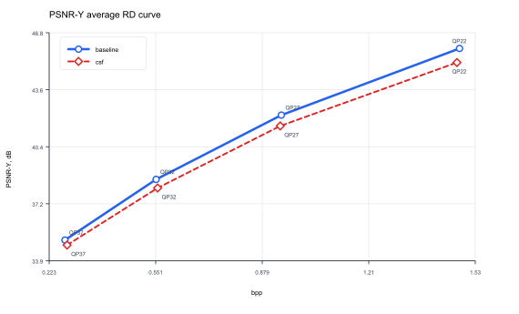 | **SSIM index**<br>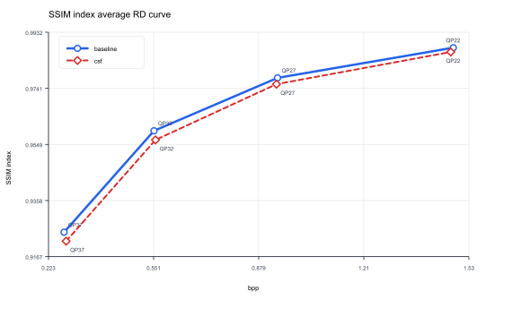 |
| **XPSNR-Y, dB**<br>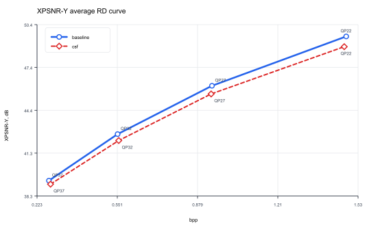 | **VMAF score**<br>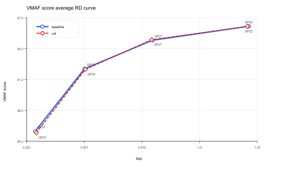 |
| **MS-SSIM luma index**<br>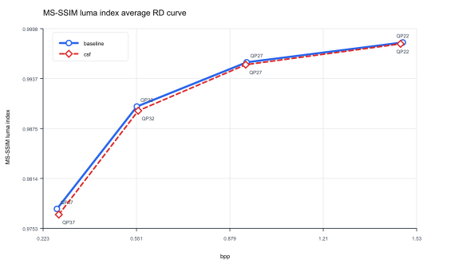 | **FSIM luma approximation**<br>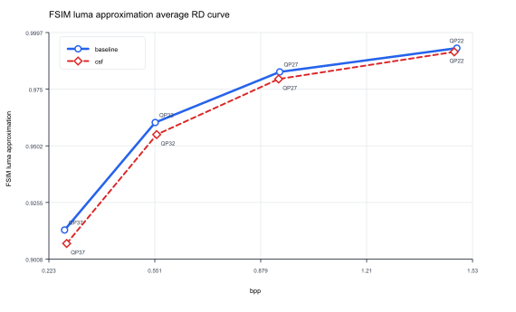 |
| **HaarPSI luma approximation**<br>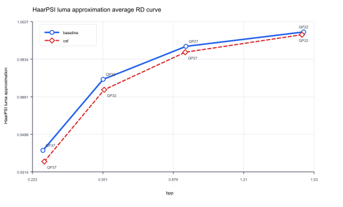 | **PSNR-HVS-M luma approximation, dB**<br>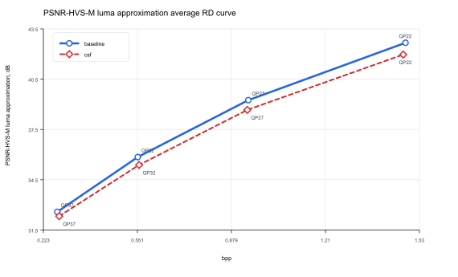 |
| **PSNR-RGB, dB**<br>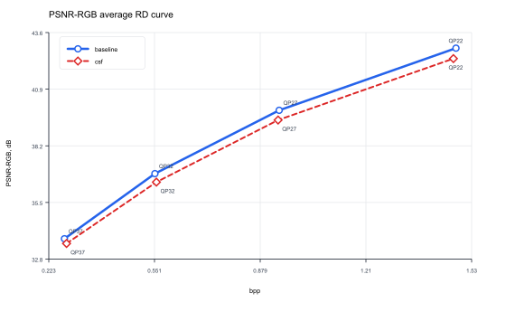 | **MS-SSIM-RGB index**<br>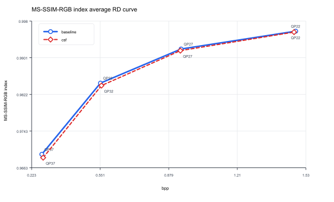 |

</details>

### VTM 23.0 Baseline vs. CSF

Metrics CSV: [`docs/image_benchmark/vtm/combined_image_metrics.csv`](../docs/image_benchmark/vtm/combined_image_metrics.csv)

Summary CSVs:

| Artifact | File |
| --- | --- |
| Same-QP deltas | [`docs/image_benchmark/vtm/combined/same_qp_summary.csv`](../docs/image_benchmark/vtm/combined/same_qp_summary.csv) |
| Equal-bpp interpolation deltas | [`docs/image_benchmark/vtm/combined/equal_bpp_metric_summary.csv`](../docs/image_benchmark/vtm/combined/equal_bpp_metric_summary.csv) |
| BD-Rate summary | [`docs/image_benchmark/vtm/combined/bd_rate_summary.csv`](../docs/image_benchmark/vtm/combined/bd_rate_summary.csv) |

Same-QP summary:

| Metric | Mean | Min | Max |
| --- | --- | --- | --- |
| PSNR-Y same-QP delta | -0.588779 | -2.112600 | 0.000000 |
| SSIM same-QP delta | -0.001250 | -0.009749 | 0.000153 |
| XPSNR-Y same-QP delta | -0.523373 | -1.958000 | 0.000000 |
| VMAF same-QP delta | -0.275069 | -1.507135 | 1.214826 |
| MS-SSIM luma same-QP delta | -0.000498 | -0.002891 | 0.000153 |
| FSIM luma approx same-QP delta | -0.004600 | -0.028883 | 0.000001 |
| HaarPSI luma approx same-QP delta | -0.004183 | -0.026922 | 0.000000 |
| PSNR-HVS-M luma approx same-QP delta | -0.532796 | -1.929102 | 0.000000 |
| PSNR-RGB same-QP delta | -0.459547 | -1.878842 | 0.013646 |
| MS-SSIM-RGB same-QP delta | -0.000512 | -0.002934 | 0.000154 |

Equal-bpp summary:

| Metric | Mean | Min | Max |
| --- | --- | --- | --- |
| PSNR-Y equal-bpp delta | -0.481620 | -2.356562 | -0.083692 |
| SSIM equal-bpp delta | -0.000858 | -0.007387 | 0.000049 |
| XPSNR-Y equal-bpp delta | -0.404339 | -2.324008 | -0.064590 |
| VMAF equal-bpp delta | -0.148109 | -0.728760 | 0.764426 |
| MS-SSIM luma equal-bpp delta | -0.000245 | -0.002611 | 0.000141 |
| FSIM luma approx equal-bpp delta | -0.004015 | -0.021246 | -0.000072 |
| HaarPSI luma approx equal-bpp delta | -0.003928 | -0.020336 | -0.000007 |
| PSNR-HVS-M luma approx equal-bpp delta | -0.408818 | -2.301004 | -0.059020 |
| PSNR-RGB equal-bpp delta | -0.359620 | -2.241035 | -0.071275 |
| MS-SSIM-RGB equal-bpp delta | -0.000215 | -0.002611 | 0.000137 |

BD-Rate summary:

| Metric | Valid images | BD-Rate mean, % | BD-Rate min, % | BD-Rate max, % | BD quality mean |
| --- | --- | --- | --- | --- | --- |
| PSNR-Y | 33 | 8.816 | 3.404 | 34.383 | -0.484157 |
| SSIM | 33 | 4.282 | -0.564 | 34.329 | -0.000788 |
| XPSNR-Y | 33 | 8.049 | 2.783 | 34.380 | -0.401046 |
| VMAF | 33 | 2.179 | -9.402 | 27.744 | -0.115815 |
| MS-SSIM luma | 33 | 1.707 | -1.179 | 27.149 | -0.000125 |
| FSIM luma approx | 33 | 7.436 | 2.879 | 33.536 | -0.003738 |
| HaarPSI luma approx | 33 | 10.551 | 3.923 | 37.207 | -0.003802 |
| PSNR-HVS-M luma approx | 33 | 8.253 | 2.930 | 33.667 | -0.406051 |
| PSNR-RGB | 33 | 8.046 | 2.350 | 34.428 | -0.348684 |
| MS-SSIM-RGB | 33 | 1.454 | -1.143 | 27.152 | -0.000088 |

<details>
<summary>Show VTM 23.0 Baseline vs. CSF RD charts</summary>

| Chart | Chart |
| --- | --- |
| **PSNR-Y, dB**<br>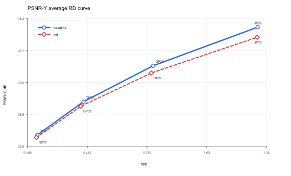 | **SSIM index**<br>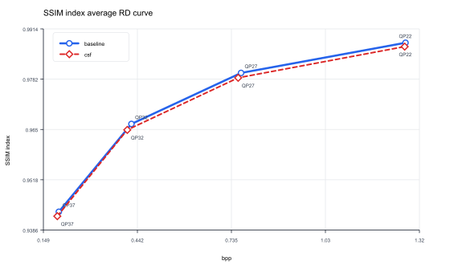 |
| **XPSNR-Y, dB**<br>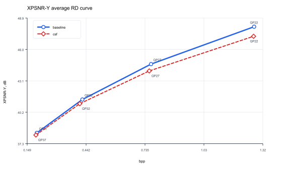 | **VMAF score**<br>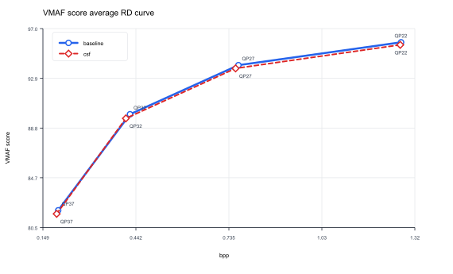 |
| **MS-SSIM luma index**<br>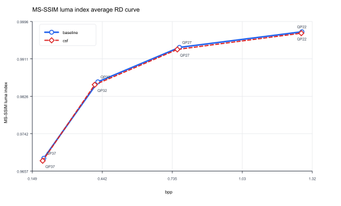 | **FSIM luma approximation**<br>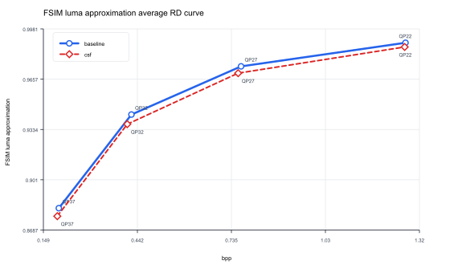 |
| **HaarPSI luma approximation**<br>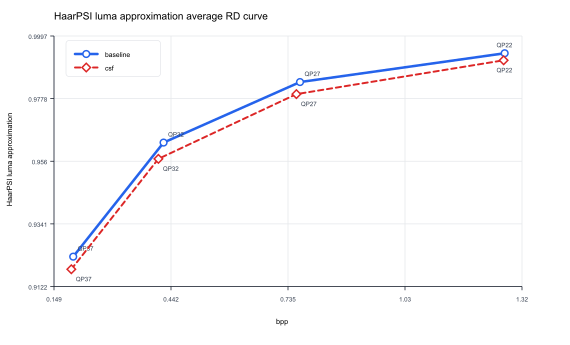 | **PSNR-HVS-M luma approximation, dB**<br>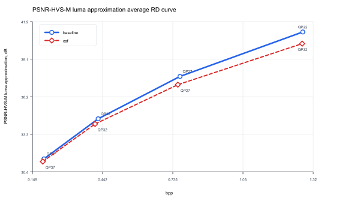 |
| **PSNR-RGB, dB**<br>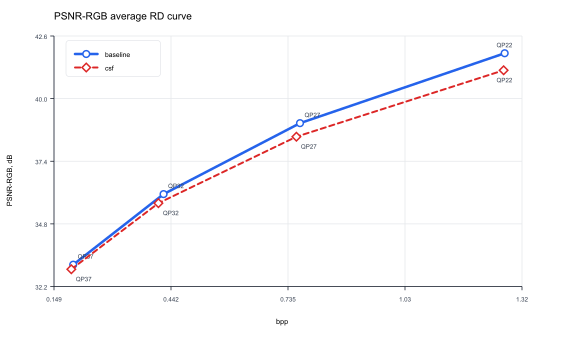 | **MS-SSIM-RGB index**<br>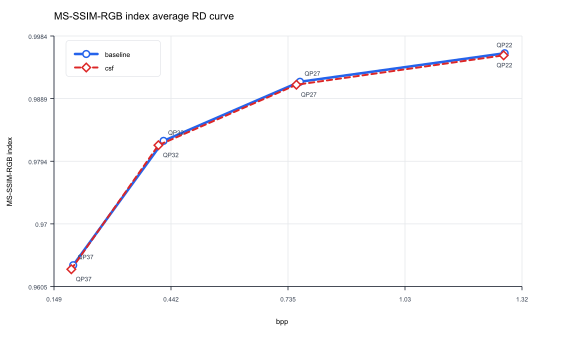 |

</details>

## Partition Map Summary

Each generated map shows final luma CUs encoded at `QP=32`, `preset=medium`, and one frame. New runs write codec-separated partition reports to `docs/partition_maps/vvenc/` and `docs/partition_maps/vtm/`.

### VVenC Partition Maps

Summary CSV: [`docs/partition_maps/vvenc/summary.csv`](../docs/partition_maps/vvenc/summary.csv)

#### Standard grayscale

<details>
<summary>Show Standard grayscale partition summary</summary>

| Image | Size | CU baseline | CU CSF | Delta, % | Dominant baseline | Dominant CSF |
| --- | --- | --- | --- | --- | --- | --- |
| baboon | 512x512 | 2575 | 9956 | 286.64 | 8x8:543; 4x4:392; 8x4:298; 4x8:248; 16x4:230; 16x8:216 | 4x4:7900; 8x4:923; 4x8:345; 8x8:315; 16x16:131; 8x16:91 |
| barbara | 512x512 | 1716 | 2870 | 67.25 | 8x8:380; 16x16:209; 8x16:205; 4x16:181; 4x8:171; 4x4:112 | 4x4:698; 4x8:618; 8x8:395; 4x16:294; 16x16:206; 8x16:188 |
| goldhill | 512x512 | 2864 | 3569 | 24.62 | 8x8:614; 4x4:434; 4x8:350; 8x4:323; 4x16:204; 16x4:197 | 4x4:1048; 8x8:555; 4x8:472; 8x4:456; 16x4:220; 4x16:197 |
| lenna | 512x512 | 1777 | 2276 | 28.08 | 8x8:378; 16x16:239; 4x8:197; 4x4:188; 8x16:176; 4x16:138 | 4x4:518; 8x8:375; 4x8:323; 16x16:236; 4x16:196; 8x16:177 |
| peppers | 512x512 | 2286 | 2556 | 11.81 | 8x8:551; 16x16:260; 4x4:258; 8x16:222; 8x4:213; 4x8:186 | 4x4:508; 8x8:479; 4x8:267; 8x4:261; 16x16:246; 8x16:230 |

</details>

#### Synthetic

<details>
<summary>Show Synthetic partition summary</summary>

| Image | Size | CU baseline | CU CSF | Delta, % | Dominant baseline | Dominant CSF |
| --- | --- | --- | --- | --- | --- | --- |
| fine_texture_512x512 | 512x512 | 351 | 16094 | 4485.19 | 32x32:191; 16x32:58; 16x16:53; 32x16:43; 32x8:2; 8x16:2 | 4x4:15820; 4x8:160; 8x4:106; 4x16:8 |
| mixed_content_512x512 | 512x512 | 549 | 540 | -1.64 | 16x16:107; 32x32:82; 8x8:61; 4x4:38; 4x16:32; 8x16:31 | 16x16:116; 32x32:63; 8x8:61; 4x4:46; 4x16:37; 64x64:30 |
| sharp_edges_512x512 | 512x512 | 577 | 576 | -0.17 | 16x16:115; 32x32:114; 16x32:67; 8x8:56; 16x8:40; 4x32:36 | 16x16:145; 32x32:112; 16x32:67; 8x8:55; 4x32:36; 8x16:33 |
| smooth_gradient_512x512 | 512x512 | 64 | 64 | 0.00 | 64x64:64 | 64x64:64 |

</details>

#### Kodak

<details>
<summary>Show Kodak partition summary</summary>

| Image | Size | CU baseline | CU CSF | Delta, % | Dominant baseline | Dominant CSF |
| --- | --- | --- | --- | --- | --- | --- |
| kodim01 | 768x512 | 5627 | 12897 | 129.20 | 8x8:1162; 8x4:870; 4x4:862; 4x8:645; 16x4:639; 16x8:445 | 4x4:8890; 8x4:1494; 4x8:781; 8x8:577; 16x4:349; 4x16:280 |
| kodim02 | 768x512 | 3739 | 4614 | 23.40 | 8x8:769; 4x4:462; 8x4:425; 4x8:344; 16x4:315; 4x16:294 | 4x4:1268; 8x8:607; 8x4:554; 4x8:408; 16x4:406; 4x16:327 |
| kodim03 | 768x512 | 2633 | 3645 | 38.44 | 8x8:438; 4x4:412; 16x16:326; 8x4:322; 4x8:196; 16x8:162 | 4x4:1268; 8x4:599; 8x8:414; 16x16:271; 4x8:255; 16x8:138 |
| kodim04 | 512x768 | 2405 | 3210 | 33.47 | 8x8:425; 16x16:307; 4x4:276; 16x8:185; 8x4:181; 4x8:169 | 4x4:820; 8x8:490; 8x4:336; 16x16:303; 4x8:246; 16x8:202 |
| kodim05 | 768x512 | 8976 | 11959 | 33.23 | 4x4:3556; 8x8:1597; 4x8:1420; 8x4:1356; 4x16:234; 16x4:210 | 4x4:7162; 8x4:1511; 4x8:1348; 8x8:1171; 16x4:206; 16x16:147 |
| kodim06 | 768x512 | 3558 | 7936 | 123.05 | 4x4:716; 8x4:610; 8x8:569; 16x4:370; 16x8:362; 4x8:220 | 4x4:3790; 8x4:2037; 16x4:661; 8x8:474; 16x8:283; 4x8:230 |
| kodim07 | 768x512 | 4513 | 5277 | 16.93 | 4x4:1236; 8x8:857; 8x4:589; 4x8:575; 16x16:280; 16x8:191 | 4x4:1964; 8x8:828; 8x4:739; 4x8:619; 16x16:306; 16x8:193 |
| kodim08 | 768x512 | 7384 | 10710 | 45.04 | 4x4:2250; 8x8:1242; 4x8:1176; 8x4:1025; 4x16:631; 16x4:328 | 4x4:5944; 4x8:1415; 8x4:1165; 8x8:815; 4x16:563; 16x4:272 |
| kodim09 | 512x768 | 2640 | 3282 | 24.32 | 4x4:458; 8x8:442; 4x8:298; 8x4:251; 16x8:192; 16x16:191 | 4x4:962; 8x4:432; 8x8:394; 4x8:385; 16x16:169; 16x4:165 |
| kodim10 | 512x768 | 3378 | 4164 | 23.27 | 8x8:652; 4x4:512; 8x4:366; 4x8:360; 16x16:283; 8x16:242 | 4x4:1202; 8x8:627; 4x8:427; 8x4:426; 16x16:292; 16x4:225 |
| kodim11 | 768x512 | 4466 | 6737 | 50.85 | 4x4:966; 8x8:775; 8x4:637; 4x8:480; 16x4:353; 16x8:261 | 4x4:3002; 8x4:992; 4x8:607; 8x8:582; 16x4:564; 16x8:220 |
| kodim12 | 768x512 | 2530 | 3209 | 26.84 | 8x8:498; 4x4:304; 16x16:243; 8x4:233; 16x8:203; 4x8:195 | 4x4:756; 8x8:466; 8x4:386; 16x4:267; 4x8:246; 16x16:236 |
| kodim13 | 768x512 | 6178 | 16261 | 163.21 | 4x4:1576; 8x8:1212; 8x4:1193; 16x4:596; 4x8:457; 16x8:443 | 4x4:13388; 8x4:1316; 4x8:606; 8x8:420; 16x16:163; 16x4:132 |
| kodim14 | 768x512 | 6840 | 9313 | 36.15 | 4x4:1984; 8x4:1289; 8x8:1238; 4x8:707; 16x4:551; 16x8:449 | 4x4:4794; 8x4:1826; 8x8:911; 4x8:555; 16x4:395; 16x8:312 |
| kodim15 | 768x512 | 2400 | 3729 | 55.38 | 8x8:521; 4x4:280; 16x16:253; 4x8:243; 8x16:212; 8x4:165 | 4x4:1500; 8x8:495; 4x8:385; 8x4:307; 16x16:247; 8x16:161 |
| kodim16 | 768x512 | 2713 | 4200 | 54.81 | 8x8:478; 8x4:322; 4x4:320; 16x8:299; 16x4:280; 16x16:233 | 4x4:1022; 8x4:907; 16x4:712; 8x8:379; 16x8:313; 16x16:209 |
| kodim17 | 512x768 | 4303 | 5301 | 23.19 | 8x8:1049; 4x4:818; 8x4:514; 4x8:511; 16x16:275; 8x16:271 | 4x4:1846; 8x8:915; 8x4:705; 4x8:592; 16x16:270; 8x16:234 |
| kodim18 | 512x768 | 4540 | 8135 | 79.19 | 4x4:988; 8x8:933; 4x8:589; 8x4:519; 16x16:368; 8x16:268 | 4x4:5216; 8x8:631; 8x4:609; 4x8:593; 16x16:342; 8x16:179 |
| kodim19 | 512x768 | 3078 | 4455 | 44.74 | 4x4:788; 8x8:438; 4x8:410; 8x4:310; 16x16:224; 4x16:162 | 4x4:2082; 8x4:491; 4x8:474; 8x8:376; 16x16:192; 16x4:168 |
| kodim20 | 768x512 | 2722 | 3912 | 43.72 | 4x4:674; 8x8:527; 8x4:407; 4x8:238; 16x16:181; 16x4:148 | 4x4:1682; 8x4:601; 8x8:480; 4x8:354; 16x16:167; 16x8:161 |
| kodim21 | 768x512 | 3883 | 7694 | 98.15 | 4x4:908; 8x4:721; 8x8:714; 16x4:428; 16x8:349; 4x8:235 | 4x4:5220; 8x4:1020; 8x8:362; 4x8:274; 16x4:268; 16x8:163 |
| kodim22 | 768x512 | 3600 | 5730 | 59.17 | 8x8:712; 4x4:636; 8x4:364; 16x16:348; 4x8:344; 8x16:280 | 4x4:2628; 8x8:653; 8x4:563; 4x8:559; 16x16:326; 8x16:237 |
| kodim23 | 768x512 | 2111 | 2473 | 17.15 | 8x8:394; 4x4:274; 8x16:256; 16x16:239; 4x8:172; 8x4:135 | 4x4:572; 8x8:365; 16x16:250; 8x4:237; 4x8:217; 8x16:212 |
| kodim24 | 768x512 | 5728 | 9720 | 69.69 | 8x8:1348; 4x4:1288; 8x4:757; 4x8:711; 8x16:395; 4x16:324 | 4x4:5834; 8x8:936; 4x8:932; 8x4:769; 4x16:289; 16x16:279 |

</details>


### VTM 23.0 Partition Maps

Summary CSV: [`docs/partition_maps/vtm/summary.csv`](../docs/partition_maps/vtm/summary.csv)

#### Standard grayscale

<details>
<summary>Show Standard grayscale partition summary</summary>

| Image | Size | CU baseline | CU CSF | Delta, % | Dominant baseline | Dominant CSF |
| --- | --- | --- | --- | --- | --- | --- |
| baboon | 512x512 | 3016 | 4881 | 61.84 | 8x4:498; 4x8:399; 4x4:394; 8x8:357; 16x8:356; 16x4:332 | 4x4:1310; 8x4:1244; 4x8:801; 16x4:439; 32x4:253; 8x8:242 |
| barbara | 512x512 | 1638 | 2326 | 42.00 | 8x16:241; 8x8:197; 4x16:183; 16x8:180; 4x8:154; 16x16:122 | 4x8:551; 4x16:264; 8x16:217; 8x8:208; 4x4:192; 8x4:191 |
| goldhill | 512x512 | 2352 | 2890 | 22.87 | 8x8:390; 4x8:316; 8x4:254; 8x16:233; 16x8:228; 4x16:184 | 4x8:487; 8x4:432; 4x4:378; 8x8:366; 16x8:223; 4x16:213 |
| lenna | 512x512 | 1627 | 1942 | 19.36 | 4x8:222; 8x16:202; 8x8:189; 4x4:152; 16x16:144; 8x4:134 | 4x8:338; 4x4:258; 8x8:253; 8x4:209; 8x16:191; 4x16:137 |
| peppers | 512x512 | 1963 | 2021 | 2.95 | 8x8:281; 8x16:243; 8x4:194; 4x8:188; 4x4:180; 16x8:175 | 8x8:282; 8x4:215; 4x4:208; 4x8:203; 8x16:202; 16x8:197 |

</details>

#### Synthetic

<details>
<summary>Show Synthetic partition summary</summary>

| Image | Size | CU baseline | CU CSF | Delta, % | Dominant baseline | Dominant CSF |
| --- | --- | --- | --- | --- | --- | --- |
| fine_texture_512x512 | 512x512 | 528 | 9341 | 1669.13 | 32x32:149; 16x16:141; 16x8:66; 32x16:59; 16x32:44; 8x16:30 | 4x4:3592; 8x4:2735; 4x8:2411; 8x8:338; 4x16:130; 16x4:113 |
| mixed_content_512x512 | 512x512 | 891 | 873 | -2.02 | 16x16:398; 16x8:78; 16x4:64; 8x16:62; 4x16:61; 4x8:48 | 16x16:421; 16x8:69; 16x4:66; 4x16:57; 8x16:56; 4x4:42 |
| sharp_edges_512x512 | 512x512 | 850 | 876 | 3.06 | 32x32:133; 4x32:90; 16x32:79; 16x16:72; 4x8:66; 8x32:63 | 32x32:132; 4x32:96; 4x8:79; 8x32:79; 16x32:74; 16x16:73 |
| smooth_gradient_512x512 | 512x512 | 67 | 67 | 0.00 | 64x64:63; 32x32:4 | 64x64:63; 32x32:4 |

</details>

#### Kodak

<details>
<summary>Show Kodak partition summary</summary>

| Image | Size | CU baseline | CU CSF | Delta, % | Dominant baseline | Dominant CSF |
| --- | --- | --- | --- | --- | --- | --- |
| kodim01 | 768x512 | 5142 | 8192 | 59.32 | 8x4:938; 16x4:826; 8x8:635; 4x8:589; 16x8:513; 4x4:502 | 8x4:2381; 4x4:2072; 4x8:1225; 16x4:803; 8x8:545; 4x16:373 |
| kodim02 | 768x512 | 2796 | 3141 | 12.34 | 16x4:299; 8x8:295; 8x16:268; 16x8:261; 8x4:243; 4x16:233 | 8x4:342; 4x8:340; 16x4:316; 8x8:294; 4x4:276; 8x16:262 |
| kodim03 | 768x512 | 2446 | 2858 | 16.84 | 8x4:339; 4x8:296; 8x8:255; 4x4:254; 16x16:179; 16x8:177 | 8x4:563; 4x4:420; 4x8:365; 8x8:224; 16x4:197; 8x16:185 |
| kodim04 | 512x768 | 2205 | 2446 | 10.93 | 16x8:222; 8x16:221; 8x8:221; 4x4:198; 4x8:177; 16x16:172 | 8x4:268; 4x4:248; 4x8:232; 16x8:219; 8x8:209; 8x16:205 |
| kodim05 | 768x512 | 8002 | 9248 | 15.57 | 4x4:2050; 8x4:1719; 4x8:1636; 8x8:1131; 16x4:360; 16x8:317 | 4x4:3070; 4x8:2039; 8x4:1970; 8x8:889; 16x4:334; 4x16:269 |
| kodim06 | 768x512 | 3147 | 4035 | 28.22 | 8x4:619; 16x4:417; 16x8:405; 8x8:288; 4x4:282; 32x8:233 | 8x4:998; 16x4:709; 4x4:536; 16x8:338; 32x4:325; 4x8:310 |
| kodim07 | 768x512 | 4112 | 4413 | 7.32 | 4x4:770; 8x4:714; 4x8:641; 8x8:488; 16x8:277; 8x16:250 | 4x4:984; 8x4:784; 4x8:736; 8x8:459; 8x16:275; 16x8:255 |
| kodim08 | 768x512 | 6585 | 7411 | 12.54 | 4x8:1435; 8x4:1235; 4x4:1192; 8x8:736; 4x16:581; 16x4:408 | 4x4:1636; 4x8:1625; 8x4:1565; 8x8:680; 4x16:578; 16x4:428 |
| kodim09 | 512x768 | 2267 | 2654 | 17.07 | 4x8:311; 4x4:286; 8x4:252; 8x8:239; 16x8:164; 8x16:156 | 8x4:405; 4x4:390; 4x8:364; 8x8:236; 16x4:206; 4x16:178 |
| kodim10 | 512x768 | 3069 | 3352 | 9.22 | 4x8:434; 8x4:365; 4x4:330; 8x8:319; 8x16:262; 16x8:237 | 4x8:492; 8x4:491; 4x4:438; 8x8:304; 8x16:261; 16x4:242 |
| kodim11 | 768x512 | 3981 | 4843 | 21.65 | 8x4:693; 4x8:536; 4x4:466; 16x4:424; 8x8:375; 16x8:311 | 4x4:1000; 8x4:954; 4x8:660; 16x4:516; 8x8:311; 16x8:308 |
| kodim12 | 768x512 | 2457 | 2680 | 9.08 | 8x8:274; 16x8:261; 8x4:251; 4x4:246; 4x8:232; 16x4:207 | 8x4:342; 16x4:329; 4x8:263; 4x4:254; 8x8:252; 16x8:239 |
| kodim13 | 768x512 | 6124 | 9775 | 59.62 | 8x4:1554; 4x4:1054; 8x8:782; 16x4:682; 4x8:627; 16x8:576 | 4x4:3106; 8x4:2904; 4x8:1621; 16x4:710; 8x8:583; 4x16:290 |
| kodim14 | 768x512 | 5686 | 6658 | 17.09 | 8x4:1293; 4x4:1074; 8x8:719; 4x8:710; 16x4:545; 16x8:500 | 8x4:1840; 4x4:1502; 4x8:907; 8x8:645; 16x4:619; 16x8:432 |
| kodim15 | 768x512 | 2107 | 2536 | 20.36 | 8x8:320; 4x8:283; 8x16:215; 8x4:176; 4x16:164; 4x4:162 | 4x8:467; 4x4:382; 8x8:249; 8x4:236; 8x16:191; 4x16:182 |
| kodim16 | 768x512 | 2392 | 3141 | 31.31 | 32x8:294; 8x4:278; 32x4:255; 16x8:253; 8x8:235; 16x4:233 | 16x4:531; 8x4:501; 4x4:380; 32x4:362; 16x8:285; 8x8:223 |
| kodim17 | 512x768 | 3795 | 4163 | 9.70 | 8x4:611; 8x8:581; 4x8:488; 4x4:486; 16x8:358; 8x16:277 | 8x4:724; 4x4:700; 4x8:606; 8x8:549; 8x16:319; 16x8:293 |
| kodim18 | 512x768 | 4074 | 5716 | 40.30 | 4x8:628; 8x8:615; 8x4:612; 4x4:560; 8x16:341; 16x8:308 | 4x4:1620; 4x8:1134; 8x4:1024; 8x8:556; 8x16:255; 16x8:229 |
| kodim19 | 512x768 | 2719 | 3644 | 34.02 | 8x4:437; 4x8:382; 4x4:350; 8x8:282; 16x8:230; 16x4:199 | 8x4:717; 4x4:626; 4x8:602; 16x4:347; 8x8:293; 16x8:248 |
| kodim20 | 768x512 | 2433 | 2740 | 12.62 | 8x4:402; 8x8:315; 4x4:292; 4x8:286; 16x8:259; 16x4:244 | 4x4:486; 8x4:483; 4x8:384; 8x8:281; 16x8:257; 16x4:226 |
| kodim21 | 768x512 | 3591 | 5193 | 44.61 | 8x4:816; 4x4:586; 16x4:481; 8x8:404; 16x8:387; 4x8:339 | 8x4:1618; 4x4:1558; 4x8:523; 16x4:479; 8x8:306; 16x8:237 |
| kodim22 | 768x512 | 2996 | 3878 | 29.44 | 8x8:389; 4x8:344; 8x4:341; 16x8:328; 8x16:285; 4x4:266 | 4x4:720; 8x4:615; 4x8:545; 8x8:352; 8x16:290; 16x8:280 |
| kodim23 | 768x512 | 1922 | 2044 | 6.35 | 8x16:238; 8x8:231; 4x8:216; 8x4:169; 4x16:168; 16x16:158 | 8x4:269; 4x8:255; 4x4:208; 8x8:208; 8x16:191; 16x8:141 |
| kodim24 | 768x512 | 4552 | 5786 | 27.11 | 8x4:674; 8x8:645; 4x8:637; 4x4:618; 16x8:381; 8x16:377 | 4x4:1280; 8x4:1077; 4x8:977; 8x8:623; 8x16:377; 16x4:335 |

</details>


## Partition Maps

### Standard grayscale

<details>
<summary>Show Standard grayscale original images and map pairs</summary>

Each row links the original PNG with baseline and CSF PNG maps generated from VVenC `D_QP` traces at the same image size and QP. VTM map pairs are stored under `docs/partition_maps/vtm/` after a VTM full run.

| Image | Original | Baseline | CSF |
| --- | --- | --- | --- |
| baboon |  | 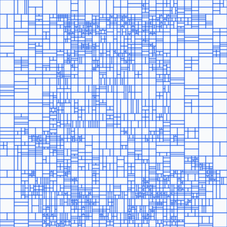 | 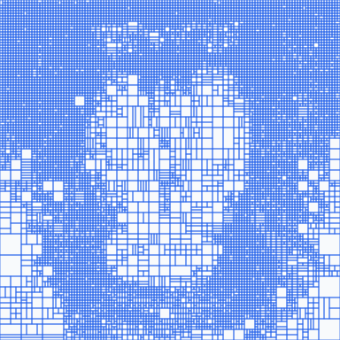 |
| barbara |  | 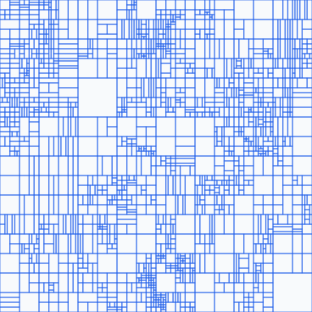 | 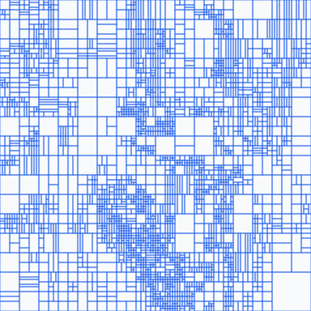 |
| goldhill |  | 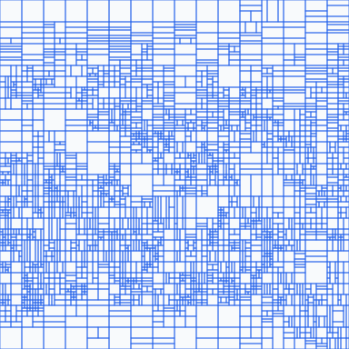 | 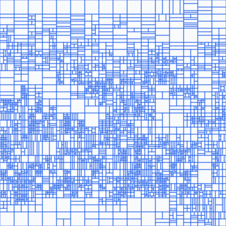 |
| lenna |  | 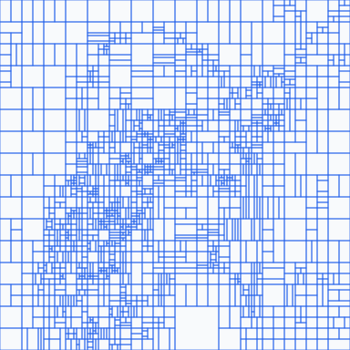 | 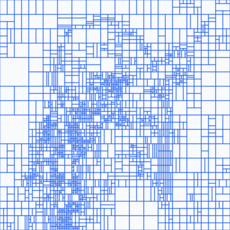 |
| peppers |  | 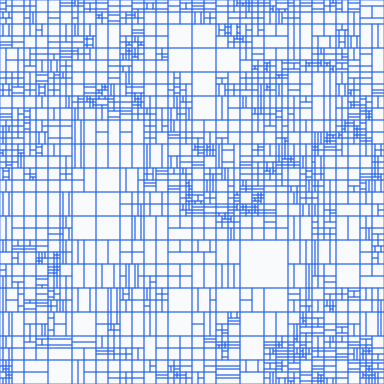 | 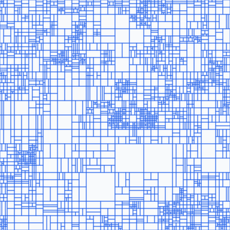 |

</details>

### Synthetic

<details>
<summary>Show Synthetic original images and map pairs</summary>

Each row links the original PNG with baseline and CSF PNG maps generated from VVenC `D_QP` traces at the same image size and QP. VTM map pairs are stored under `docs/partition_maps/vtm/` after a VTM full run.

| Image | Original | Baseline | CSF |
| --- | --- | --- | --- |
| fine_texture_512x512 |  | 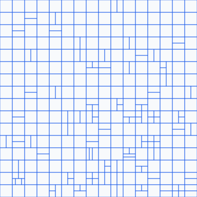 | 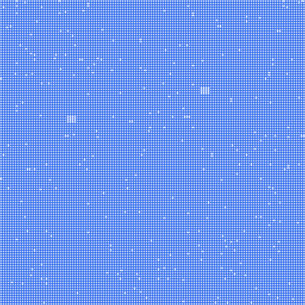 |
| mixed_content_512x512 |  | 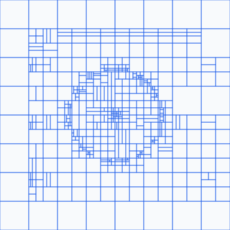 | 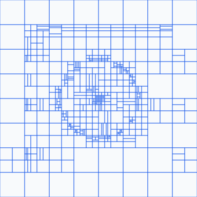 |
| sharp_edges_512x512 |  | 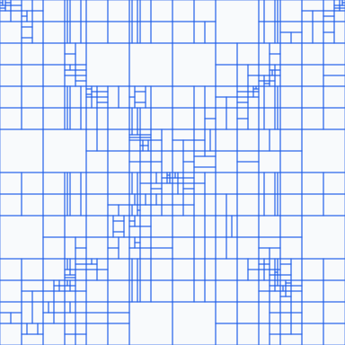 | 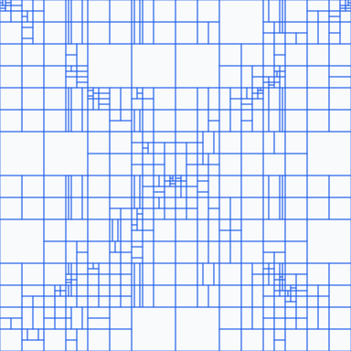 |
| smooth_gradient_512x512 |  |  | 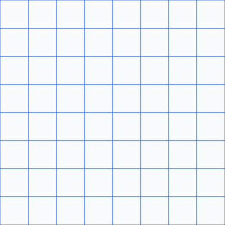 |

</details>

### Kodak

<details>
<summary>Show Kodak original images and map pairs</summary>

Each row links the original PNG with baseline and CSF PNG maps generated from VVenC `D_QP` traces at the same image size and QP. VTM map pairs are stored under `docs/partition_maps/vtm/` after a VTM full run.

| Image | Original | Baseline | CSF |
| --- | --- | --- | --- |
| kodim01 |  | 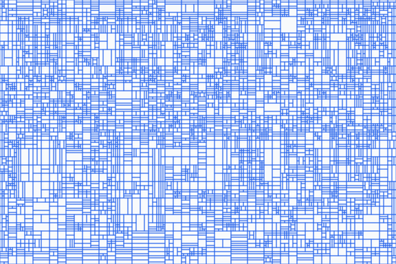 | 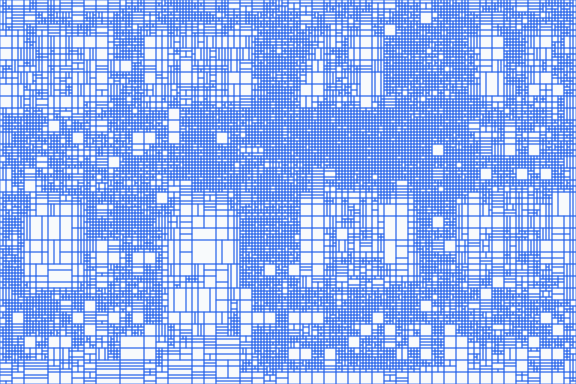 |
| kodim02 |  | 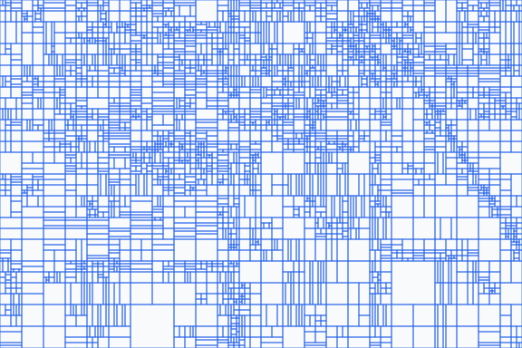 | 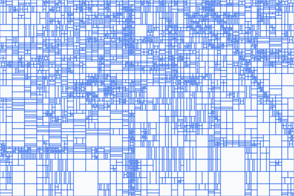 |
| kodim03 |  | 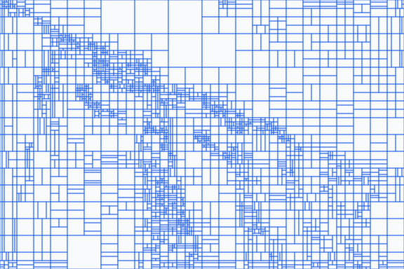 | 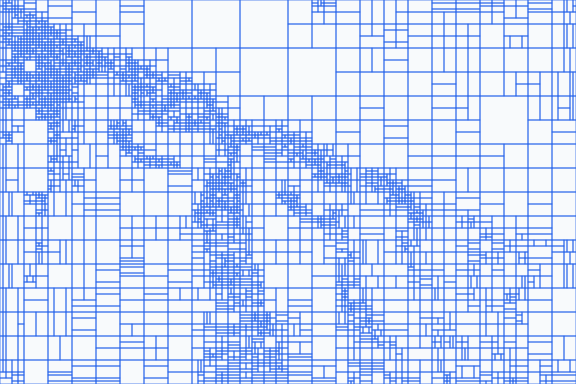 |
| kodim04 |  | 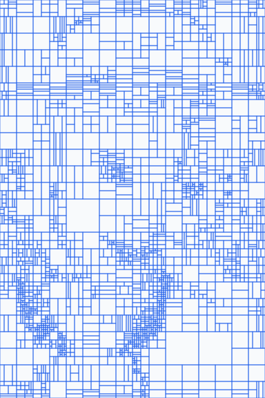 | 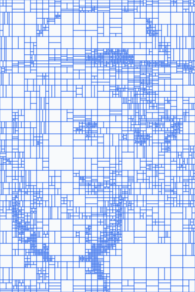 |
| kodim05 |  | 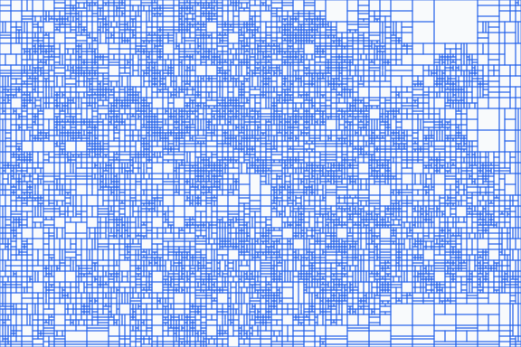 | 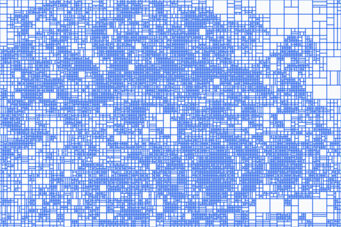 |
| kodim06 |  | 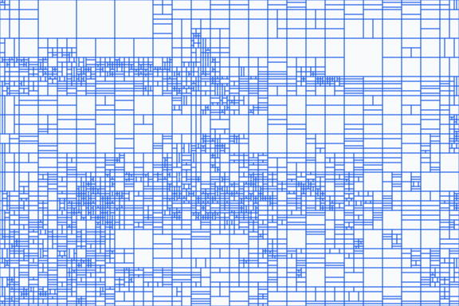 | 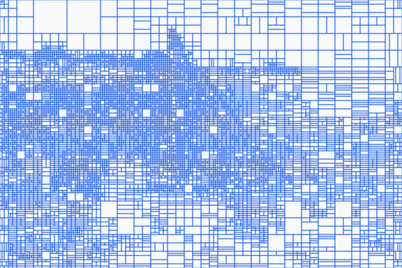 |
| kodim07 |  | 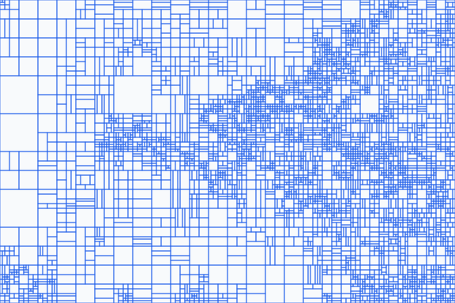 |  |
| kodim08 |  |  |  |
| kodim09 |  |  |  |
| kodim10 |  |  |  |
| kodim11 |  |  |  |
| kodim12 |  |  |  |
| kodim13 |  |  |  |
| kodim14 |  |  |  |
| kodim15 |  |  |  |
| kodim16 |  |  |  |
| kodim17 |  |  |  |
| kodim18 |  |  |  |
| kodim19 |  |  |  |
| kodim20 |  |  |  |
| kodim21 |  |  |  |
| kodim22 |  |  |  |
| kodim23 |  |  |  |
| kodim24 |  |  |  |

</details>

## How to Extend

This benchmark is designed to be easily extensible. You can customize the image inputs or add new visual quality metrics.

### Adding a Custom Image Set
1. Create a subdirectory under `data/datasets/images/` containing your input images in PNG format (e.g., `data/datasets/images/custom_set/png/`).
2. Update the paths in `configs/image_benchmark.ini` or pass your custom directory via the `--smoke-dir`, `--synthetic-dir`, or `--kodak-dir` CLI arguments when invoking `run_all.py`.

### Adding a Custom Quality Metric
1. Implement the luma metric calculation function in `metrics/image_quality.py`.
2. Update the `calculate_luma_metrics()` function in `metrics/image_quality.py` to execute your new metric and append its score to the returned dictionary.
3. Add a tuple with the metric's CSV key, short label, and chart label to `_METRIC_DEFS` in `metrics/registry.py`. All report scripts pick up the new metric automatically.

## Current Conclusion

The CSF integration passes the mechanical checks used by this benchmark: `--CSFScalingList 1` is accepted, generated bitstreams decode through VVdeC, encoder reconstruction matches decoded output, matrices are signaled, and the tables, RD charts, and CU partition maps are regenerated from repository scripts.

Across the current standard grayscale, synthetic, and Kodak datasets, the average same-QP and equal-bpp deltas remain negative for most quality metrics. This means the current CSF matrix shape does not outperform the default encoder configuration under the fixed conditions used here.
