# Image Benchmark Report

This report expands the root README with the exact binaries, commands, CSV outputs, charts, and partition-map evidence used in the image benchmark. Standard grayscale images are listed first because they are the primary control set for this stage of the experiment.

## Binaries

| File | Purpose |
| --- | --- |
| `binaries/vvenc_default[.exe]` | Clean upstream/default VVenC encoder without CSF. Local build from [fraunhoferhhi/vvenc](https://github.com/fraunhoferhhi/vvenc) |
| `binaries/vvenc_csf[.exe]` | Modified VVenC encoder. CSF is enabled with `--CSFScalingList 1`. Local build from the [CSF VVenC branch](https://github.com/For2natop1ua/vvenc/tree/feature-branch) |
| `binaries/vvenc_default_trace[.exe]` | Default encoder built with `VVENC_ENABLE_TRACING=ON` for partition maps only. Local build from [fraunhoferhhi/vvenc](https://github.com/fraunhoferhhi/vvenc) |
| `binaries/vvenc_csf_trace[.exe]` | CSF encoder built with `VVENC_ENABLE_TRACING=ON` for partition maps only. Local build from the [CSF VVenC branch](https://github.com/For2natop1ua/vvenc/tree/feature-branch) |
| `binaries/vvdecapp[.exe]` | VVdeC decoder used to verify bitstream decoding. Local build from [Fraunhofer HHI VVdeC](https://github.com/fraunhoferhhi/vvdec) |

The repository currently stores Windows `.exe` binaries. On Linux/macOS, place suffixless binaries with the same stems in `binaries/`. The scripts select the platform-specific executable names automatically. More detail is available in [`binaries/README.md`](../binaries/README.md).

<details>
<summary>Default encoder rebuild commands</summary>

```powershell
git clone https://github.com/fraunhoferhhi/vvenc ..\vvenc_upstream
cd ..\vvenc_upstream
git checkout 6f76748
cmake -S . -B build\release -G "MinGW Makefiles" -DCMAKE_BUILD_TYPE=Release -DVVENC_ENABLE_LINK_TIME_OPT=OFF
cmake --build build\release --target vvencFFapp --parallel 8
Copy-Item bin\release-static\vvencFFapp.exe ..\vvenc_csf_tests\binaries\vvenc_default.exe

cmake -S . -B build\trace -G "MinGW Makefiles" -DCMAKE_BUILD_TYPE=Release -DVVENC_ENABLE_TRACING=ON -DVVENC_ENABLE_LINK_TIME_OPT=OFF
cmake --build build\trace --target vvencFFapp --parallel 8
Copy-Item bin\release-static\vvencFFapp.exe ..\vvenc_csf_tests\binaries\vvenc_default_trace.exe
```

</details>

## Scaling Matrices

Scaling matrices are defined in the encoder, not in this Python project. In the CSF branch, the base table is in `source/Lib/CommonLib/CSFWeights.h`; quant/dequant application is implemented in `source/Lib/CommonLib/Quant.cpp`.

`docs/matrices/` stores CSV snapshots of the default and CSF matrices. These files do not drive the encoder. They record the numerical matrices used for analysis, comparison, and result verification.

<details>
<summary>Default and CSF 8x8 matrices</summary>

Default 8x8 matrix:

```text
16,16,16,16,16,16,16,16
16,16,16,16,16,16,16,16
16,16,16,16,16,16,16,16
16,16,16,16,16,16,16,16
16,16,16,16,16,16,16,16
16,16,16,16,16,16,16,16
16,16,16,16,16,16,16,16
16,16,16,16,16,16,16,16
```

CSF 8x8 matrix:

```text
16,16,16,19,22,26,32,40
16,16,17,20,24,30,38,48
16,17,19,23,28,35,45,58
19,20,23,28,34,43,56,72
22,24,28,34,43,55,71,92
26,30,35,43,55,71,92,119
32,38,45,56,71,92,119,155
40,48,58,72,92,119,155,200
```

</details>

For non-8x8 Transform Units (TU), the encoder maps the 8x8 CSF table to the active TU size. Square TUs use scaled indices up to `min(size, 8)`. Rectangular TUs use the longer side and `ratioH`/`ratioW` mapping to select coordinates from the base CSF table. Coefficients outside the zero-out threshold are written as zero, matching the standard scaling-list behavior.

The current VVenC application binaries do not expose a `--ScalingListFile` option, so the VTM-style external scaling-list file check is not used in this project. The neutral value evidence is split into [source verification](matrices/neutral_16_verification.md) and a [practical control run](matrices/neutral_16_control.md).

## Image Partitioning

VVenC codes a picture through Coding Tree Units (CTU) and recursively selects CU partitions through rate-distortion search. The final partition structure is copied into the picture-level coding structure.

```cpp
partitioner->initCtu( area, CH_L, *cs.slice );
xCompressCU( tempCS, bestCS, *partitioner );
cs.useSubStructure( *bestCS, partitioner->chType, TREE_D,
  CS::getArea( *bestCS, area, partitioner->chType, partitioner->treeType ) );
```

The maps in this repository come from the VVenC `D_QP` trace, not from a synthetic approximation. The trace records final luma CUs in `CABACWriter.cpp`:

```cpp
DTRACE_COND( ( isEncoding() ), g_trace_ctx, D_QP,
  "x=%d, y=%d, w=%d, h=%d, qp=%d\n",
  cu.Y().x, cu.Y().y, cu.Y().width, cu.Y().height, cu.qp );
```

Baseline maps are generated with `vvenc_default_trace`; CSF maps are generated with `vvenc_csf_trace` (`.exe` suffix on Windows). Both binaries write final luma CU coordinates through the same `D_QP` trace, so a denser CSF map means the encoder selected more small CUs under the CSF configuration.

## Reproducing the Run

```powershell
py -3 -m venv .venv
.\.venv\Scripts\python.exe -m pip install -r requirements.txt
.\.venv\Scripts\python.exe run_all.py full --clean
```

## Experiment Conditions

| Parameter | Value |
| --- | --- |
| Primary dataset | 5 standard grayscale images |
| Additional datasets | 4 synthetic + 24 Kodak images |
| Frames | 1 frame per image |
| Encode pixel format | `yuv420p`, 8-bit |
| QP points | 22, 27, 32, 37 |
| Preset | `medium` |
| Baseline mode | `vvenc_default`, without `--CSFScalingList` (`.exe` suffix on Windows) |
| CSF mode | `vvenc_csf --CSFScalingList 1` (`.exe` suffix on Windows) |
| Decoder | `vvdecapp` (`.exe` suffix on Windows) |

The compression control parameter is `QP`. All other conditions are fixed. Compression ratio is computed per `image + QP + mode` point:

```text
raw_bytes = width * height * 3 / 2
compression_ratio = raw_bytes / bitstream_bytes
bpp = bitstream_bytes * 8 / (width * height)
```

## Visual Quality Metrics

Encoder behavior is evaluated through same-QP comparison and equal-bpp interpolation. Luma means the Y component in the YUV representation. The local MS-SSIM, FSIM, HaarPSI, and PSNR-HVS-M columns are computed on the Y plane to keep structural, edge, and texture comparisons stable.

| Metric | Source |
| --- | --- |
| PSNR-Y/U/V | Parsed from the VVenC encode log |
| SSIM | `ffmpeg -lavfi ssim`, parsed as the aggregate `All` score |
| XPSNR-Y | `ffmpeg -lavfi xpsnr`, Y score |
| VMAF | `ffmpeg -lavfi libvmaf` when the local ffmpeg build provides libvmaf |
| MS-SSIM | Local luma implementation in `metrics/image_quality.py` |
| FSIM | Local luma implementation in `metrics/image_quality.py` |
| HaarPSI | Local luma implementation in `metrics/image_quality.py` |
| PSNR-HVS-M | Local luma implementation in `metrics/image_quality.py` |
| PSNR-RGB | Local YUV→RGB (BT.601) conversion + per-channel MSE in `metrics/image_quality.py` |
| MS-SSIM-RGB | Local YUV→RGB (BT.601) conversion + per-channel MS-SSIM in `metrics/image_quality.py` |

The local luma metrics are not bit-exact replacements for pinned external implementations. External implementations can differ by RGB/YUV input handling, chroma use, padding, scaling, filters, multi-scale weights, phase congruency details, and Haar-wavelet details. Here they are reproducible in-repository indicators applied identically to baseline and CSF.

## Same-QP Summary

CSV: [`docs/image_benchmark/combined/same_qp_summary.csv`](image_benchmark/combined/same_qp_summary.csv)

| Metric | Mean | Min | Max |
| --- | --- | --- | --- |
| psnr_y_delta | -0.542548 | -1.437300 | 0.498400 |
| ssim_delta | -0.002447 | -0.011512 | 0.000771 |
| xpsnr_y_delta | -0.500045 | -1.377400 | 0.286200 |
| vmaf_delta | -0.039329 | -1.386822 | 1.076791 |
| msssim_luma_delta | -0.000423 | -0.002515 | 0.000218 |
| fsim_luma_delta | -0.003970 | -0.015175 | 0.003091 |
| haarpsi_luma_delta | -0.003477 | -0.018561 | 0.001788 |
| psnr_hvs_m_luma_delta | -0.501798 | -1.352777 | 0.456938 |
| psnr_rgb_delta | -0.399617 | -1.269984 | 0.350753 |
| msssim_rgb_delta | -0.000451 | -0.002451 | 0.000281 |

## Equal-bpp Summary

CSV: [`docs/image_benchmark/combined/equal_bpp_metric_summary.csv`](image_benchmark/combined/equal_bpp_metric_summary.csv)

| Metric | Mean | Min | Max |
| --- | --- | --- | --- |
| psnr_y_equal_bpp_delta | -0.825877 | -6.534639 | 0.000000 |
| ssim_equal_bpp_delta | -0.002743 | -0.009478 | 0.000000 |
| xpsnr_y_equal_bpp_delta | -0.733665 | -5.767764 | 0.000000 |
| vmaf_equal_bpp_delta | -0.071758 | -0.821547 | 0.198170 |
| msssim_luma_equal_bpp_delta | -0.000468 | -0.001365 | 0.000000 |
| fsim_luma_equal_bpp_delta | -0.004360 | -0.012932 | 0.000000 |
| haarpsi_luma_equal_bpp_delta | -0.003864 | -0.013726 | 0.000000 |
| psnr_hvs_m_luma_equal_bpp_delta | -0.678115 | -4.082148 | 0.000000 |
| psnr_rgb_equal_bpp_delta | -0.580042 | -3.993145 | 0.000000 |
| msssim_rgb_equal_bpp_delta | -0.000558 | -0.003687 | 0.000000 |

## BD-Rate Summary

CSV: [`docs/image_benchmark/combined/bd_rate_summary.csv`](image_benchmark/combined/bd_rate_summary.csv). Per-image values are stored in [`docs/image_benchmark/combined/bd_rate_by_image.csv`](image_benchmark/combined/bd_rate_by_image.csv). Negative BD-Rate means the CSF encoder needs fewer bits than baseline for the same quality metric; positive BD-Rate means it needs more bits.

| Metric | Valid images | BD-Rate mean, % | BD-Rate min, % | BD-Rate max, % | BD quality mean |
| --- | --- | --- | --- | --- | --- |
| PSNR-Y | 33 | 18.675 | 5.678 | 254.387 | -0.893396 |
| SSIM | 33 | 20.118 | 3.592 | 321.259 | -0.003456 |
| XPSNR-Y | 33 | 18.757 | 5.423 | 266.394 | -0.781452 |
| VMAF | 33 | 12.921 | -4.767 | 313.512 | -0.114842 |
| MS-SSIM | 33 | 14.540 | 2.019 | 255.544 | -0.000601 |
| FSIM approx | 33 | 21.089 | 6.181 | 275.315 | -0.005387 |
| HaarPSI approx | 33 | 23.992 | 7.965 | 284.523 | -0.004731 |
| PSNR-HVS-M approx | 33 | 18.582 | 5.481 | 254.424 | -0.733127 |
| PSNR-RGB | 33 | 19.347 | 3.968 | 309.561 | -0.621841 |
| MS-SSIM-RGB | 33 | 13.690 | 0.883 | 249.799 | -0.000712 |

<details>
<summary>Show BD-Rate per image</summary>

| Dataset | Image | PSNR-Y, % | SSIM, % | XPSNR-Y, % | VMAF, % | MS-SSIM, % | FSIM approx, % | HaarPSI approx, % | PSNR-HVS-M approx, % | PSNR-RGB, % | MS-SSIM-RGB, % |
| --- | --- | --- | --- | --- | --- | --- | --- | --- | --- | --- | --- |
| Standard grayscale | baboon | 10.014 | 9.433 | 10.058 | 0.115 | 3.696 | 11.463 | 15.081 | 9.729 | 9.991 | 3.696 |
| Standard grayscale | barbara | 13.160 | 9.491 | 12.171 | 0.297 | 3.760 | 13.564 | 18.828 | 12.382 | 13.043 | 3.760 |
| Standard grayscale | goldhill | 9.410 | 8.727 | 9.062 | 4.543 | 4.973 | 10.478 | 12.532 | 9.271 | 9.519 | 4.974 |
| Standard grayscale | lenna | 10.490 | 9.901 | 10.206 | 7.566 | 6.708 | 12.213 | 13.861 | 10.271 | 10.635 | 6.708 |
| Standard grayscale | peppers | 15.102 | 18.025 | 14.832 | 3.760 | 6.075 | 11.730 | 20.528 | 15.379 | 14.786 | 6.075 |
| Synthetic | fine_texture_512x512 | 28.814 | 52.701 | 29.016 | 1.697 | 33.343 | 49.964 | 55.274 | 28.541 | 29.567 | 33.347 |
| Synthetic | mixed_content_512x512 | 32.919 | 34.768 | 34.015 | 34.928 | 35.187 | 37.607 | 39.866 | 35.097 | 39.485 | 36.925 |
| Synthetic | sharp_edges_512x512 | 31.362 | 33.872 | 31.966 | 34.428 | 35.558 | 33.683 | 33.530 | 33.010 | 31.666 | 34.656 |
| Synthetic | smooth_gradient_512x512 | 254.387 | 321.259 | 266.394 | 313.512 | 255.544 | 275.315 | 284.523 | 254.424 | 309.561 | 249.799 |
| Kodak | kodim01 | 9.251 | 8.590 | 8.893 | -1.231 | 4.250 | 11.185 | 13.321 | 9.051 | 8.729 | 4.120 |
| Kodak | kodim02 | 9.214 | 7.707 | 8.827 | -1.169 | 4.925 | 10.718 | 13.544 | 8.969 | 7.654 | 3.731 |
| Kodak | kodim03 | 9.640 | 8.458 | 8.802 | 2.885 | 5.450 | 12.301 | 14.450 | 9.468 | 7.900 | 4.039 |
| Kodak | kodim04 | 10.650 | 7.384 | 10.105 | -4.767 | 2.859 | 11.395 | 16.391 | 10.424 | 8.459 | 3.127 |
| Kodak | kodim05 | 5.678 | 3.592 | 5.423 | 0.661 | 2.019 | 6.181 | 7.965 | 5.481 | 3.968 | 1.213 |
| Kodak | kodim06 | 9.925 | 7.828 | 9.543 | 2.228 | 3.249 | 10.866 | 13.420 | 9.696 | 8.765 | 2.570 |
| Kodak | kodim07 | 5.941 | 4.239 | 5.700 | 3.771 | 4.529 | 7.157 | 8.344 | 5.891 | 4.394 | 2.761 |
| Kodak | kodim08 | 8.029 | 4.750 | 7.834 | 0.771 | 2.391 | 7.718 | 11.313 | 7.761 | 6.483 | 1.336 |
| Kodak | kodim09 | 9.144 | 7.599 | 8.945 | 6.099 | 5.590 | 9.493 | 11.643 | 8.848 | 7.180 | 4.410 |
| Kodak | kodim10 | 7.575 | 5.254 | 7.201 | 1.937 | 4.326 | 7.397 | 9.103 | 7.358 | 6.272 | 3.157 |
| Kodak | kodim11 | 8.372 | 6.809 | 7.965 | 2.547 | 4.225 | 8.519 | 11.211 | 8.050 | 6.491 | 3.010 |
| Kodak | kodim12 | 9.675 | 8.403 | 9.298 | 3.121 | 4.705 | 10.250 | 12.439 | 9.680 | 8.137 | 3.875 |
| Kodak | kodim13 | 8.787 | 7.859 | 8.813 | -0.269 | 3.714 | 11.141 | 12.971 | 8.495 | 7.599 | 3.026 |
| Kodak | kodim14 | 7.104 | 5.404 | 6.809 | 1.895 | 3.026 | 7.778 | 9.498 | 6.874 | 5.383 | 2.081 |
| Kodak | kodim15 | 10.815 | 8.548 | 9.699 | 3.376 | 4.935 | 12.962 | 15.261 | 10.486 | 8.096 | 4.039 |
| Kodak | kodim16 | 10.300 | 8.764 | 10.071 | -0.554 | 3.597 | 11.322 | 14.403 | 10.091 | 9.679 | 2.854 |
| Kodak | kodim17 | 6.409 | 5.445 | 5.869 | 6.308 | 4.112 | 7.489 | 9.039 | 5.988 | 5.427 | 3.839 |
| Kodak | kodim18 | 8.356 | 4.834 | 7.633 | -1.985 | 2.637 | 8.964 | 11.399 | 8.062 | 6.019 | 1.364 |
| Kodak | kodim19 | 9.917 | 8.810 | 10.500 | 0.273 | 2.858 | 12.982 | 14.702 | 9.925 | 8.521 | 1.754 |
| Kodak | kodim20 | 10.526 | 10.746 | 10.331 | -0.580 | 7.116 | 13.919 | 15.113 | 10.821 | 8.465 | 5.254 |
| Kodak | kodim21 | 8.862 | 6.396 | 8.661 | -0.918 | 3.287 | 10.361 | 12.424 | 8.609 | 7.604 | 2.542 |
| Kodak | kodim22 | 9.355 | 6.505 | 8.797 | -3.218 | 3.044 | 11.815 | 14.651 | 9.149 | 6.002 | 0.883 |
| Kodak | kodim23 | 9.227 | 6.983 | 8.511 | 4.626 | 5.922 | 10.317 | 13.566 | 8.697 | 6.316 | 5.081 |
| Kodak | kodim24 | 7.866 | 4.825 | 7.028 | -0.271 | 2.227 | 7.681 | 11.523 | 7.218 | 6.645 | 1.770 |

</details>

The generated XLSX workbook `docs/image_benchmark/combined/results.xlsx` contains the full metrics table, same-QP summary, and BD-Rate summary when `openpyxl` is installed and XLSX output is enabled.

## Per-Image Summary

The table aggregates four QP points for each image. The full per-image/QP/mode table is stored in [`docs/image_benchmark/combined_image_metrics.csv`](image_benchmark/combined_image_metrics.csv).

<details>
<summary>Show per-image summary</summary>

| Dataset | Image | bpp CSF vs base, % | Compression ratio CSF vs base, % | PSNR-Y | SSIM | XPSNR-Y | VMAF | MS-SSIM | FSIM approx | HaarPSI approx | PSNR-HVS-M approx | PSNR-RGB | MS-SSIM-RGB |
| --- | --- | --- | --- | --- | --- | --- | --- | --- | --- | --- | --- | --- | --- |
| Standard grayscale | baboon | 0.75 | -0.74 | -0.907 | -0.004020 | -0.877 | -0.105 | -0.000492 | -0.004722 | -0.006154 | -0.843083 | -0.818 | -0.000492 |
| Standard grayscale | barbara | -0.10 | 0.11 | -0.837 | -0.002742 | -0.722 | -0.187 | -0.000491 | -0.004608 | -0.004363 | -0.758940 | -0.757 | -0.000491 |
| Standard grayscale | goldhill | -0.53 | 0.65 | -0.632 | -0.003304 | -0.603 | -0.234 | -0.000583 | -0.005045 | -0.003634 | -0.603223 | -0.569 | -0.000583 |
| Standard grayscale | lenna | 2.02 | -1.53 | -0.430 | -0.001643 | -0.420 | -0.024 | -0.000236 | -0.002915 | -0.001961 | -0.397827 | -0.377 | -0.000236 |
| Standard grayscale | peppers | 1.00 | 0.11 | -0.651 | -0.004001 | -0.624 | -0.207 | -0.000408 | -0.003587 | -0.003058 | -0.613511 | -0.562 | -0.000408 |
| Synthetic | fine_texture_512x512 | 10.39 | -9.07 | -0.898 | -0.003980 | -0.878 | 0.489 | -0.000316 | -0.005406 | -0.006529 | -0.852831 | -0.819 | -0.000317 |
| Synthetic | mixed_content_512x512 | 33.52 | -24.53 | -0.019 | 0.000189 | -0.049 | 0.152 | -0.000004 | -0.000014 | -0.000031 | -0.039002 | -0.096 | 0.000006 |
| Synthetic | sharp_edges_512x512 | 30.36 | -23.11 | -0.043 | 0.000121 | -0.092 | 0.043 | 0.000048 | 0.000750 | 0.000431 | 0.012121 | -0.070 | 0.000024 |
| Synthetic | smooth_gradient_512x512 | 262.71 | -70.55 | 0.000 | 0.000000 | 0.000 | 0.000 | 0.000000 | 0.000000 | 0.000000 | 0.000000 | 0.000 | 0.000000 |
| Kodak | kodim01 | -0.93 | 0.96 | -0.810 | -0.004287 | -0.741 | 0.093 | -0.000736 | -0.005796 | -0.005827 | -0.766701 | -0.633 | -0.000842 |
| Kodak | kodim02 | 1.30 | -1.14 | -0.409 | -0.002509 | -0.369 | 0.196 | -0.000447 | -0.005634 | -0.003412 | -0.383767 | -0.284 | -0.000600 |
| Kodak | kodim03 | 2.96 | -2.82 | -0.380 | -0.001405 | -0.302 | 0.288 | -0.000238 | -0.004494 | -0.002884 | -0.348112 | -0.231 | -0.000128 |
| Kodak | kodim04 | -0.80 | 0.87 | -0.574 | -0.003082 | -0.535 | 0.280 | -0.000576 | -0.006197 | -0.004366 | -0.545942 | -0.406 | -0.000732 |
| Kodak | kodim05 | -0.77 | 0.78 | -0.575 | -0.001811 | -0.529 | -0.085 | -0.000290 | -0.002512 | -0.002650 | -0.538104 | -0.359 | -0.000398 |
| Kodak | kodim06 | 0.51 | -0.50 | -0.673 | -0.003388 | -0.620 | -0.106 | -0.000588 | -0.004911 | -0.004882 | -0.622344 | -0.496 | -0.000653 |
| Kodak | kodim07 | 1.92 | -1.83 | -0.282 | -0.000394 | -0.252 | -0.092 | -0.000105 | -0.001513 | -0.001305 | -0.252857 | -0.152 | 0.000024 |
| Kodak | kodim08 | -1.07 | 1.08 | -0.751 | -0.002456 | -0.695 | -0.035 | -0.000401 | -0.002754 | -0.003604 | -0.699844 | -0.514 | -0.000379 |
| Kodak | kodim09 | 1.21 | -1.08 | -0.351 | -0.001118 | -0.316 | -0.164 | -0.000224 | -0.002482 | -0.002106 | -0.307622 | -0.233 | -0.000210 |
| Kodak | kodim10 | 1.57 | -1.43 | -0.300 | -0.000902 | -0.263 | 0.140 | -0.000201 | -0.001991 | -0.001559 | -0.268724 | -0.204 | -0.000186 |
| Kodak | kodim11 | -0.49 | 0.51 | -0.603 | -0.003359 | -0.538 | -0.183 | -0.000744 | -0.004442 | -0.003744 | -0.556585 | -0.400 | -0.000880 |
| Kodak | kodim12 | 1.04 | -0.91 | -0.448 | -0.002280 | -0.415 | -0.239 | -0.000481 | -0.003930 | -0.002439 | -0.415406 | -0.310 | -0.000387 |
| Kodak | kodim13 | -1.44 | 1.48 | -0.990 | -0.005901 | -0.955 | -0.092 | -0.001013 | -0.006487 | -0.007109 | -0.937136 | -0.689 | -0.001108 |
| Kodak | kodim14 | -1.17 | 1.20 | -0.631 | -0.003252 | -0.583 | -0.194 | -0.000640 | -0.004723 | -0.003730 | -0.593605 | -0.421 | -0.000714 |
| Kodak | kodim15 | -0.38 | 0.47 | -0.612 | -0.002731 | -0.529 | 0.019 | -0.000517 | -0.006119 | -0.004243 | -0.562263 | -0.401 | -0.000555 |
| Kodak | kodim16 | 0.21 | -0.19 | -0.594 | -0.003249 | -0.554 | -0.190 | -0.000579 | -0.005679 | -0.004391 | -0.559220 | -0.458 | -0.000633 |
| Kodak | kodim17 | 0.98 | -0.89 | -0.340 | -0.001118 | -0.249 | -0.405 | -0.000242 | -0.002504 | -0.001971 | -0.301259 | -0.226 | -0.000249 |
| Kodak | kodim18 | -2.49 | 2.56 | -0.801 | -0.003808 | -0.705 | -0.072 | -0.000769 | -0.005511 | -0.005240 | -0.757806 | -0.525 | -0.000928 |
| Kodak | kodim19 | -1.41 | 1.48 | -0.629 | -0.003395 | -0.619 | -0.120 | -0.000642 | -0.005001 | -0.003974 | -0.589388 | -0.453 | -0.000656 |
| Kodak | kodim20 | 0.60 | -0.53 | -0.584 | -0.002268 | -0.570 | -0.008 | -0.000459 | -0.005765 | -0.004013 | -0.529037 | -0.345 | -0.000546 |
| Kodak | kodim21 | -0.12 | 0.12 | -0.607 | -0.001931 | -0.566 | -0.057 | -0.000366 | -0.004447 | -0.004740 | -0.543732 | -0.430 | -0.000387 |
| Kodak | kodim22 | -1.52 | 1.56 | -0.632 | -0.003923 | -0.581 | -0.034 | -0.000788 | -0.006965 | -0.005176 | -0.593885 | -0.376 | -0.000787 |
| Kodak | kodim23 | 3.34 | -3.09 | -0.264 | -0.000501 | -0.207 | -0.282 | -0.000116 | -0.001893 | -0.001521 | -0.220639 | -0.125 | -0.000077 |
| Kodak | kodim24 | -0.07 | 0.07 | -0.647 | -0.002300 | -0.541 | 0.116 | -0.000331 | -0.003707 | -0.004554 | -0.569061 | -0.448 | -0.000387 |

</details>

## RD Charts

The charts are rendered by `tools/report_image_benchmark.py` from `docs/image_benchmark/combined_image_metrics.csv`. They plot bpp against each quality metric for baseline and CSF, averaged over the combined image set. Dataset-specific charts are stored under `docs/image_benchmark/standard_grayscale/`, `docs/image_benchmark/synthetic/`, and `docs/image_benchmark/kodak/`.

<details>
<summary>Show combined RD charts</summary>

| Chart | Chart |
| --- | --- |
| **PSNR-Y, dB**<br> | **SSIM index**<br> |
| **XPSNR-Y, dB**<br> | **VMAF score**<br> |
| **MS-SSIM luma index**<br> | **FSIM luma approximation**<br> |
| **HaarPSI luma approximation**<br> | **PSNR-HVS-M luma approximation, dB**<br> |
| **PSNR-RGB, dB**<br> | **MS-SSIM RGB index**<br> |

</details>

## Standard Grayscale Metric-vs-QP Charts

The following charts use only the `standard_grayscale` benchmark rows. They are rendered from `docs/image_benchmark/standard_grayscale/` and show one measured metric as a function of QP for one image.

<details>
<summary>Show standard grayscale metric-vs-QP charts</summary>

### baboon

| Metric vs QP | Metric vs QP |
| --- | --- |
| **PSNR-Y, dB**<br> | **SSIM index**<br> |
| **XPSNR-Y, dB**<br> | **VMAF score**<br> |
| **MS-SSIM luma index**<br> | **FSIM luma approximation**<br> |
| **HaarPSI luma approximation**<br> | **PSNR-HVS-M luma approximation, dB**<br> |
| **PSNR-RGB, dB**<br> | **MS-SSIM RGB index**<br> |

### barbara

| Metric vs QP | Metric vs QP |
| --- | --- |
| **PSNR-Y, dB**<br> | **SSIM index**<br> |
| **XPSNR-Y, dB**<br> | **VMAF score**<br> |
| **MS-SSIM luma index**<br> | **FSIM luma approximation**<br> |
| **HaarPSI luma approximation**<br> | **PSNR-HVS-M luma approximation, dB**<br> |
| **PSNR-RGB, dB**<br> | **MS-SSIM RGB index**<br> |

### goldhill

| Metric vs QP | Metric vs QP |
| --- | --- |
| **PSNR-Y, dB**<br> | **SSIM index**<br> |
| **XPSNR-Y, dB**<br> | **VMAF score**<br> |
| **MS-SSIM luma index**<br> | **FSIM luma approximation**<br> |
| **HaarPSI luma approximation**<br> | **PSNR-HVS-M luma approximation, dB**<br> |
| **PSNR-RGB, dB**<br> | **MS-SSIM RGB index**<br> |

### lenna

| Metric vs QP | Metric vs QP |
| --- | --- |
| **PSNR-Y, dB**<br> | **SSIM index**<br> |
| **XPSNR-Y, dB**<br> | **VMAF score**<br> |
| **MS-SSIM luma index**<br> | **FSIM luma approximation**<br> |
| **HaarPSI luma approximation**<br> | **PSNR-HVS-M luma approximation, dB**<br> |
| **PSNR-RGB, dB**<br> | **MS-SSIM RGB index**<br> |

### peppers

| Metric vs QP | Metric vs QP |
| --- | --- |
| **PSNR-Y, dB**<br> | **SSIM index**<br> |
| **XPSNR-Y, dB**<br> | **VMAF score**<br> |
| **MS-SSIM luma index**<br> | **FSIM luma approximation**<br> |
| **HaarPSI luma approximation**<br> | **PSNR-HVS-M luma approximation, dB**<br> |
| **PSNR-RGB, dB**<br> | **MS-SSIM RGB index**<br> |


</details>

## Partition Map Summary

Each map shows final luma CUs encoded at `QP=32`, `preset=medium`, and one frame.

### Standard grayscale

<details>
<summary>Show Standard grayscale partition summary</summary>

| Image | Size | CU baseline | CU CSF | Delta, % | Dominant baseline | Dominant CSF |
| --- | --- | --- | --- | --- | --- | --- |
| baboon | 512x512 | 2575 | 9956 | 286.64 | 8x8:543; 4x4:392; 8x4:298; 4x8:248; 16x4:230; 16x8:216 | 4x4:7900; 8x4:923; 4x8:345; 8x8:315; 16x16:131; 8x16:91 |
| barbara | 512x512 | 1716 | 2870 | 67.25 | 8x8:380; 16x16:209; 8x16:205; 4x16:181; 4x8:171; 4x4:112 | 4x4:698; 4x8:618; 8x8:395; 4x16:294; 16x16:206; 8x16:188 |
| goldhill | 512x512 | 2864 | 3569 | 24.62 | 8x8:614; 4x4:434; 4x8:350; 8x4:323; 4x16:204; 16x4:197 | 4x4:1048; 8x8:555; 4x8:472; 8x4:456; 16x4:220; 4x16:197 |
| lenna | 512x512 | 1777 | 2276 | 28.08 | 8x8:378; 16x16:239; 4x8:197; 4x4:188; 8x16:176; 4x16:138 | 4x4:518; 8x8:375; 4x8:323; 16x16:236; 4x16:196; 8x16:177 |
| peppers | 512x512 | 2286 | 2556 | 11.81 | 8x8:551; 16x16:260; 4x4:258; 8x16:222; 8x4:213; 4x8:186 | 4x4:508; 8x8:479; 4x8:267; 8x4:261; 16x16:246; 8x16:230 |

</details>

### Synthetic

<details>
<summary>Show Synthetic partition summary</summary>

| Image | Size | CU baseline | CU CSF | Delta, % | Dominant baseline | Dominant CSF |
| --- | --- | --- | --- | --- | --- | --- |
| fine_texture_512x512 | 512x512 | 351 | 16094 | 4485.19 | 32x32:191; 16x32:58; 16x16:53; 32x16:43; 32x8:2; 8x16:2 | 4x4:15820; 4x8:160; 8x4:106; 4x16:8 |
| mixed_content_512x512 | 512x512 | 549 | 540 | -1.64 | 16x16:107; 32x32:82; 8x8:61; 4x4:38; 4x16:32; 8x16:31 | 16x16:116; 32x32:63; 8x8:61; 4x4:46; 4x16:37; 64x64:30 |
| sharp_edges_512x512 | 512x512 | 577 | 576 | -0.17 | 16x16:115; 32x32:114; 16x32:67; 8x8:56; 16x8:40; 4x32:36 | 16x16:145; 32x32:112; 16x32:67; 8x8:55; 4x32:36; 8x16:33 |
| smooth_gradient_512x512 | 512x512 | 64 | 64 | 0.00 | 64x64:64 | 64x64:64 |

</details>

### Kodak

<details>
<summary>Show Kodak partition summary</summary>

| Image | Size | CU baseline | CU CSF | Delta, % | Dominant baseline | Dominant CSF |
| --- | --- | --- | --- | --- | --- | --- |
| kodim01 | 768x512 | 5627 | 12897 | 129.20 | 8x8:1162; 8x4:870; 4x4:862; 4x8:645; 16x4:639; 16x8:445 | 4x4:8890; 8x4:1494; 4x8:781; 8x8:577; 16x4:349; 4x16:280 |
| kodim02 | 768x512 | 3739 | 4614 | 23.40 | 8x8:769; 4x4:462; 8x4:425; 4x8:344; 16x4:315; 4x16:294 | 4x4:1268; 8x8:607; 8x4:554; 4x8:408; 16x4:406; 4x16:327 |
| kodim03 | 768x512 | 2633 | 3645 | 38.44 | 8x8:438; 4x4:412; 16x16:326; 8x4:322; 4x8:196; 16x8:162 | 4x4:1268; 8x4:599; 8x8:414; 16x16:271; 4x8:255; 16x8:138 |
| kodim04 | 512x768 | 2405 | 3210 | 33.47 | 8x8:425; 16x16:307; 4x4:276; 16x8:185; 8x4:181; 4x8:169 | 4x4:820; 8x8:490; 8x4:336; 16x16:303; 4x8:246; 16x8:202 |
| kodim05 | 768x512 | 8976 | 11959 | 33.23 | 4x4:3556; 8x8:1597; 4x8:1420; 8x4:1356; 4x16:234; 16x4:210 | 4x4:7162; 8x4:1511; 4x8:1348; 8x8:1171; 16x4:206; 16x16:147 |
| kodim06 | 768x512 | 3558 | 7936 | 123.05 | 4x4:716; 8x4:610; 8x8:569; 16x4:370; 16x8:362; 4x8:220 | 4x4:3790; 8x4:2037; 16x4:661; 8x8:474; 16x8:283; 4x8:230 |
| kodim07 | 768x512 | 4513 | 5277 | 16.93 | 4x4:1236; 8x8:857; 8x4:589; 4x8:575; 16x16:280; 16x8:191 | 4x4:1964; 8x8:828; 8x4:739; 4x8:619; 16x16:306; 16x8:193 |
| kodim08 | 768x512 | 7384 | 10710 | 45.04 | 4x4:2250; 8x8:1242; 4x8:1176; 8x4:1025; 4x16:631; 16x4:328 | 4x4:5944; 4x8:1415; 8x4:1165; 8x8:815; 4x16:563; 16x4:272 |
| kodim09 | 512x768 | 2640 | 3282 | 24.32 | 4x4:458; 8x8:442; 4x8:298; 8x4:251; 16x8:192; 16x16:191 | 4x4:962; 8x4:432; 8x8:394; 4x8:385; 16x16:169; 16x4:165 |
| kodim10 | 512x768 | 3378 | 4164 | 23.27 | 8x8:652; 4x4:512; 8x4:366; 4x8:360; 16x16:283; 8x16:242 | 4x4:1202; 8x8:627; 4x8:427; 8x4:426; 16x16:292; 16x4:225 |
| kodim11 | 768x512 | 4466 | 6737 | 50.85 | 4x4:966; 8x8:775; 8x4:637; 4x8:480; 16x4:353; 16x8:261 | 4x4:3002; 8x4:992; 4x8:607; 8x8:582; 16x4:564; 16x8:220 |
| kodim12 | 768x512 | 2530 | 3209 | 26.84 | 8x8:498; 4x4:304; 16x16:243; 8x4:233; 16x8:203; 4x8:195 | 4x4:756; 8x8:466; 8x4:386; 16x4:267; 4x8:246; 16x16:236 |
| kodim13 | 768x512 | 6178 | 16261 | 163.21 | 4x4:1576; 8x8:1212; 8x4:1193; 16x4:596; 4x8:457; 16x8:443 | 4x4:13388; 8x4:1316; 4x8:606; 8x8:420; 16x16:163; 16x4:132 |
| kodim14 | 768x512 | 6840 | 9313 | 36.15 | 4x4:1984; 8x4:1289; 8x8:1238; 4x8:707; 16x4:551; 16x8:449 | 4x4:4794; 8x4:1826; 8x8:911; 4x8:555; 16x4:395; 16x8:312 |
| kodim15 | 768x512 | 2400 | 3729 | 55.38 | 8x8:521; 4x4:280; 16x16:253; 4x8:243; 8x16:212; 8x4:165 | 4x4:1500; 8x8:495; 4x8:385; 8x4:307; 16x16:247; 8x16:161 |
| kodim16 | 768x512 | 2713 | 4200 | 54.81 | 8x8:478; 8x4:322; 4x4:320; 16x8:299; 16x4:280; 16x16:233 | 4x4:1022; 8x4:907; 16x4:712; 8x8:379; 16x8:313; 16x16:209 |
| kodim17 | 512x768 | 4303 | 5301 | 23.19 | 8x8:1049; 4x4:818; 8x4:514; 4x8:511; 16x16:275; 8x16:271 | 4x4:1846; 8x8:915; 8x4:705; 4x8:592; 16x16:270; 8x16:234 |
| kodim18 | 512x768 | 4540 | 8135 | 79.19 | 4x4:988; 8x8:933; 4x8:589; 8x4:519; 16x16:368; 8x16:268 | 4x4:5216; 8x8:631; 8x4:609; 4x8:593; 16x16:342; 8x16:179 |
| kodim19 | 512x768 | 3078 | 4455 | 44.74 | 4x4:788; 8x8:438; 4x8:410; 8x4:310; 16x16:224; 4x16:162 | 4x4:2082; 8x4:491; 4x8:474; 8x8:376; 16x16:192; 16x4:168 |
| kodim20 | 768x512 | 2722 | 3912 | 43.72 | 4x4:674; 8x8:527; 8x4:407; 4x8:238; 16x16:181; 16x4:148 | 4x4:1682; 8x4:601; 8x8:480; 4x8:354; 16x16:167; 16x8:161 |
| kodim21 | 768x512 | 3883 | 7694 | 98.15 | 4x4:908; 8x4:721; 8x8:714; 16x4:428; 16x8:349; 4x8:235 | 4x4:5220; 8x4:1020; 8x8:362; 4x8:274; 16x4:268; 16x8:163 |
| kodim22 | 768x512 | 3600 | 5730 | 59.17 | 8x8:712; 4x4:636; 8x4:364; 16x16:348; 4x8:344; 8x16:280 | 4x4:2628; 8x8:653; 8x4:563; 4x8:559; 16x16:326; 8x16:237 |
| kodim23 | 768x512 | 2111 | 2473 | 17.15 | 8x8:394; 4x4:274; 8x16:256; 16x16:239; 4x8:172; 8x4:135 | 4x4:572; 8x8:365; 16x16:250; 8x4:237; 4x8:217; 8x16:212 |
| kodim24 | 768x512 | 5728 | 9720 | 69.69 | 8x8:1348; 4x4:1288; 8x4:757; 4x8:711; 8x16:395; 4x16:324 | 4x4:5834; 8x8:936; 4x8:932; 8x4:769; 4x16:289; 16x16:279 |

</details>

## Partition Maps

### Standard grayscale

<details>
<summary>Show Standard grayscale original images and map pairs</summary>

Each row links the original PNG with baseline and CSF SVG maps generated from VVenC `D_QP` traces at the same image size and QP. A denser CSF map indicates more small CUs selected by the encoder.

| Image | Original | Baseline | CSF |
| --- | --- | --- | --- |
| baboon |  |  |  |
| barbara |  |  |  |
| goldhill | 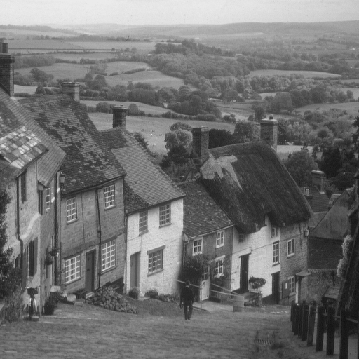 |  |  |
| lenna |  |  |  |
| peppers | 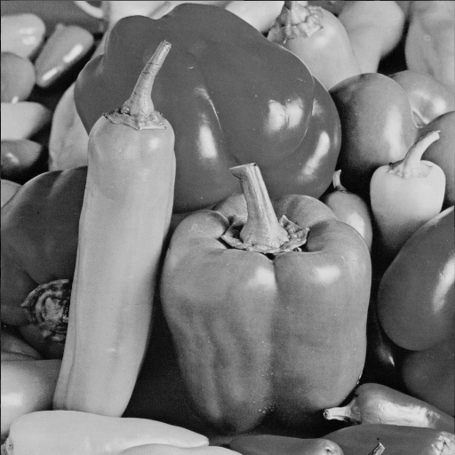 |  |  |

</details>

### Synthetic

<details>
<summary>Show Synthetic original images and map pairs</summary>

Each row links the original PNG with baseline and CSF SVG maps generated from VVenC `D_QP` traces at the same image size and QP. A denser CSF map indicates more small CUs selected by the encoder.

| Image | Original | Baseline | CSF |
| --- | --- | --- | --- |
| fine_texture_512x512 |  |  |  |
| mixed_content_512x512 | 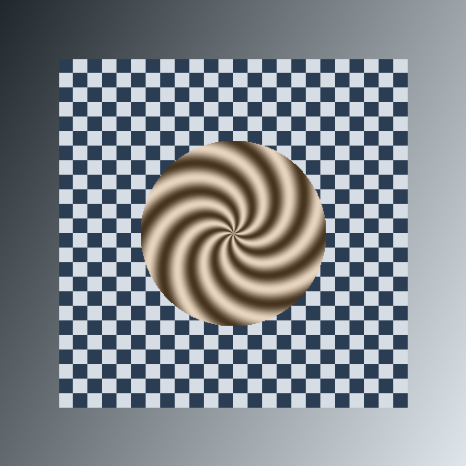 |  |  |
| sharp_edges_512x512 |  |  |  |
| smooth_gradient_512x512 |  |  |  |

</details>

### Kodak

<details>
<summary>Show Kodak original images and map pairs</summary>

Each row links the original PNG with baseline and CSF SVG maps generated from VVenC `D_QP` traces at the same image size and QP. A denser CSF map indicates more small CUs selected by the encoder.

| Image | Original | Baseline | CSF |
| --- | --- | --- | --- |
| kodim01 |  |  |  |
| kodim02 |  |  |  |
| kodim03 |  |  |  |
| kodim04 |  |  |  |
| kodim05 |  |  |  |
| kodim06 | 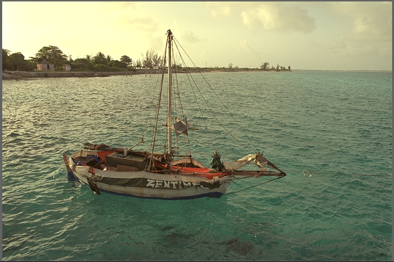 |  |  |
| kodim07 |  |  |  |
| kodim08 | 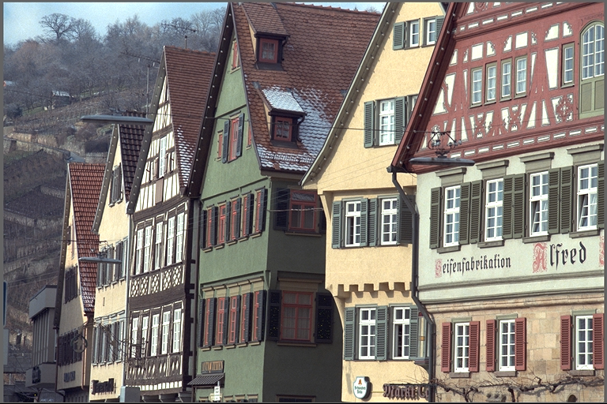 |  |  |
| kodim09 | 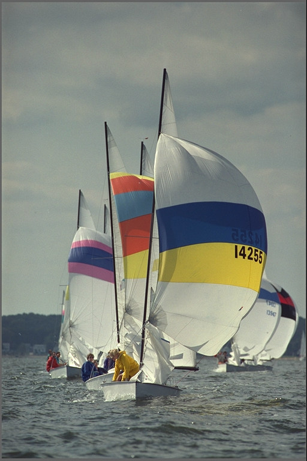 |  |  |
| kodim10 |  |  |  |
| kodim11 |  |  |  |
| kodim12 | 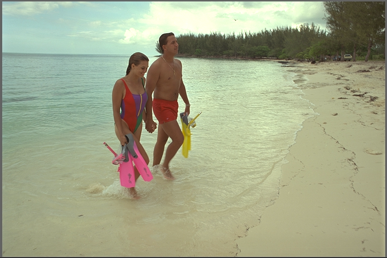 |  |  |
| kodim13 | 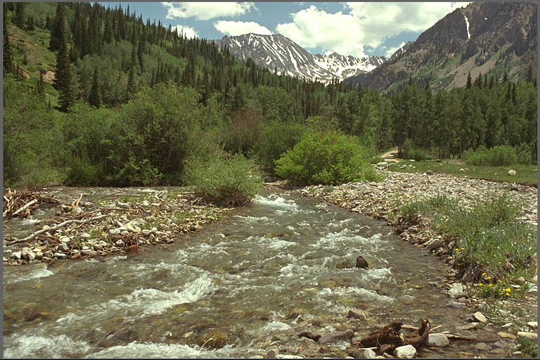 |  |  |
| kodim14 |  |  |  |
| kodim15 |  |  |  |
| kodim16 |  |  |  |
| kodim17 | 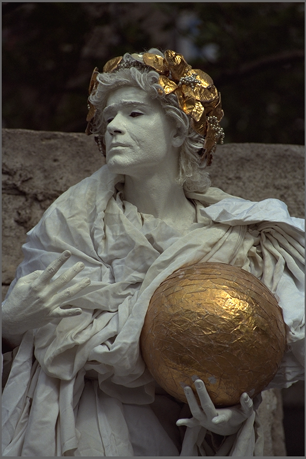 |  |  |
| kodim18 |  |  |  |
| kodim19 |  |  |  |
| kodim20 |  |  |  |
| kodim21 |  |  |  |
| kodim22 | 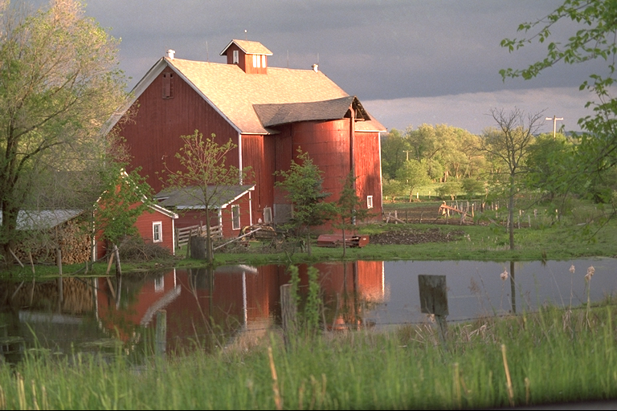 |  |  |
| kodim23 |  |  |  |
| kodim24 | 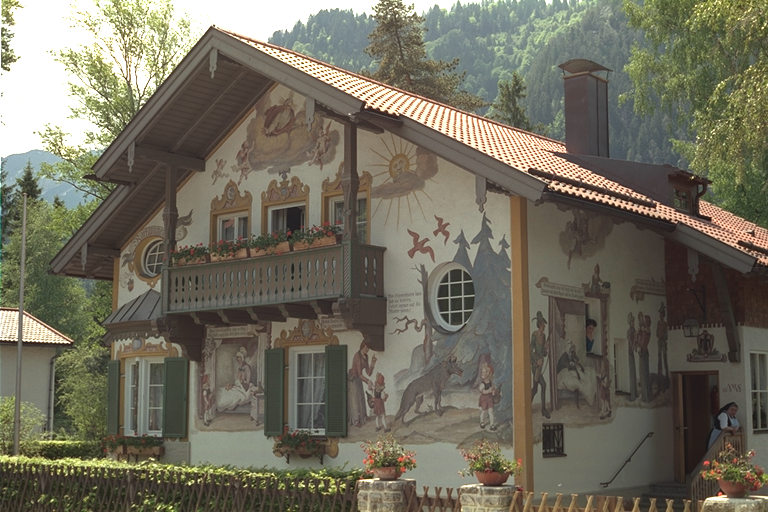 |  |  |

</details>

## How to Extend

This benchmark is designed to be easily extensible. You can customize the image inputs or add new visual quality metrics.

### Adding a Custom Image Set
1. Create a subdirectory under `data/datasets/images/` containing your input images in PNG format (e.g., `data/datasets/images/custom_set/png/`).
2. Update the paths in `configs/image_benchmark.ini` or pass your custom directory via the `--smoke-dir`, `--synthetic-dir`, or `--kodak-dir` CLI arguments when invoking `run_all.py`.

### Adding a Custom Quality Metric
1. Implement the luma metric calculation function in `metrics/image_quality.py`.
2. Update the `calculate_luma_metrics()` function in `metrics/image_quality.py` to execute your new metric and append its score to the returned dictionary.
3. Add a tuple with the metric's CSV key, short label, and chart label to `_METRIC_DEFS` in `metrics/registry.py`. All report scripts pick up the new metric automatically.

## Current Conclusion

The CSF integration passes the mechanical checks used by this benchmark: `--CSFScalingList 1` is accepted, generated bitstreams decode through VVdeC, encoder reconstruction matches decoded output, matrices are signaled, and the tables, RD charts, and CU partition maps are regenerated from repository scripts.

Across the current standard grayscale, synthetic, and Kodak datasets, the average same-QP and equal-bpp deltas remain negative for most quality metrics. This means the current CSF matrix shape does not outperform the default encoder configuration under the fixed conditions used here.
