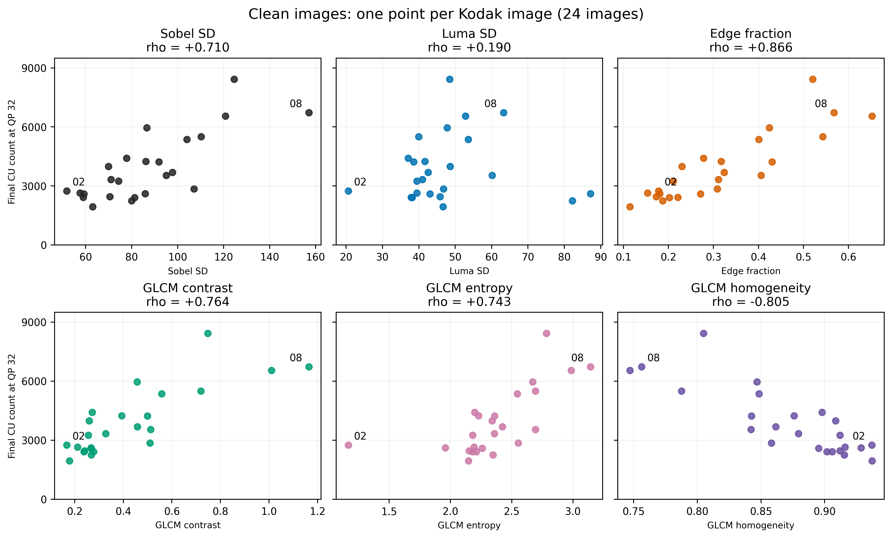
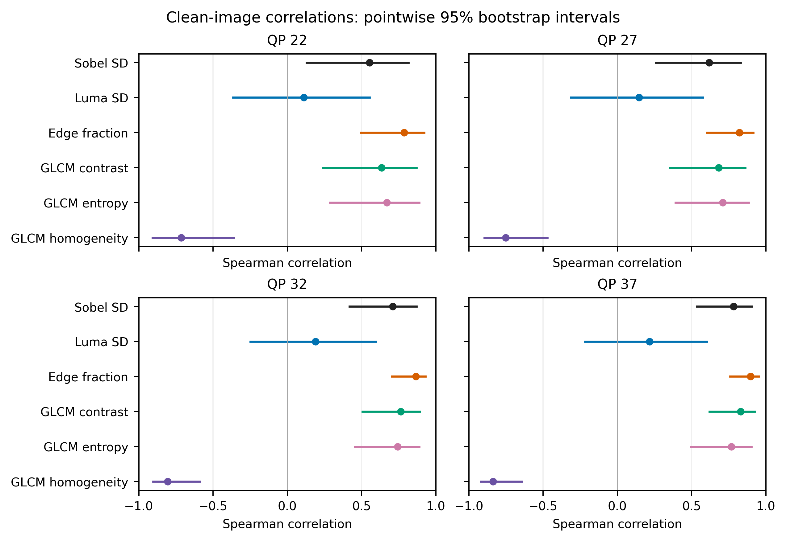
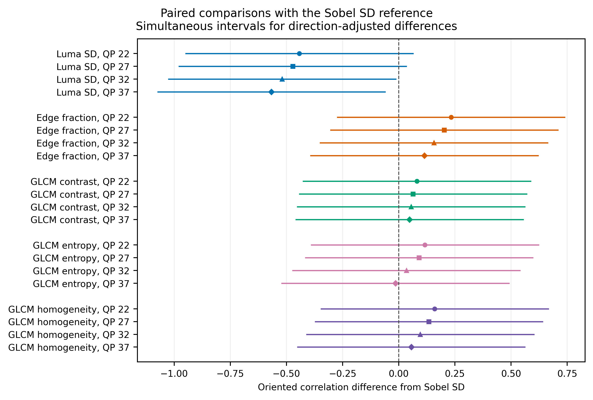
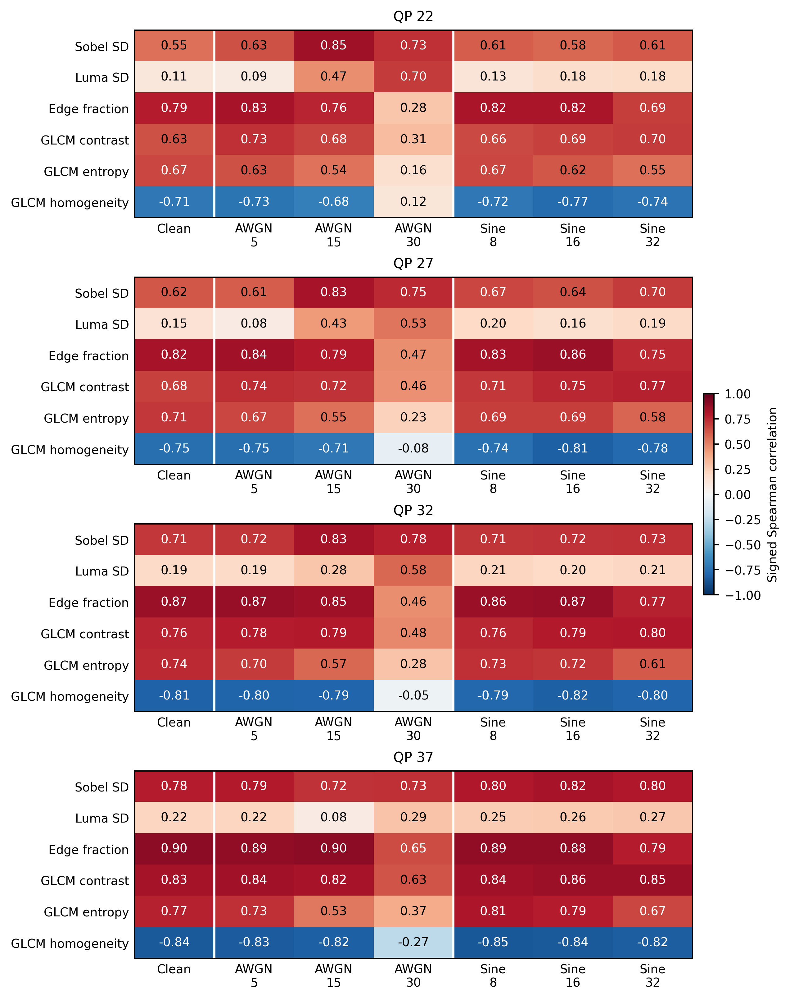
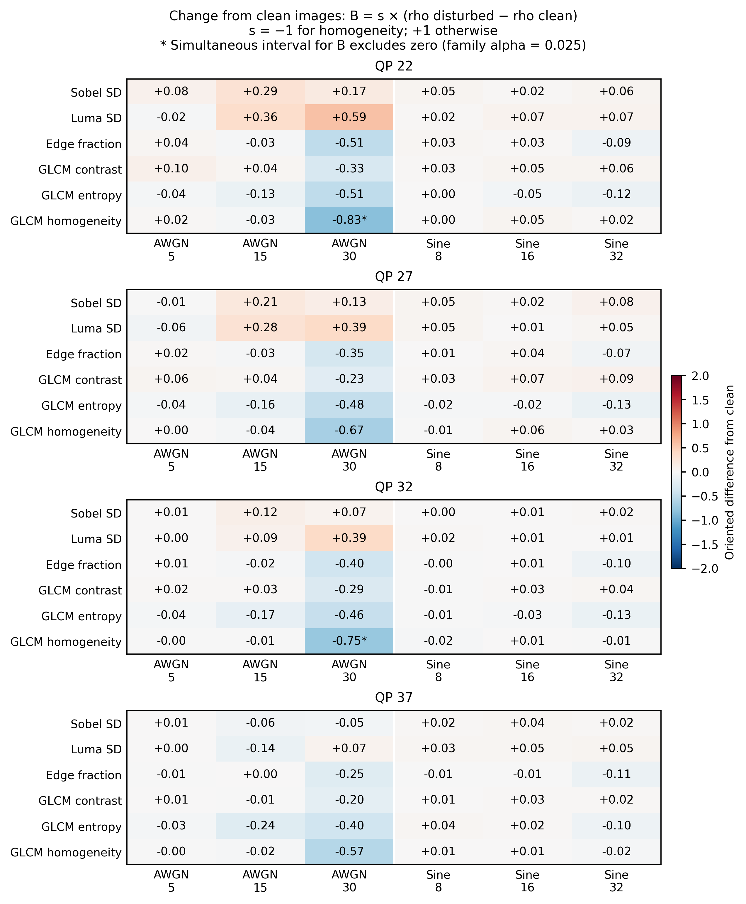
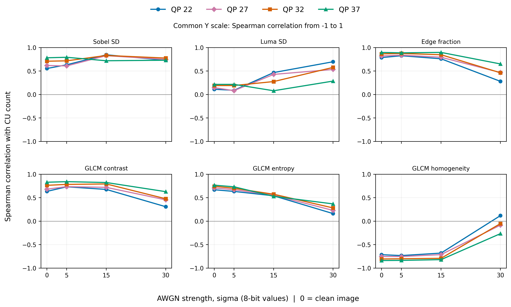
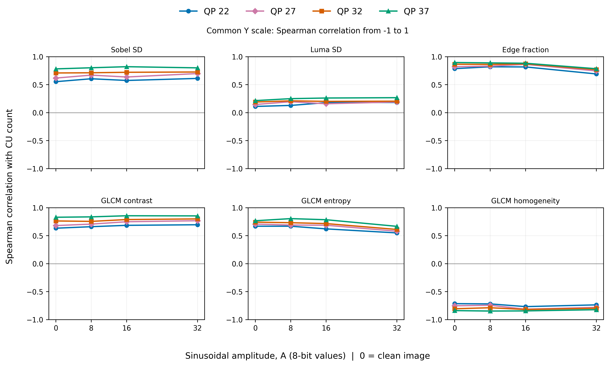
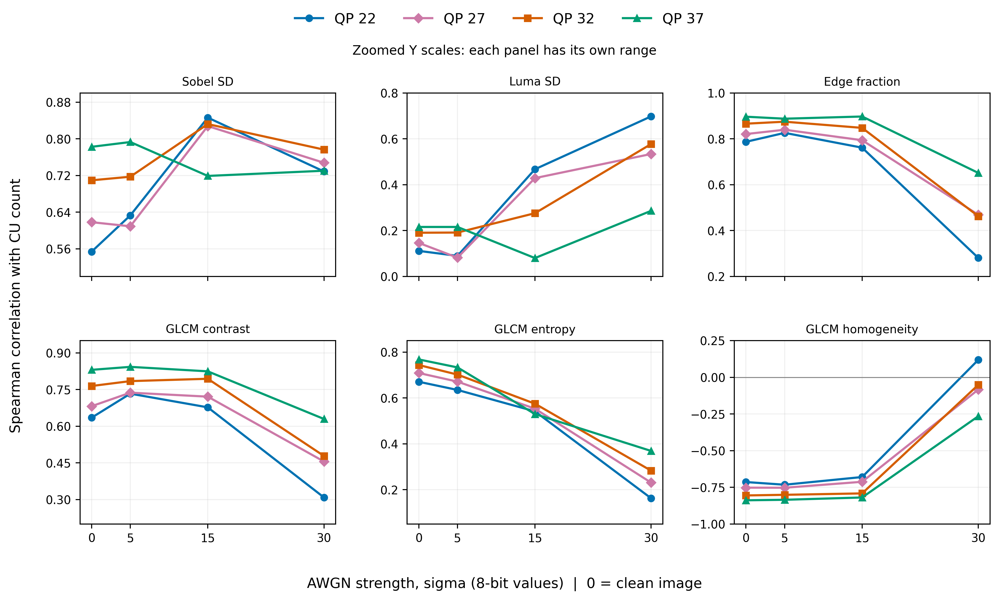
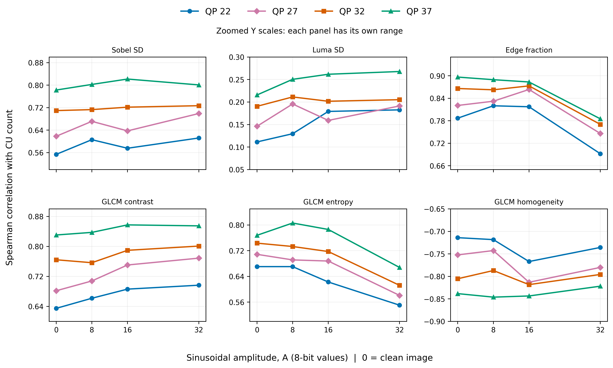

# VTM Image Complexity and Block Partitioning

This study extends the [content-partition study](../README.md) by comparing six image-complexity measures with the final luma coding-unit (CU) count produced by the unmodified VTM 23.0 reference encoder in single-frame intra coding.

The focus of this extension is how these associations change after adding Gaussian noise and sinusoidal bands at a fixed QP. Clean-image correlations provide the reference for evaluating disturbance effects. Paired comparisons quantify the magnitude and uncertainty of the changes and identify which changes are supported in the studied sample. Together, these results characterize the sensitivity of descriptor–CU associations to the tested disturbances.

## Key Findings

- Edge fraction has the largest positive point correlation at every clean-image QP.
- GLCM contrast and entropy have positive clean-image correlations; homogeneity has a negative correlation. Brightness spread (Luma SD) is less strongly associated with CU count in these images.
- The simultaneous comparisons do not establish that any candidate has a stronger association than Sobel.
- GLCM homogeneity under AWGN at level 30 has a weaker direction-adjusted association at QP 22, 32. Other disturbance comparisons remain inconclusive.

## Experimental Protocol

| Item | Setting |
| --- | --- |
| Encoder | Unmodified VTM 23.0; trace-enabled build for final CU boundaries |
| Configuration | Single-frame all-intra, [vtm_encoder_intra.cfg](../../../configs/vtm_encoder_intra.cfg) |
| Input | OpenCV planar YUV 4:4:4 conversion; 8-bit input, 10-bit internal processing |
| Images | 24 Kodak images; 393,216 pixels per image |
| Clean-image QPs | 22, 27, 32, 37 |
| Disturbance QPs | 22, 27, 32, 37 |
| Gaussian noise (AWGN) | Nominal sigma 5, 15, 30; base seeds 20260811, 20260812, 20260813 |
| Sinusoidal bands | Horizontal; amplitude 8, 16, 32; period 16 pixels; phase zero |
| Measurements | 312 saved stimuli; 1,248 encodings |
| Consistency checks | Decoder output matches encoder reconstruction; CU rectangles cover the coded image |

AWGN adds the same random field to each color channel before rounding and clipping. Noise levels for one image and base seed scale the same field. Nominal sigma and amplitude differ from the actual luma RMS after clipping; the measured RMS is included in the CSVs.

## Complexity Measures

[Zhang et al., *An Adaptive Infrared Image Preprocessing Method Based on Background Complexity Descriptors*](https://doi.org/10.1109/IMCCC.2018.00079) compares GLCM entropy, edge-pixel ratio, GLCM contrast, GLCM correlation and GLCM energy for infrared preprocessing. Here, edge fraction, contrast and entropy are compared with Sobel SD, Luma SD and homogeneity. This examines three of the paper's descriptor types with explicit parameters; it does not reproduce its full method or combined score.

All descriptors are calculated from the actual input PNG, using its OpenCV 8-bit luma plane Y. SD means population standard deviation. No resizing, denoising or intensity normalization is applied.

| Measure | What it describes | Definition |
| --- | --- | --- |
| Sobel SD | Variation in local gradient strength | SD of the unnormalized 3 × 3 Sobel gradient magnitude; exclude the one-pixel border |
| Luma SD | Spread of pixel brightness, regardless of arrangement | SD of all Y pixels |
| Edge fraction | Fraction of pixels with strong local brightness changes | Fraction of interior pixels with summed absolute response to four directional Sobel masks > 150 |
| GLCM contrast | Differences between neighboring gray levels | Mean over directions of `sum(P(i,j) × (i-j)^2)` |
| GLCM entropy | Diversity of neighboring gray-level pairs | Mean over directions of `-sum(P(i,j) × ln(P(i,j)))`; `0 ln(0) = 0` |
| GLCM homogeneity | Local similarity of gray levels | Mean over directions of `sum(P(i,j) / (1 + (i-j)^2))` |

GLCM is the gray-level co-occurrence matrix: how often neighboring gray levels occur together. Y is quantized to eight levels as `floor(8 × Y / 256)`. Offsets `(row, column)` are `(0,1), (1,1), (1,0), (1,-1)`. Each matrix uses valid pairs, is symmetrized and normalized separately; the resulting feature values are averaged. The exact edge masks and formulas are in [spatial_complexity.py](../../../vvenc_csf/spatial_complexity.py). The edge masks and threshold follow [Zhao et al.](https://doi.org/10.3390/electronics11142147); the GLCM-setting comparison is motivated by [Bakkouri et al.](https://doi.org/10.3390/app16031368). The 32-level and horizontal-only GLCMs are sensitivity checks.

## Statistical Method

For each fixed QP, disturbance level and seed, Spearman rho compares the ordering of the same 24 images by a descriptor and by CU count. Near +1 means larger descriptor values tend to accompany more CUs; near −1 means fewer CUs; near zero means little consistent increasing or decreasing ordering. A coefficient describes the group of images, not one image. CU density is `1,000,000 × CU count / coded area`; equal image areas make its ranks identical to CU-count ranks.

The primary AWGN realization uses base seed 20260811. Seeds 20260812 and 20260813 are analyzed separately. QP, noise levels and seeds do not increase the number of independent images beyond 24.

Pointwise 95% correlation intervals use 99,999 paired image-bootstrap samples (seed 20260905), with average ranks for ties and reranking within each sample. The same sampled images are used across conditions. Simultaneous comparisons cover 20 candidate-versus-Sobel contrasts and 144 disturbed-versus-clean contrasts. Basic maximum-error intervals use alpha 0.025 per family, for a combined nominal error rate of 0.05. Finite-sample coverage is approximate. Direction is positive for five descriptors and negative for homogeneity; raw signed correlations are shown throughout. An interval containing zero is inconclusive.

Sobel SD is the reference descriptor inherited from the original study, not an established best descriptor. For descriptor k, let `s[k] = +1` for Sobel SD, Luma SD, edge fraction, contrast and entropy, and `s[k] = −1` for homogeneity. These directions were fixed before the descriptor comparison; they are not estimated from the clean correlations. Clean-image comparisons with Sobel use `A = s[k] × rho[k, clean, QP] − rho[Sobel, clean, QP]`. Disturbance comparisons use `B = s[k] × (rho[k, disturbed, QP] − rho[k, clean, QP])`. Negative B means weakening in the expected direction, not necessarily a smaller absolute correlation.

Auxiliary tests of independence use 99,999 permutations (seed 20260906) with Holm correction over 168 primary correlations. They do not test differences between correlations. [study_statistics.py](../../../vvenc_csf/study_statistics.py) implements these calculations.

## Clean Images

<details>
<summary>Image examples and all-image scatter plots at QP 32</summary>

The two examples retain the low- and high-Sobel images used in the original study. Both maps show final CU boundaries at QP 32. More CUs mean smaller blocks on average.

| | kodim02.png | kodim08.png |
| --- | :---: | :---: |
| Input |  |  |
| CU map, QP 32 |  |  |
| CU count | 2,747 | 6,732 |
| Sobel SD | 51.754 | 157.114 |
| Luma SD | 20.594 | 63.282 |
| Edge fraction | 0.178 | 0.568 |
| GLCM contrast | 0.167 | 1.164 |
| GLCM entropy | 1.166 | 3.143 |
| GLCM homogeneity | 0.937 | 0.756 |

The scatter plots show all 24 clean images at QP 32. Each point is one image; labels 02 and 08 identify the examples above. All panels use the same CU-count scale.



These scatter plots expose the observations behind the correlations. Their appearance alone is not an influence test; the omission analysis below checks the two labelled images explicitly.

</details>

### Correlation at Each QP

| Measure | QP 22 | QP 27 | QP 32 | QP 37 |
| --- | ---: | ---: | ---: | ---: |
| Sobel SD | 0.554 | 0.618 | 0.710 | 0.783 |
| Luma SD | 0.111 | 0.146 | 0.190 | 0.216 |
| Edge fraction | 0.787 | 0.821 | 0.866 | 0.897 |
| GLCM contrast | 0.635 | 0.682 | 0.764 | 0.830 |
| GLCM entropy | 0.670 | 0.709 | 0.743 | 0.768 |
| GLCM homogeneity | -0.714 | -0.752 | -0.805 | -0.838 |



Dots are estimated correlations; horizontal lines are pointwise 95% bootstrap confidence intervals. They show uncertainty in each correlation, without adjustment for inspecting multiple intervals. The Luma SD intervals include zero at all four QPs, which leaves substantial uncertainty about its association; this does not establish absence of an association. The Holm-adjusted independence tests are reported separately in the CSV.

A larger point estimate alone does not establish a better descriptor. The paired candidate-versus-Sobel comparisons answer a different question from individual correlation intervals; overlap of those individual intervals is not the comparison test.

<details>
<summary>Paired comparisons with Sobel SD</summary>



These are simultaneous intervals for A. Luma SD has a weaker association than Sobel at QP 32 and 37. The remaining candidate comparisons are inconclusive; that does not establish equivalence to Sobel.

</details>

## Disturbance Effects

The first map shows signed correlations for every primary condition, with a shared −1 to +1 color scale. Each cell compares the same 24 images at one QP. The clean column is the reference for the change map.



The second map shows B, the direction-adjusted difference from clean images. Its values are correlation differences, whose possible range is −2 to +2. The shared color scale runs from −2 to +2; use the cell values to compare their magnitude.



**An asterisk (*) means that the simultaneous confidence interval for B excludes zero**, using all 144 disturbed-versus-clean comparisons as one family. It does not mark a sign change in rho, nor whether an individual correlation interval contains zero. No asterisk means the comparison is inconclusive, not that the descriptor is proven stable.

<details>
<summary>Disturbance trends on a common correlation scale</summary>

Each line keeps QP fixed, zero disturbance is the clean reference, and each point uses 24 images. All panels in both figures use the same −1 to +1 vertical range. Lines connect tested levels without fitting a model. These plots repeat the raw correlations in the first map; the second map additionally shows paired differences and inference. Slope magnitudes across AWGN sigma and sinusoidal amplitude are not interchangeable because the horizontal quantities differ.

### Gaussian Noise

These curves show the primary AWGN realization, base seed 20260811. The other two realizations are reported separately in the sensitivity table below and the complete correlation CSV. We do not pool seeds as independent images.



### Sinusoidal Bands



</details>

<details>
<summary>Magnified trends for reading close QP curves</summary>

These supplementary views use a separate vertical range for each descriptor. Compare QPs within a panel; equal visual slopes across panels can represent different numerical changes. The common-scale figures above support cross-panel comparison.





</details>

### Comparisons Supported by the Simultaneous Intervals

Positive differences mean a stronger association in the expected direction; negative differences mean a weaker one. For homogeneity, weakening means a shift away from its expected negative association. All remaining comparisons are retained in the complete CSV.

| Measure | Condition | QP | Direction-adjusted difference | Simultaneous interval |
| --- | --- | ---: | ---: | --- |
| GLCM homogeneity | AWGN, level 30 versus clean | 22 | -0.833 | [-1.533, -0.133] |
| GLCM homogeneity | AWGN, level 30 versus clean | 32 | -0.754 | [-1.454, -0.054] |
| Luma SD | Clean versus Sobel | 32 | -0.519 | [-1.025, -0.013] |
| Luma SD | Clean versus Sobel | 37 | -0.567 | [-1.073, -0.061] |

For example, homogeneity under AWGN sigma 30 illustrates the asterisk rule at all four QPs. Here B is the negative of disturbed-minus-clean rho because the fixed direction is −1.

| QP | Clean rho | AWGN rho | B | Simultaneous interval for B | Asterisk |
| ---: | ---: | ---: | ---: | --- | :---: |
| 22 | -0.714 | +0.119 | -0.833 | [-1.533, -0.133] | * |
| 27 | -0.752 | -0.083 | -0.669 | [-1.368, +0.031] | — |
| 32 | -0.805 | -0.051 | -0.754 | [-1.454, -0.054] | * |
| 37 | -0.838 | -0.265 | -0.573 | [-1.273, +0.127] | — |

The decision depends on the interval for the change, not on how close the disturbed rho is to zero. At QP 32 the raw correlation remains negative, yet the change interval excludes zero. At QP 27 it includes zero. Rounded cell values alone do not determine statistical support.


<details>
<summary>AWGN realization sensitivity: all descriptors, strengths and QPs</summary>

Each value below uses 24 images for one seed. The primary seed remains 20260811; additional seeds are sensitivity checks on these same images.

| Measure | Sigma | QP | Seed 20260811 | Seed 20260812 | Seed 20260813 |
| --- | ---: | ---: | ---: | ---: | ---: |
| Sobel SD | 5 | 22 | +0.633 | +0.640 | +0.608 |
| Sobel SD | 5 | 27 | +0.609 | +0.593 | +0.656 |
| Sobel SD | 5 | 32 | +0.717 | +0.710 | +0.712 |
| Sobel SD | 5 | 37 | +0.793 | +0.788 | +0.781 |
| Sobel SD | 15 | 22 | +0.846 | +0.834 | +0.854 |
| Sobel SD | 15 | 27 | +0.828 | +0.783 | +0.830 |
| Sobel SD | 15 | 32 | +0.832 | +0.783 | +0.792 |
| Sobel SD | 15 | 37 | +0.719 | +0.708 | +0.708 |
| Sobel SD | 30 | 22 | +0.729 | +0.756 | +0.671 |
| Sobel SD | 30 | 27 | +0.748 | +0.790 | +0.759 |
| Sobel SD | 30 | 32 | +0.777 | +0.798 | +0.815 |
| Sobel SD | 30 | 37 | +0.730 | +0.839 | +0.764 |
| Luma SD | 5 | 22 | +0.090 | +0.084 | +0.091 |
| Luma SD | 5 | 27 | +0.082 | +0.063 | +0.124 |
| Luma SD | 5 | 32 | +0.191 | +0.188 | +0.167 |
| Luma SD | 5 | 37 | +0.216 | +0.237 | +0.231 |
| Luma SD | 15 | 22 | +0.467 | +0.426 | +0.414 |
| Luma SD | 15 | 27 | +0.429 | +0.383 | +0.462 |
| Luma SD | 15 | 32 | +0.276 | +0.256 | +0.262 |
| Luma SD | 15 | 37 | +0.080 | +0.111 | +0.113 |
| Luma SD | 30 | 22 | +0.698 | +0.624 | +0.560 |
| Luma SD | 30 | 27 | +0.534 | +0.605 | +0.529 |
| Luma SD | 30 | 32 | +0.577 | +0.578 | +0.532 |
| Luma SD | 30 | 37 | +0.286 | +0.443 | +0.371 |
| Edge fraction | 5 | 22 | +0.826 | +0.820 | +0.817 |
| Edge fraction | 5 | 27 | +0.840 | +0.856 | +0.846 |
| Edge fraction | 5 | 32 | +0.875 | +0.867 | +0.898 |
| Edge fraction | 5 | 37 | +0.888 | +0.884 | +0.897 |
| Edge fraction | 15 | 22 | +0.761 | +0.759 | +0.764 |
| Edge fraction | 15 | 27 | +0.794 | +0.759 | +0.773 |
| Edge fraction | 15 | 32 | +0.848 | +0.815 | +0.843 |
| Edge fraction | 15 | 37 | +0.897 | +0.922 | +0.907 |
| Edge fraction | 30 | 22 | +0.280 | +0.372 | +0.295 |
| Edge fraction | 30 | 27 | +0.469 | +0.450 | +0.449 |
| Edge fraction | 30 | 32 | +0.463 | +0.472 | +0.490 |
| Edge fraction | 30 | 37 | +0.651 | +0.633 | +0.609 |
| GLCM contrast | 5 | 22 | +0.733 | +0.726 | +0.723 |
| GLCM contrast | 5 | 27 | +0.737 | +0.728 | +0.764 |
| GLCM contrast | 5 | 32 | +0.784 | +0.778 | +0.791 |
| GLCM contrast | 5 | 37 | +0.843 | +0.836 | +0.849 |
| GLCM contrast | 15 | 22 | +0.677 | +0.668 | +0.697 |
| GLCM contrast | 15 | 27 | +0.721 | +0.668 | +0.691 |
| GLCM contrast | 15 | 32 | +0.794 | +0.738 | +0.784 |
| GLCM contrast | 15 | 37 | +0.824 | +0.825 | +0.819 |
| GLCM contrast | 30 | 22 | +0.309 | +0.376 | +0.306 |
| GLCM contrast | 30 | 27 | +0.456 | +0.475 | +0.457 |
| GLCM contrast | 30 | 32 | +0.478 | +0.487 | +0.517 |
| GLCM contrast | 30 | 37 | +0.630 | +0.659 | +0.588 |
| GLCM entropy | 5 | 22 | +0.635 | +0.646 | +0.641 |
| GLCM entropy | 5 | 27 | +0.671 | +0.665 | +0.694 |
| GLCM entropy | 5 | 32 | +0.702 | +0.683 | +0.703 |
| GLCM entropy | 5 | 37 | +0.733 | +0.729 | +0.742 |
| GLCM entropy | 15 | 22 | +0.541 | +0.537 | +0.523 |
| GLCM entropy | 15 | 27 | +0.553 | +0.508 | +0.553 |
| GLCM entropy | 15 | 32 | +0.575 | +0.568 | +0.568 |
| GLCM entropy | 15 | 37 | +0.530 | +0.568 | +0.544 |
| GLCM entropy | 30 | 22 | +0.162 | +0.156 | +0.079 |
| GLCM entropy | 30 | 27 | +0.230 | +0.283 | +0.247 |
| GLCM entropy | 30 | 32 | +0.283 | +0.266 | +0.265 |
| GLCM entropy | 30 | 37 | +0.369 | +0.442 | +0.320 |
| GLCM homogeneity | 5 | 22 | -0.732 | -0.713 | -0.724 |
| GLCM homogeneity | 5 | 27 | -0.753 | -0.737 | -0.777 |
| GLCM homogeneity | 5 | 32 | -0.801 | -0.771 | -0.800 |
| GLCM homogeneity | 5 | 37 | -0.835 | -0.808 | -0.849 |
| GLCM homogeneity | 15 | 22 | -0.680 | -0.671 | -0.710 |
| GLCM homogeneity | 15 | 27 | -0.712 | -0.677 | -0.698 |
| GLCM homogeneity | 15 | 32 | -0.791 | -0.748 | -0.791 |
| GLCM homogeneity | 15 | 37 | -0.819 | -0.839 | -0.825 |
| GLCM homogeneity | 30 | 22 | +0.119 | +0.039 | +0.042 |
| GLCM homogeneity | 30 | 27 | -0.083 | -0.045 | -0.117 |
| GLCM homogeneity | 30 | 32 | -0.051 | -0.048 | -0.144 |
| GLCM homogeneity | 30 | 37 | -0.265 | -0.238 | -0.269 |

</details>

<details>
<summary>Influence of images 02 and 08 on clean-image correlations</summary>

This exploratory check removes both labelled images together and recalculates ranks for the remaining 22 images. The pair was chosen after inspecting the examples, so this is an additional sensitivity check rather than a prespecified confirmation. The main results continue to use all 24 images. No new confidence intervals or significance tests are inferred for the reduced sample.

Each entry is full-sample rho → rho without images 02 and 08.

| Measure | QP 22 | QP 27 | QP 32 | QP 37 |
| --- | ---: | ---: | ---: | ---: |
| Sobel SD | +0.554 → +0.600 | +0.618 → +0.617 | +0.710 → +0.679 | +0.783 → +0.744 |
| Luma SD | +0.111 → +0.099 | +0.146 → +0.098 | +0.190 → +0.100 | +0.216 → +0.082 |
| Edge fraction | +0.787 → +0.857 | +0.821 → +0.843 | +0.866 → +0.860 | +0.897 → +0.884 |
| GLCM contrast | +0.635 → +0.705 | +0.682 → +0.698 | +0.764 → +0.747 | +0.830 → +0.801 |
| GLCM entropy | +0.670 → +0.750 | +0.709 → +0.737 | +0.743 → +0.721 | +0.768 → +0.729 |
| GLCM homogeneity | -0.714 → -0.791 | -0.752 → -0.776 | -0.805 → -0.791 | -0.838 → -0.811 |

The raw correlation sign is retained in 24/24 cells. The largest absolute rho change is 0.134 for Luma SD at QP 37. The candidate-versus-Sobel point difference keeps its sign in 20/20 comparisons. These point-estimate checks do not establish unchanged statistical support or eliminate influence from other images.

The existing leave-one-image-out analysis reranks 23 images after each individual omission. Its clean candidate-versus-Sobel point differences span zero for GLCM entropy at QP 32 and 37; the other clean comparisons retain their point-difference signs. This further limits any claim of a universal descriptor ranking. The [omission table](tables/image_omission_sensitivity.csv) includes those ranges and the two-image omission results.

</details>

## Data

Leave-one-image-out comparisons, GLCM parameter changes and within-image descriptor/CU changes are supplementary checks. All measurements and comparisons are retained in these tables.

| What can be checked | CSV |
| --- | --- |
| Complexity values for each clean or disturbed input image | [stimulus_features](tables/stimulus_features.csv) |
| Complexity values and final CU counts for the same image and QP | [joined_measurements](tables/joined_measurements.csv) |
| Correlations and their uncertainty at every tested QP and disturbance condition | [correlations](tables/correlations.csv) |
| Whether differences from Sobel or from the clean-image correlation are supported | [contrasts](tables/contrasts.csv) |
| How correlations change with the GLCM settings | [parameter_sensitivity](tables/parameter_sensitivity.csv) |
| How strongly the complexity descriptors relate to one another | [clean_feature_associations](tables/clean_feature_associations.csv) |
| GLCM values for each separate neighbor direction | [direction_features](tables/direction_features.csv) |
| How comparisons change when each image is left out in turn | [leave_one_out_contrasts](tables/leave_one_out_contrasts.csv) |
| Supplementary association between within-image descriptor and CU changes | [paired_change_correlations](tables/paired_change_correlations.csv) |
| Individual descriptor and CU changes relative to the clean image | [paired_changes](tables/paired_changes.csv) |
| Exploratory removal of images 02/08 and single-image omission ranges | [image_omission_sensitivity](tables/image_omission_sensitivity.csv) |

## Reproduction

From the repository root, regenerate the README and figures from the saved CSVs:

```powershell
python tools/reporting/report_vtm_spatial_complexity.py
```

Use `--analysis-dir <directory>` to select another completed analysis and `--output <directory>` to write elsewhere. This command also recalculates the descriptive image-omission check; it performs no encoding or statistical resampling. To recompute the descriptors and statistical analysis from the saved input images and measurements, then verify the result:

```powershell
python tools/research/analyze_vtm_spatial_complexity.py all
python tools/research/verify_vtm_spatial_complexity_analysis.py --analysis-dir results/vtm_content_partition_four_qp/analysis_workspace/analysis
python tools/reporting/report_vtm_spatial_complexity.py --analysis-dir results/vtm_content_partition_four_qp/analysis_workspace/analysis
```

The analysis writes CSV tables and bootstrap caches to the results directory shown above; resampling can take time. Use the analysis command's `--output <directory>` to select another directory and pass it to the verifier. The [encoding runner](../../../tools/research/complete_vtm_four_qp_study.py) provides the VTM measurements.

## Limitations

The results describe 24 Kodak images in single-frame intra coding, one VTM configuration and the tested disturbances. Additional seeds reuse the same images; sinusoidal bands have one orientation and period. No temporal prediction, motion or video-sequence behavior is evaluated. The tested synthetic disturbances do not represent every acquisition artifact. The measured endpoint is final image-level CU count, not local split prediction or the encoder's search cost. A high correlation does not by itself make a descriptor a validated predictor or a fast partitioning algorithm. These associations do not establish causation, predictive accuracy, encoding speedup or improved visual quality. Validation on new images is needed before generalizing the findings.
