# VTM QP Study

This focused study compares VTM 23.0 baseline and VTM 23.0 CSF on five standard grayscale images and their color counterparts.

The focused runner defaults to OpenCV 4:4:4 RGB->YUV conversion (`--conversion opencv_444`) to match the external validation methodology more closely. Use `--conversion ffmpeg_444` when a canonical FFmpeg video-conversion control run is needed.

Primary scientific metrics are PSNR-RGB and MS-SSIM-RGB, because these two metric paths were cross-checked in the VTM validation reports. PSNR-HVS-M luma, HaarPSI luma, and MS-SSIM luma are computed with pinned published algorithms and explicit implementation provenance.

Metric provenance:

| Metric | Implementation | Evidence / source |
| --- | --- | --- |
| PSNR-RGB | local implementation, externally cross-checked | [Duan et al. validation report](../vtm_validation/lossy-vae/README.md) |
| MS-SSIM-RGB | local implementation, protocol/RD cross-checked | [CompressAI validation report](../vtm_validation/compressai/README.md) |
| PSNR-HVS-M luma | NumPy/SciPy port of authors' MATLAB implementation | [author page and MATLAB source](https://www.ponomarenko.info/psnrhvsm.htm); [audit copy and port notes](../../third_party/psnr_hvs_m/SOURCE.md) |
| HaarPSI luma | authors' Python/NumPy implementation | [authors' project and implementation](https://www.math.uni-bremen.de/cda/HaarPSI/); [audit copy](../../third_party/haarpsi/SOURCE.md) |
| PSNR-Y | codec log | [VTM EncoderApp source](https://github.com/ooplisko/VVCSoftware_VTM_CSF/blob/feature/csf-scaling-list/source/Lib/EncoderLib/EncGOP.cpp) |
| MS-SSIM luma | Wang et al. algorithm | [Wang-Simoncelli-Bovik paper](https://ece.uwaterloo.ca/~z70wang/publications/msssim.pdf); [numerical regression tests](../../tests/test_image_quality.py) |

### Metric implementations

- **MS-SSIM luma** implements the five-scale product formulation by Wang, Simoncelli, and Bovik with the published weights, 11x11 Gaussian window, symmetric 2x2 low-pass filtering, and dyadic downsampling. A fixed numerical regression test is cross-checked against `sewar==0.4.6`.
- **HaarPSI luma** directly calls the authors' MIT-licensed Python/NumPy implementation with its default viewing-distance preprocessing. The exact upstream source and license are vendored under [`third_party/haarpsi/`](../../third_party/haarpsi/).
- **PSNR-HVS-M luma** uses a NumPy/SciPy port of Nikolay Ponomarenko's original MATLAB implementation: the same 8x8 DCT, CSF matrix, masking matrix, between-coefficient contrast masking, and block traversal. Four regression cases match values generated by the original MATLAB code under Octave. The original source is retained under [`third_party/psnr_hvs_m/`](../../third_party/psnr_hvs_m/) for auditability.

Here, *reference implementation* means code supplied by an algorithm's authors. HaarPSI satisfies that definition directly. PSNR-HVS-M is identified more narrowly as a source-faithful Python port because the authors supplied MATLAB rather than Python code. MS-SSIM is identified by the published algorithm and pinned numerical regression, since no single implementation defines a universal bit-exact standard.

## Reproduce

```powershell
python tools\research\run_vtm_qp_study.py --clean
python tools\reporting\report_vtm_qp_study.py
```

The runner writes long intermediate codec output under `results/vtm_qp_study/`. This README and the compact artifacts are stored under `docs/vtm_qp_study/`.

## Standard Grayscale

Metrics CSV: [`standard_grayscale/image_metrics.csv`](standard_grayscale/image_metrics.csv)

| Image | QP points | Mean bpp delta, % | PSNR-Y | MS-SSIM luma | PSNR-HVS-M luma | HaarPSI luma |
| --- | --- | --- | --- | --- | --- | --- |
| baboon | 4 | -2.087 | -1.428475 | -0.001589 | -0.564236 | -0.006976 |
| barbara | 4 | -4.219 | -0.807900 | -0.000576 | -0.101467 | -0.001511 |
| goldhill | 4 | -3.632 | -0.628175 | -0.000823 | -0.243027 | -0.002599 |
| lenna | 4 | -3.783 | -0.377150 | -0.000283 | -0.140706 | -0.001584 |
| peppers | 4 | -3.369 | -0.457975 | -0.000431 | -0.140805 | -0.001259 |

### Comparative interpretation

The ordinal robustness rank orders the images independently for each quality metric by the mean CSF-minus-baseline delta, then sums those ranks. It does not average dB and unitless indices. A lower rank sum means that the image retained quality more consistently across the selected metrics.

Absolute metric values should not be used to declare that one source image has inherently better visual quality than another: image content, texture, and visual masking affect metric scales. The comparison below therefore measures the effect of CSF against the baseline reconstruction of the same image.

| Image | Robustness rank sum | Mean BPP delta, % | Mean CU-count delta, % | Mean CU-area delta, % |
| --- | --- | --- | --- | --- |
| lenna | 7 | -3.783 | 25.7 | -18.3 |
| peppers | 8 | -3.369 | 30.0 | -17.1 |
| barbara | 10 | -4.219 | 50.8 | -33.6 |
| goldhill | 15 | -3.632 | 35.2 | -23.6 |
| baboon | 20 | -2.087 | 70.8 | -41.3 |

**Result:** Lenna is the most robust grayscale image overall, with Peppers close behind. Baboon ranks last for every selected metric and is therefore the clearest adverse case for the CSF matrix.

The partition statistics show encoder decisions rather than visual quality. Positive CU-count deltas and negative CU-area deltas mean that CSF produced more, smaller coding units. Baboon exhibits the largest partitioning shift and the largest quality loss, but with only five images this is an exploratory association, not evidence that finer partitioning causes the loss.

<details>
<summary><strong>Baboon</strong>: QP curves and partition maps</summary>

| QP chart | QP chart |
| --- | --- |
| **PSNR-Y, dB**<br>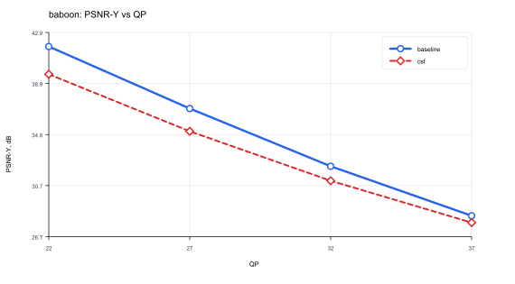 | **MS-SSIM luma index**<br>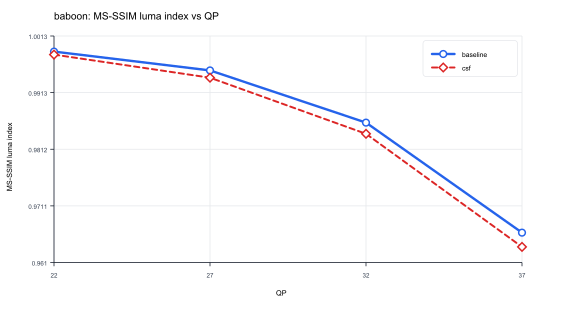 |
| **PSNR-HVS-M luma, dB**<br>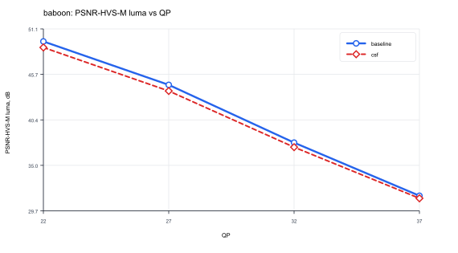 | **HaarPSI luma index**<br>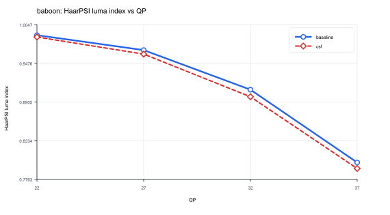 |

Partition-map overlays at QP=32:

| Baseline | CSF |
| --- | --- |
| 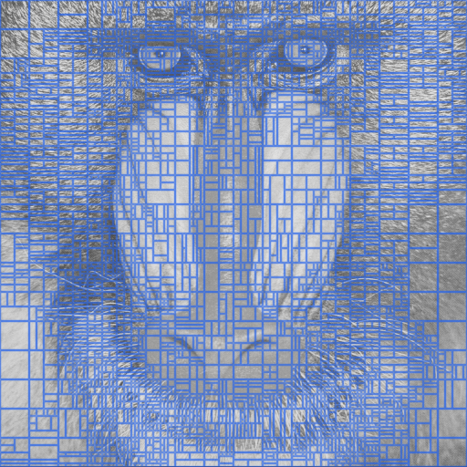 | 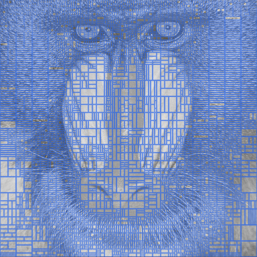 |

</details>

<details>
<summary><strong>Barbara</strong>: QP curves and partition maps</summary>

| QP chart | QP chart |
| --- | --- |
| **PSNR-Y, dB**<br>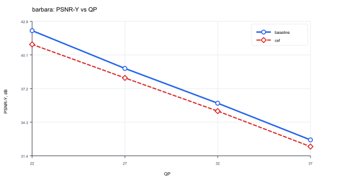 | **MS-SSIM luma index**<br> |
| **PSNR-HVS-M luma, dB**<br>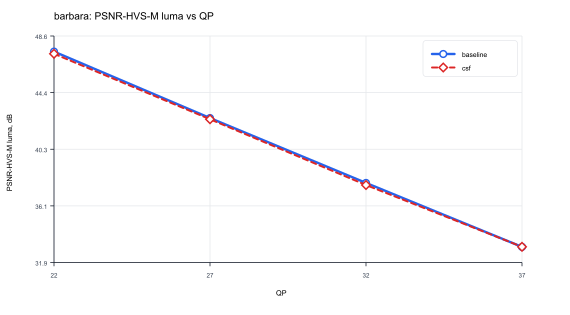 | **HaarPSI luma index**<br>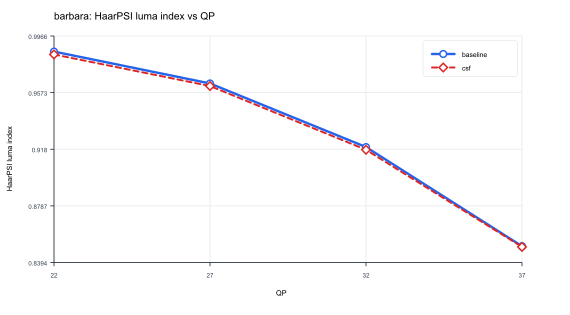 |

Partition-map overlays at QP=32:

| Baseline | CSF |
| --- | --- |
| 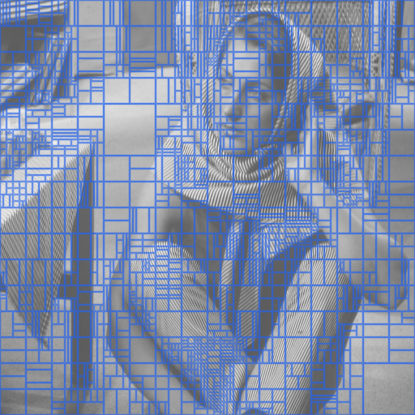 | 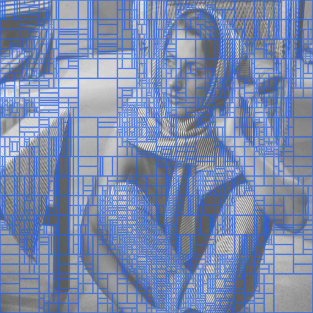 |

</details>

<details>
<summary><strong>Goldhill</strong>: QP curves and partition maps</summary>

| QP chart | QP chart |
| --- | --- |
| **PSNR-Y, dB**<br>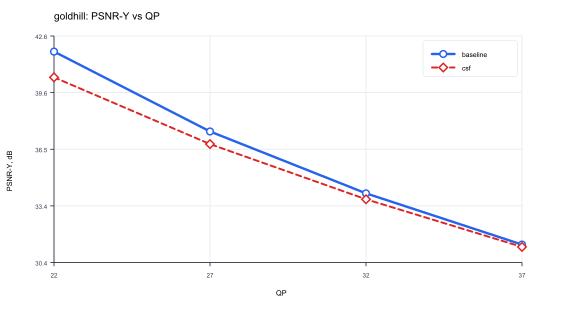 | **MS-SSIM luma index**<br>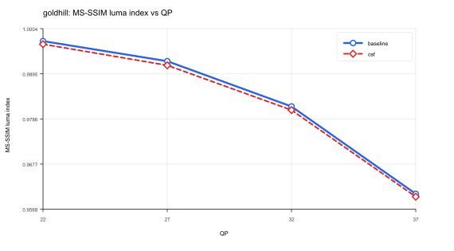 |
| **PSNR-HVS-M luma, dB**<br>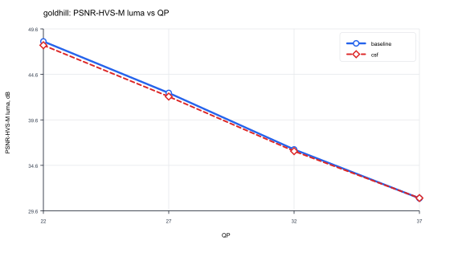 | **HaarPSI luma index**<br>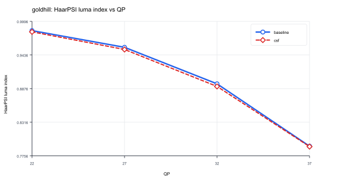 |

Partition-map overlays at QP=32:

| Baseline | CSF |
| --- | --- |
| 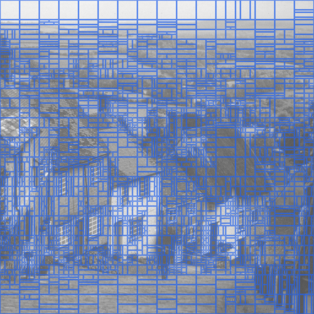 | 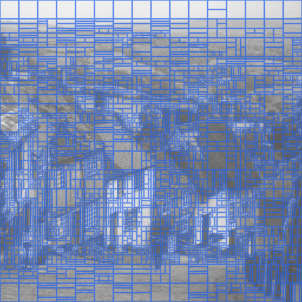 |

</details>

<details>
<summary><strong>Lenna</strong>: QP curves and partition maps</summary>

| QP chart | QP chart |
| --- | --- |
| **PSNR-Y, dB**<br>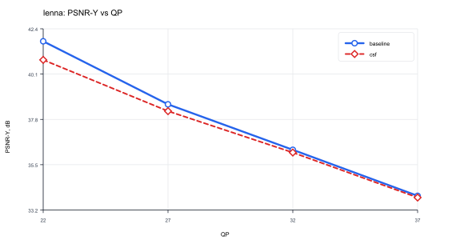 | **MS-SSIM luma index**<br>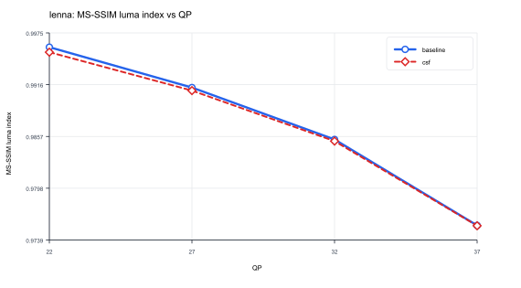 |
| **PSNR-HVS-M luma, dB**<br>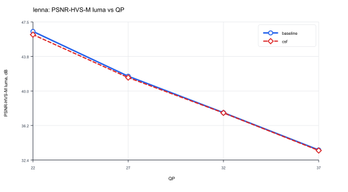 | **HaarPSI luma index**<br>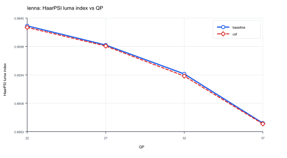 |

Partition-map overlays at QP=32:

| Baseline | CSF |
| --- | --- |
| 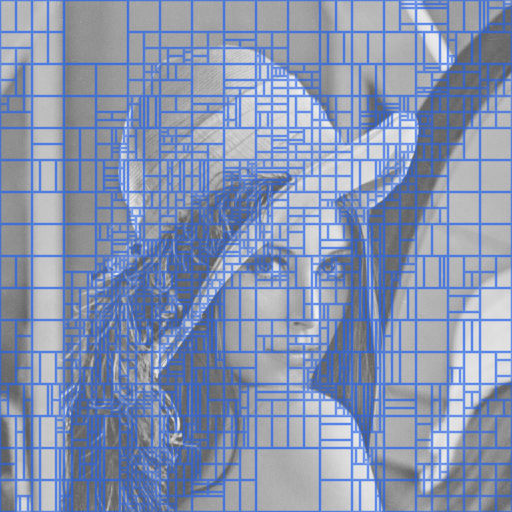 | 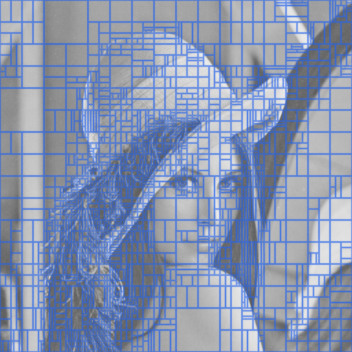 |

</details>

<details>
<summary><strong>Peppers</strong>: QP curves and partition maps</summary>

| QP chart | QP chart |
| --- | --- |
| **PSNR-Y, dB**<br>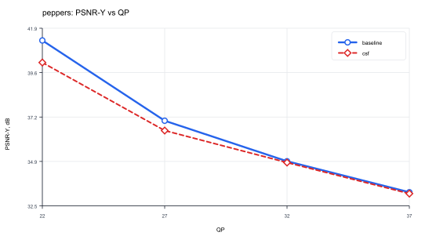 | **MS-SSIM luma index**<br>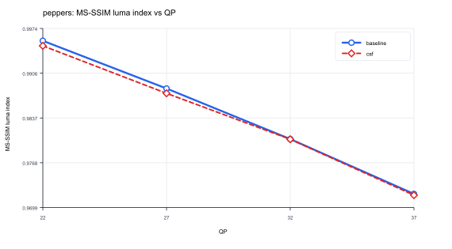 |
| **PSNR-HVS-M luma, dB**<br>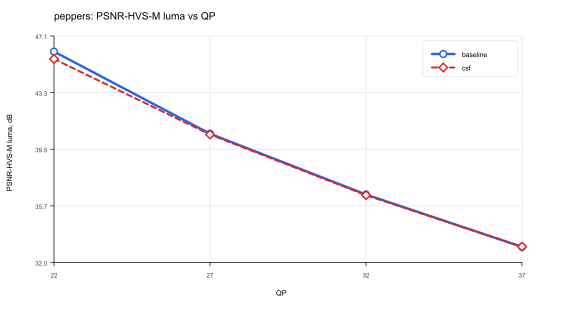 | **HaarPSI luma index**<br>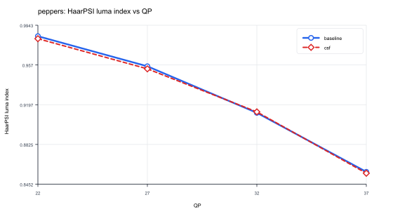 |

Partition-map overlays at QP=32:

| Baseline | CSF |
| --- | --- |
| 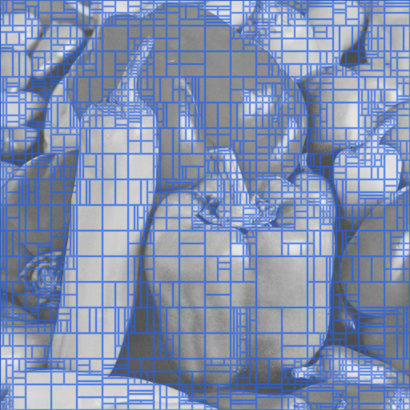 | 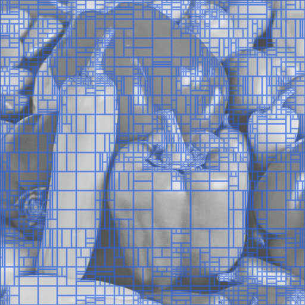 |

</details>

Full per-QP overlays: [`partition_overlays/standard_grayscale/`](partition_overlays/standard_grayscale/).

## Standard Color

Metrics CSV: [`standard_color/image_metrics.csv`](standard_color/image_metrics.csv)

| Image | QP points | Mean bpp delta, % | PSNR-RGB | MS-SSIM-RGB | PSNR-HVS-M luma | HaarPSI luma |
| --- | --- | --- | --- | --- | --- | --- |
| baboon | 4 | -0.464 | -0.863221 | -0.001810 | -0.821274 | -0.007389 |
| barbara | 4 | -5.552 | -0.493034 | -0.000457 | -0.132148 | -0.002003 |
| goldhill | 4 | -4.313 | -0.387117 | -0.000488 | -0.181435 | -0.001840 |
| lenna | 4 | -3.954 | -0.298151 | -0.000568 | -0.221299 | -0.001506 |
| peppers | 4 | -4.235 | -0.357367 | -0.000625 | -0.151317 | -0.001378 |

### Comparative interpretation

The ordinal robustness rank orders the images independently for each quality metric by the mean CSF-minus-baseline delta, then sums those ranks. It does not average dB and unitless indices. A lower rank sum means that the image retained quality more consistently across the selected metrics.

Absolute metric values should not be used to declare that one source image has inherently better visual quality than another: image content, texture, and visual masking affect metric scales. The comparison below therefore measures the effect of CSF against the baseline reconstruction of the same image.

| Image | Robustness rank sum | Mean BPP delta, % | Mean CU-count delta, % | Mean CU-area delta, % |
| --- | --- | --- | --- | --- |
| peppers | 9 | -4.235 | 31.0 | -18.5 |
| barbara | 10 | -5.552 | 32.7 | -24.2 |
| lenna | 10 | -3.954 | 33.0 | -22.8 |
| goldhill | 11 | -4.313 | 28.1 | -19.9 |
| baboon | 20 | -0.464 | 52.6 | -34.3 |

**Result:** No single color image dominates every metric. Lenna has the smallest PSNR-RGB loss; Barbara has the smallest MS-SSIM-RGB and PSNR-HVS-M losses while providing the largest mean BPP reduction; Peppers has the smallest HaarPSI loss and the best aggregate ordinal rank. Baboon ranks last for all four metrics.

The partition statistics show encoder decisions rather than visual quality. Positive CU-count deltas and negative CU-area deltas mean that CSF produced more, smaller coding units. Baboon exhibits the largest partitioning shift and the largest quality loss, but with only five images this is an exploratory association, not evidence that finer partitioning causes the loss.

<details>
<summary><strong>Baboon</strong>: QP curves and partition maps</summary>

| QP chart | QP chart |
| --- | --- |
| **PSNR-RGB, dB**<br>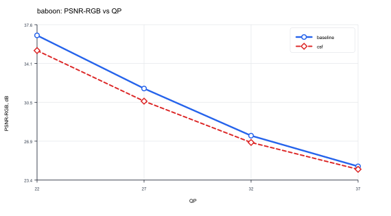 | **MS-SSIM-RGB index**<br>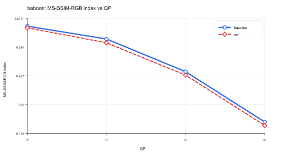 |
| **PSNR-HVS-M luma, dB**<br>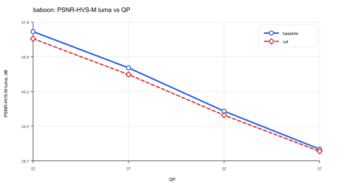 | **HaarPSI luma index**<br>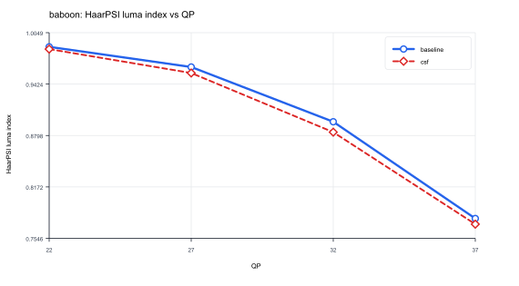 |

Partition-map overlays at QP=32:

| Baseline | CSF |
| --- | --- |
| 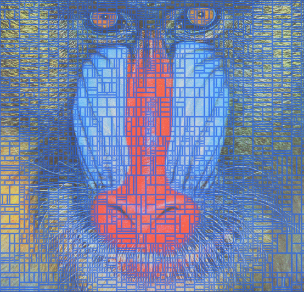 | 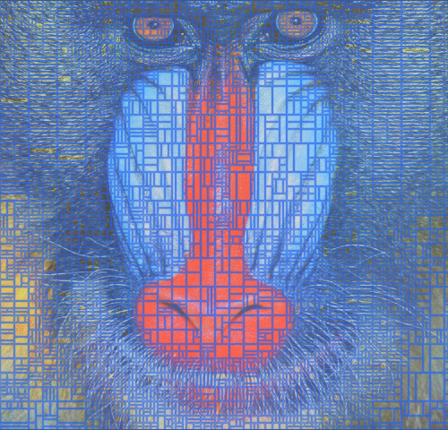 |

</details>

<details>
<summary><strong>Barbara</strong>: QP curves and partition maps</summary>

| QP chart | QP chart |
| --- | --- |
| **PSNR-RGB, dB**<br>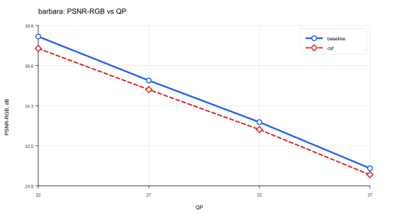 | **MS-SSIM-RGB index**<br>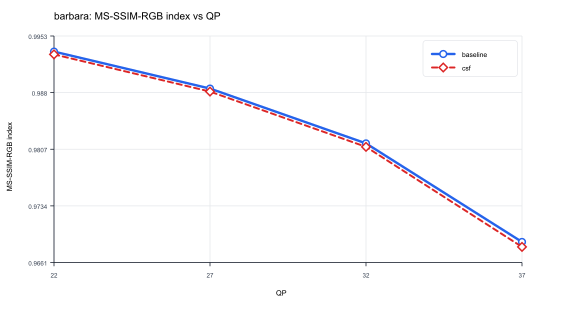 |
| **PSNR-HVS-M luma, dB**<br>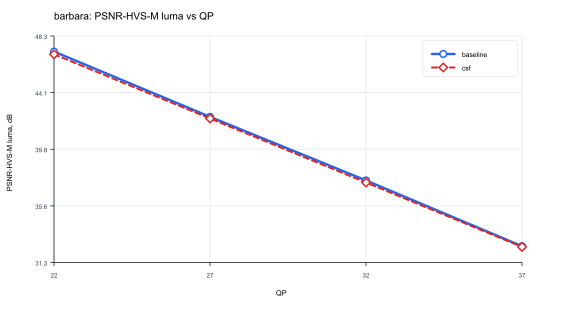 | **HaarPSI luma index**<br>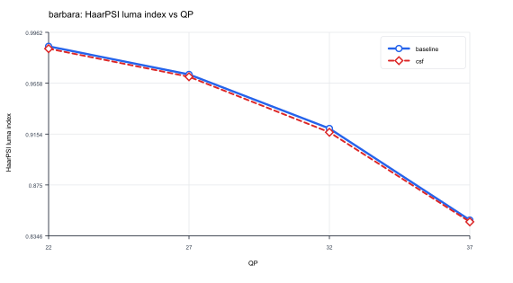 |

Partition-map overlays at QP=32:

| Baseline | CSF |
| --- | --- |
| 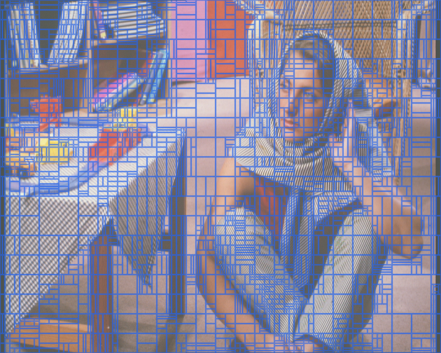 | 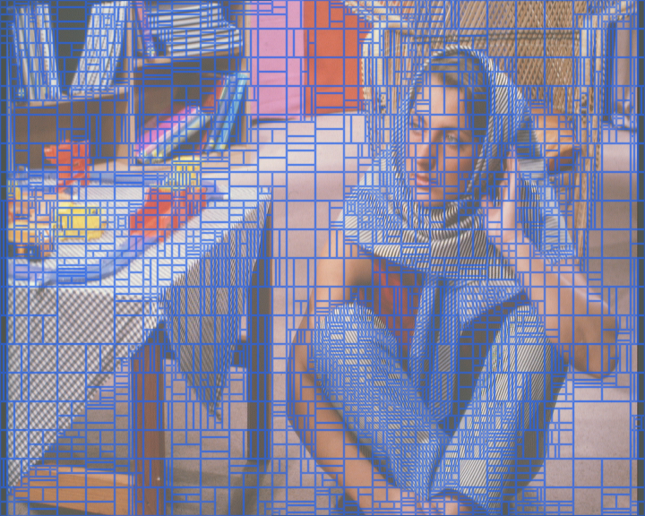 |

</details>

<details>
<summary><strong>Goldhill</strong>: QP curves and partition maps</summary>

| QP chart | QP chart |
| --- | --- |
| **PSNR-RGB, dB**<br>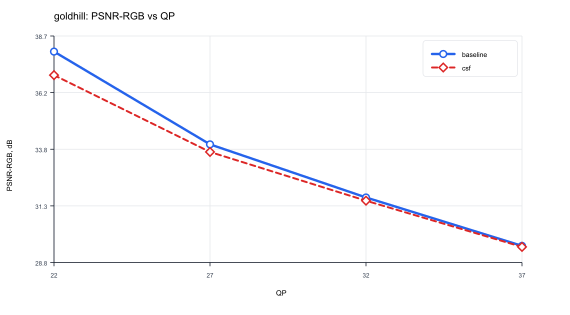 | **MS-SSIM-RGB index**<br>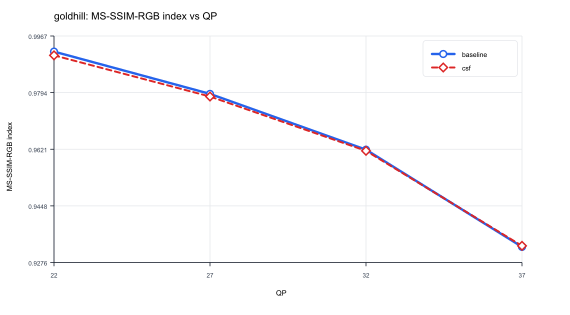 |
| **PSNR-HVS-M luma, dB**<br>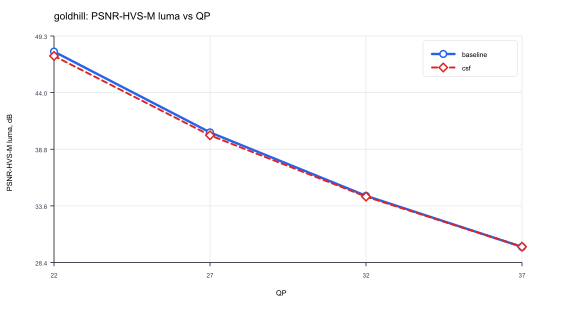 | **HaarPSI luma index**<br>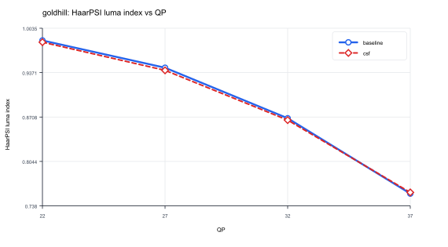 |

Partition-map overlays at QP=32:

| Baseline | CSF |
| --- | --- |
| 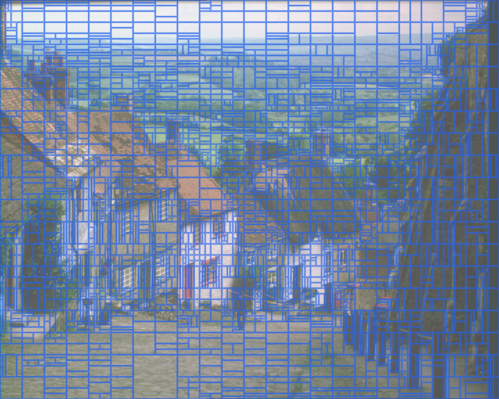 | 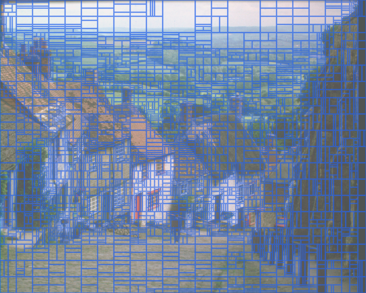 |

</details>

<details>
<summary><strong>Lenna</strong>: QP curves and partition maps</summary>

| QP chart | QP chart |
| --- | --- |
| **PSNR-RGB, dB**<br>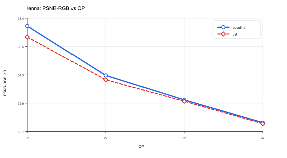 | **MS-SSIM-RGB index**<br>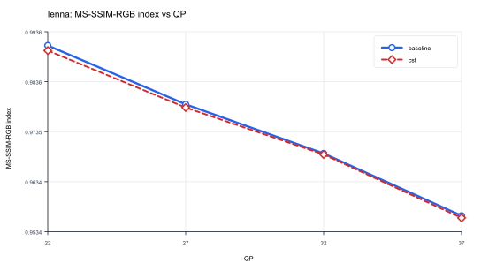 |
| **PSNR-HVS-M luma, dB**<br>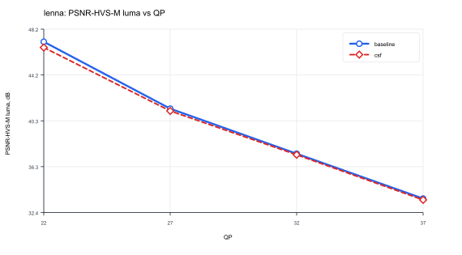 | **HaarPSI luma index**<br>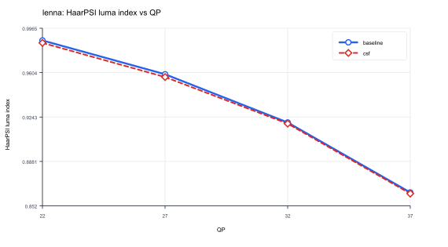 |

Partition-map overlays at QP=32:

| Baseline | CSF |
| --- | --- |
| 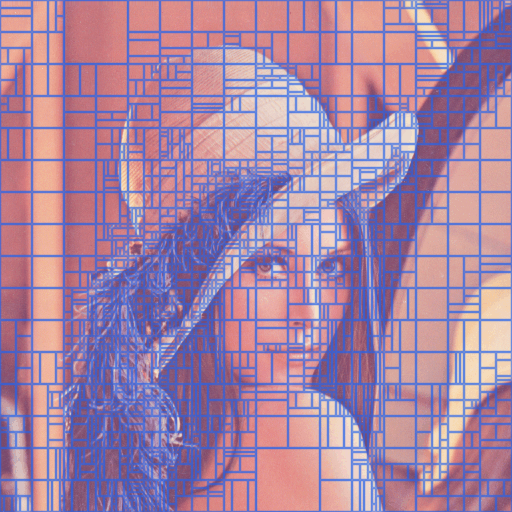 | 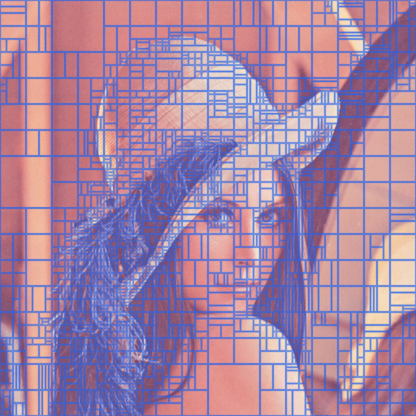 |

</details>

<details>
<summary><strong>Peppers</strong>: QP curves and partition maps</summary>

| QP chart | QP chart |
| --- | --- |
| **PSNR-RGB, dB**<br>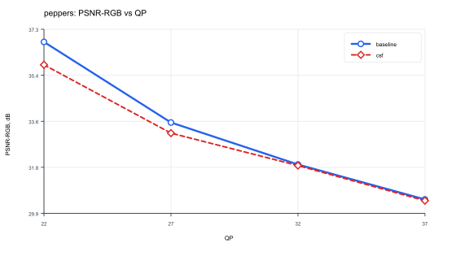 | **MS-SSIM-RGB index**<br> |
| **PSNR-HVS-M luma, dB**<br> | **HaarPSI luma index**<br>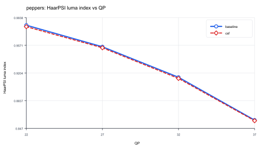 |

Partition-map overlays at QP=32:

| Baseline | CSF |
| --- | --- |
| 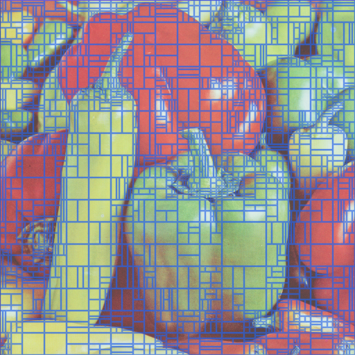 | 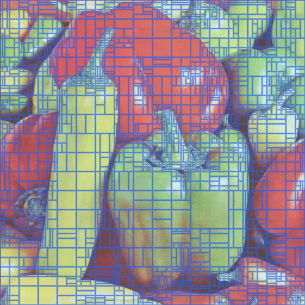 |

</details>

Full per-QP overlays: [`partition_overlays/standard_color/`](partition_overlays/standard_color/).
