# VTM Scaling List Study

This study isolates the built-in VTM 23.0 default scaling-list mode: `--ScalingList=1`.
It uses only `baboon`, `goldhill`, and `peppers` in the standard grayscale and standard color datasets.

The main goal is to inspect the behavior of the partitioning scheme as QP changes when the VTM default scaling-list mechanism is explicitly enabled.

## Reproduce

```powershell
python tools\research\run_vtm_scaling_list_study.py --clean
python tools\reporting\report_vtm_scaling_list_study.py
```

The runner writes long intermediate codec output under `results/vtm_scaling_list_study/`. This README and compact artifacts are stored under `docs/vtm_scaling_list_study/`.

## Standard Grayscale

Metrics CSV: [`standard_grayscale/image_metrics.csv`](standard_grayscale/image_metrics.csv)
Partition CSV: [`partition_overlays/standard_grayscale/summary.csv`](partition_overlays/standard_grayscale/summary.csv)

### Baboon

Mode: VTM 23.0 `--ScalingList=1`.

Metric values by QP:

| QP | BPP | Bitstream bytes | PSNR-Y | MS-SSIM luma | PSNR-HVS-M luma | HaarPSI luma |
| --- | --- | --- | --- | --- | --- | --- |
| 22 | 2.8338 | 92859 | 41.803 | 0.998562 | 49.614 | 0.988930 |
| 27 | 1.9699 | 64550 | 36.871 | 0.995215 | 44.499 | 0.966943 |
| 32 | 1.1966 | 39211 | 32.273 | 0.985897 | 37.698 | 0.908470 |
| 37 | 0.6306 | 20663 | 28.336 | 0.966285 | 31.438 | 0.800921 |

CU partition statistics by QP:

| QP | CU count | Min area | Max area | Mean area | Dominant CU sizes |
| --- | --- | --- | --- | --- | --- |
| 22 | 4137 | 16 | 1024 | 63.37 | 8x4:811; 4x4:760; 4x8:737; 8x8:579; 16x8:307; 16x4:304 |
| 27 | 3722 | 16 | 1024 | 70.43 | 8x4:678; 4x4:654; 4x8:543; 8x8:524; 16x4:409; 16x8:320 |
| 32 | 3271 | 16 | 1024 | 80.14 | 8x4:560; 4x4:460; 4x8:458; 8x8:447; 16x4:367; 16x8:339 |
| 37 | 2335 | 16 | 1024 | 112.27 | 8x4:314; 4x8:288; 4x4:256; 8x8:247; 16x8:246; 16x4:197 |

QP metric curves:

| QP chart | QP chart |
| --- | --- |
| **PSNR-Y, dB**<br>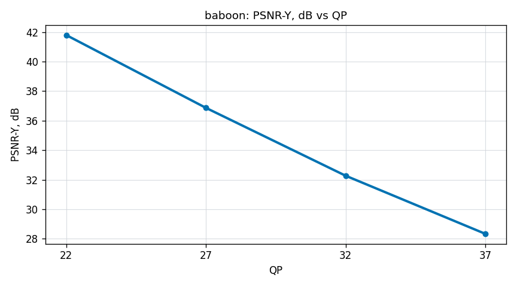 | **MS-SSIM luma index**<br>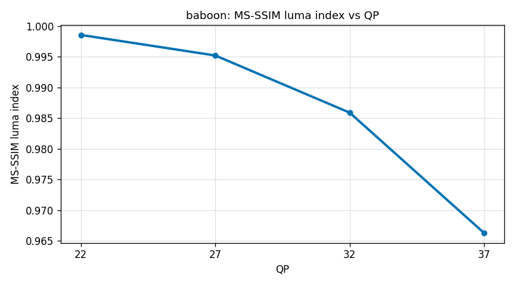 |
| **PSNR-HVS-M luma, dB**<br>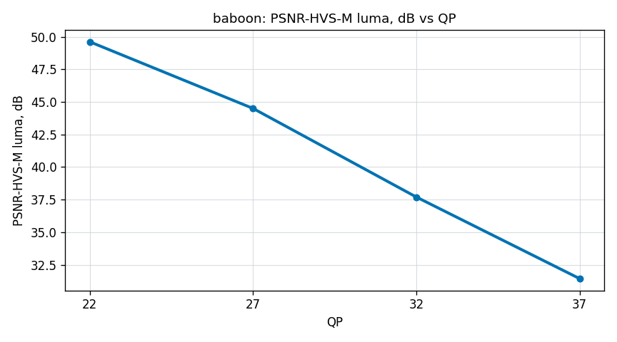 | **HaarPSI luma index**<br>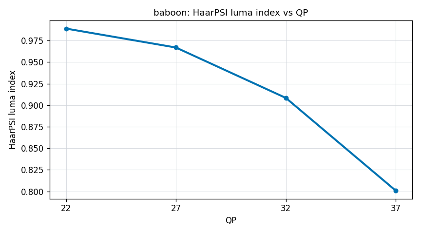 |

CU partition-map overlays:

| Overlay | Overlay |
| --- | --- |
| **QP 22**<br>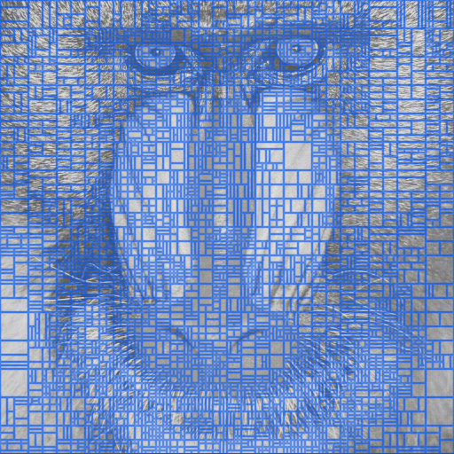 | **QP 27**<br>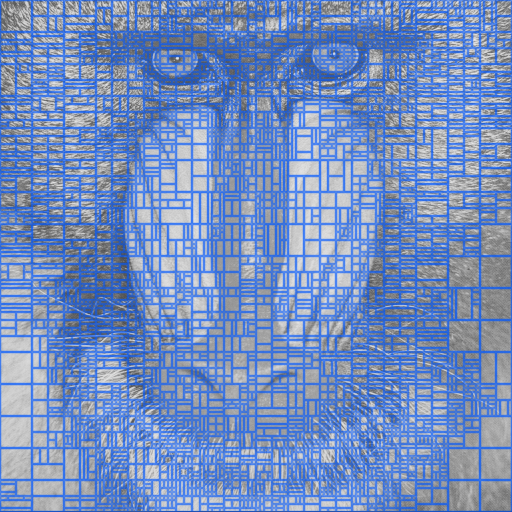 |
| **QP 32**<br>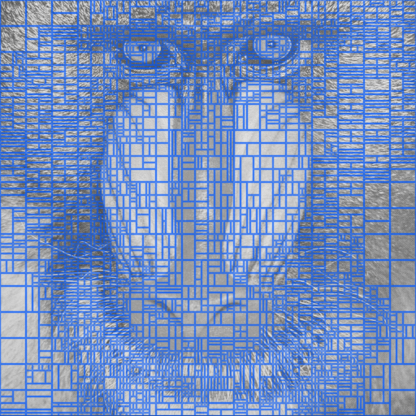 | **QP 37**<br>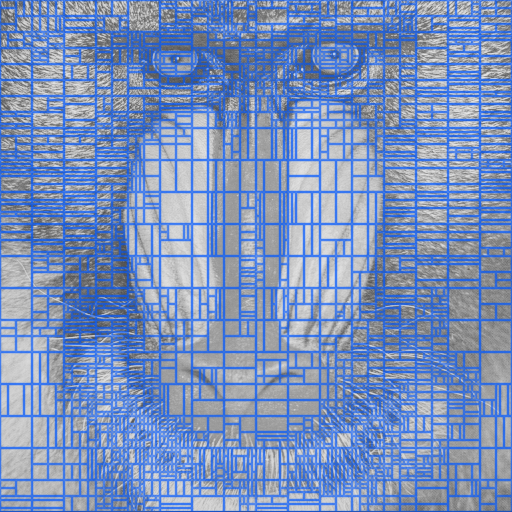 |

### Goldhill

Mode: VTM 23.0 `--ScalingList=1`.

Metric values by QP:

| QP | BPP | Bitstream bytes | PSNR-Y | MS-SSIM luma | PSNR-HVS-M luma | HaarPSI luma |
| --- | --- | --- | --- | --- | --- | --- |
| 22 | 1.5258 | 49997 | 41.764 | 0.997357 | 48.183 | 0.984193 |
| 27 | 0.8197 | 26860 | 37.454 | 0.992517 | 42.538 | 0.956405 |
| 32 | 0.4011 | 13142 | 34.113 | 0.981572 | 36.344 | 0.895574 |
| 37 | 0.1859 | 6092 | 31.349 | 0.960468 | 30.994 | 0.791549 |

CU partition statistics by QP:

| QP | CU count | Min area | Max area | Mean area | Dominant CU sizes |
| --- | --- | --- | --- | --- | --- |
| 22 | 4518 | 16 | 1024 | 58.02 | 8x4:940; 4x8:931; 4x4:846; 8x8:584; 16x4:328; 4x16:293 |
| 27 | 3927 | 16 | 1024 | 66.75 | 8x4:771; 4x8:745; 4x4:704; 8x8:433; 4x16:315; 16x4:260 |
| 32 | 2727 | 16 | 1024 | 96.13 | 4x8:436; 8x4:385; 8x8:385; 4x4:270; 16x8:247; 8x16:230 |
| 37 | 1669 | 16 | 1024 | 157.07 | 8x16:233; 16x8:192; 8x8:185; 4x16:157; 16x4:126; 16x16:125 |

QP metric curves:

| QP chart | QP chart |
| --- | --- |
| **PSNR-Y, dB**<br>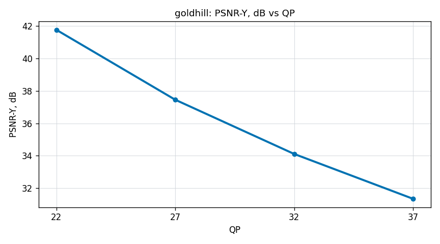 | **MS-SSIM luma index**<br>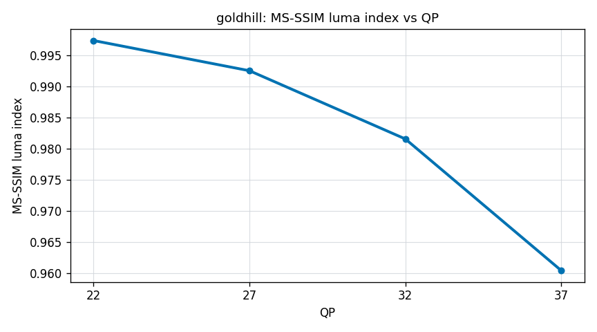 |
| **PSNR-HVS-M luma, dB**<br>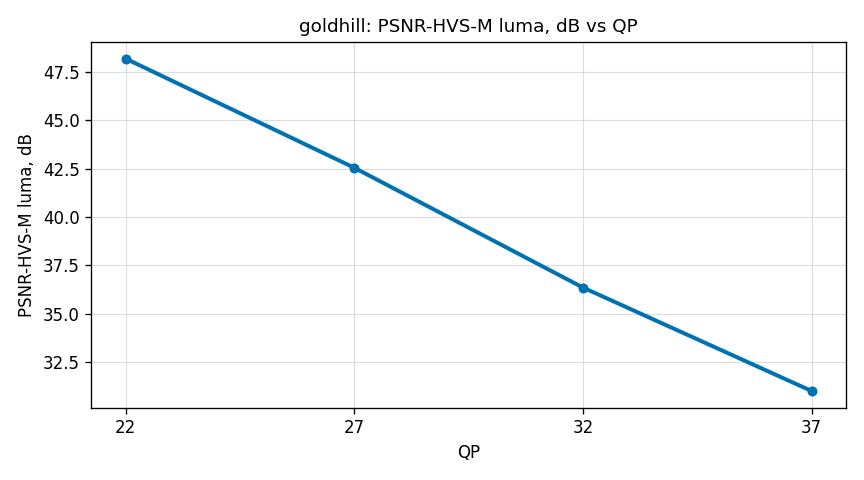 | **HaarPSI luma index**<br>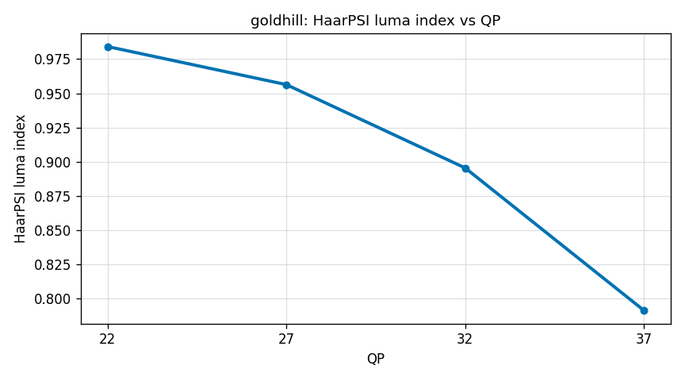 |

CU partition-map overlays:

| Overlay | Overlay |
| --- | --- |
| **QP 22**<br>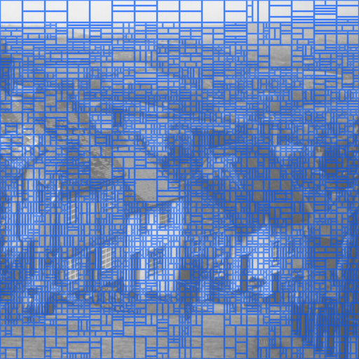 | **QP 27**<br>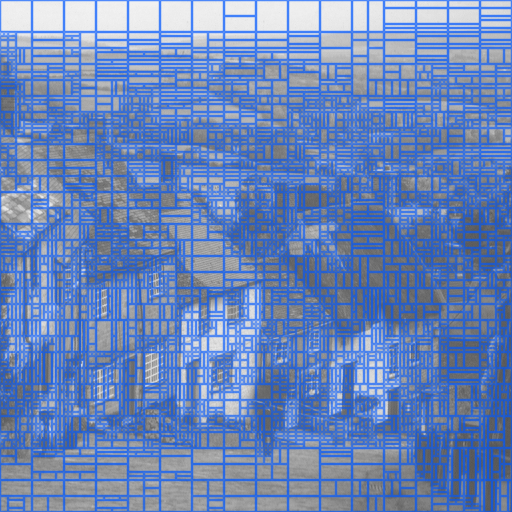 |
| **QP 32**<br>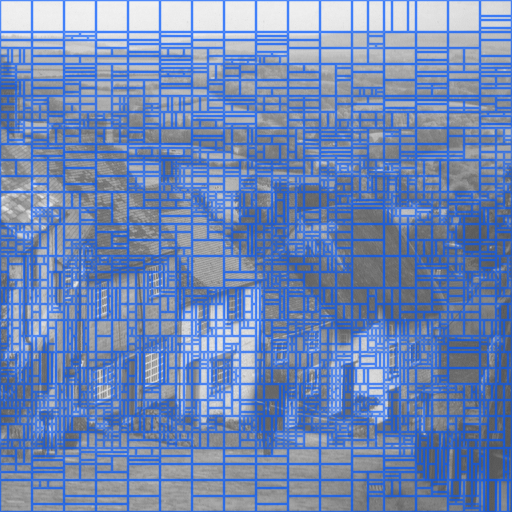 | **QP 37**<br>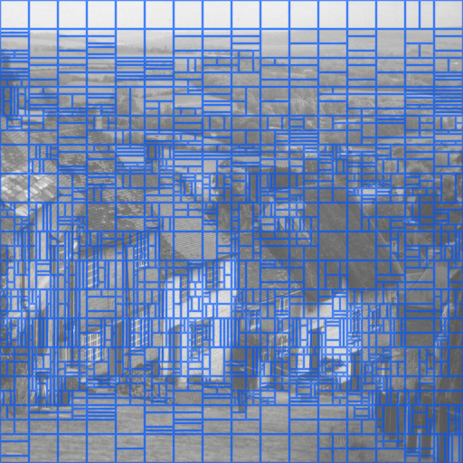 |

### Peppers

Mode: VTM 23.0 `--ScalingList=1`.

Metric values by QP:

| QP | BPP | Bitstream bytes | PSNR-Y | MS-SSIM luma | PSNR-HVS-M luma | HaarPSI luma |
| --- | --- | --- | --- | --- | --- | --- |
| 22 | 1.1861 | 38866 | 41.284 | 0.995533 | 46.024 | 0.984003 |
| 27 | 0.4579 | 15005 | 37.029 | 0.988201 | 40.551 | 0.955788 |
| 32 | 0.2021 | 6623 | 34.881 | 0.980428 | 36.500 | 0.912144 |
| 37 | 0.1165 | 3816 | 33.239 | 0.972002 | 33.010 | 0.856761 |

CU partition statistics by QP:

| QP | CU count | Min area | Max area | Mean area | Dominant CU sizes |
| --- | --- | --- | --- | --- | --- |
| 22 | 3573 | 16 | 1024 | 73.37 | 8x4:663; 4x4:610; 8x8:561; 4x8:558; 16x8:252; 4x16:236 |
| 27 | 2735 | 16 | 1024 | 95.85 | 8x8:425; 4x4:398; 8x4:396; 4x8:385; 8x16:211; 4x16:209 |
| 32 | 2074 | 16 | 4096 | 126.40 | 8x8:311; 8x16:237; 4x8:221; 8x4:220; 4x4:198; 4x16:163 |
| 37 | 1417 | 16 | 4096 | 185.00 | 8x8:197; 8x16:180; 16x8:179; 16x16:128; 16x4:116; 4x16:94 |

QP metric curves:

| QP chart | QP chart |
| --- | --- |
| **PSNR-Y, dB**<br>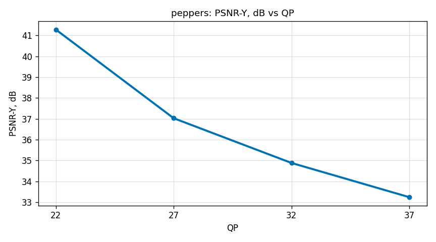 | **MS-SSIM luma index**<br>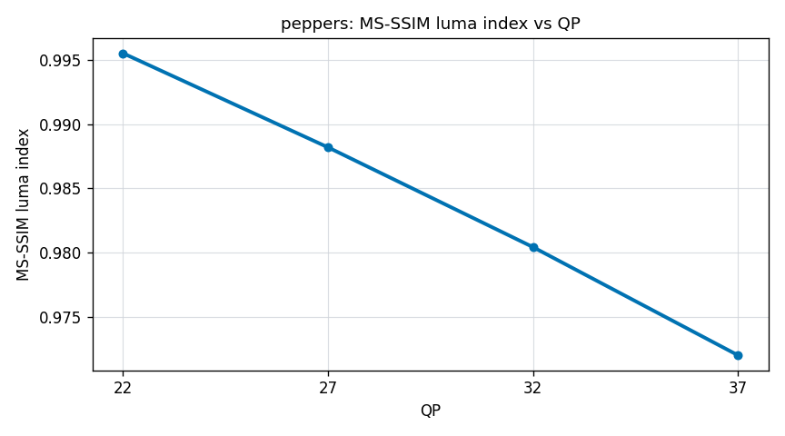 |
| **PSNR-HVS-M luma, dB**<br> | **HaarPSI luma index**<br>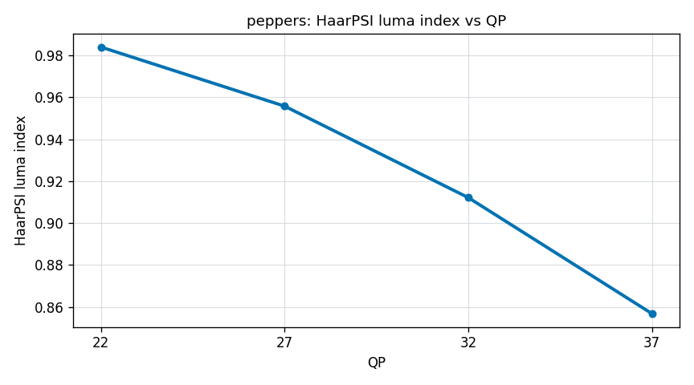 |

CU partition-map overlays:

| Overlay | Overlay |
| --- | --- |
| **QP 22**<br>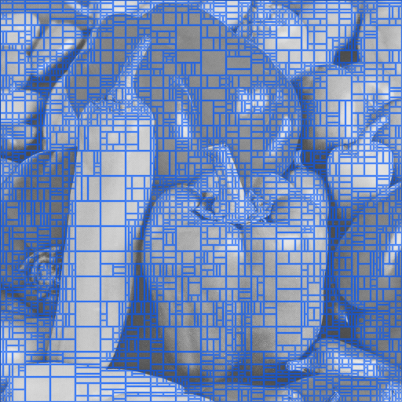 | **QP 27**<br>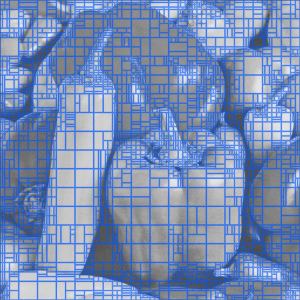 |
| **QP 32**<br>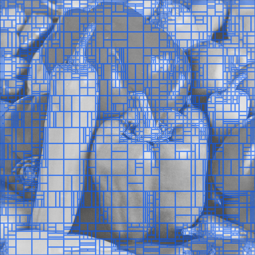 | **QP 37**<br>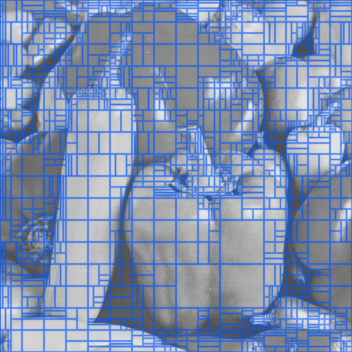 |

## Standard Color

Metrics CSV: [`standard_color/image_metrics.csv`](standard_color/image_metrics.csv)
Partition CSV: [`partition_overlays/standard_color/summary.csv`](partition_overlays/standard_color/summary.csv)

### Baboon

Mode: VTM 23.0 `--ScalingList=1`.

Metric values by QP:

| QP | BPP | Bitstream bytes | PSNR-RGB | MS-SSIM-RGB | PSNR-HVS-M luma | HaarPSI luma |
| --- | --- | --- | --- | --- | --- | --- |
| 22 | 6.5756 | 197269 | 36.657 | 0.996363 | 50.035 | 0.987677 |
| 27 | 4.0788 | 122365 | 31.772 | 0.988790 | 44.066 | 0.963182 |
| 32 | 1.7875 | 53625 | 27.430 | 0.969449 | 36.925 | 0.896491 |
| 37 | 0.7008 | 21025 | 24.607 | 0.939732 | 30.673 | 0.778727 |

CU partition statistics by QP:

| QP | CU count | Min area | Max area | Mean area | Dominant CU sizes |
| --- | --- | --- | --- | --- | --- |
| 22 | 4355 | 16 | 1024 | 55.55 | 4x8:900; 8x4:871; 4x4:822; 8x8:539; 16x4:302; 4x16:294 |
| 27 | 4200 | 16 | 1024 | 57.60 | 8x4:836; 4x4:762; 4x8:741; 8x8:574; 16x4:373; 16x8:303 |
| 32 | 3456 | 16 | 1024 | 70.00 | 8x4:627; 4x8:523; 4x4:500; 8x8:430; 16x4:371; 16x8:310 |
| 37 | 2240 | 16 | 1024 | 108.00 | 8x4:298; 4x8:266; 16x4:244; 16x8:240; 4x4:240; 8x8:227 |

QP metric curves:

| QP chart | QP chart |
| --- | --- |
| **PSNR-RGB, dB**<br>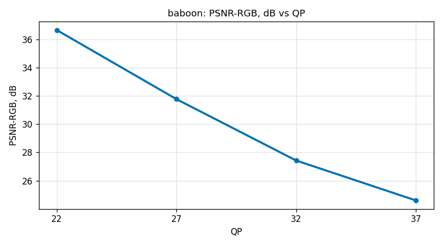 | **MS-SSIM-RGB index**<br>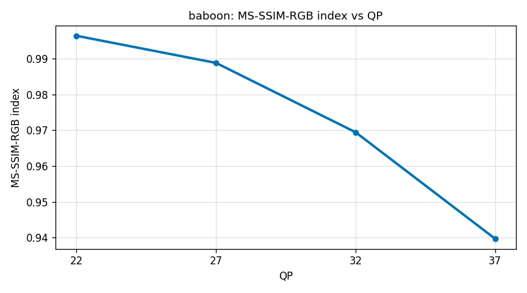 |
| **PSNR-HVS-M luma, dB**<br>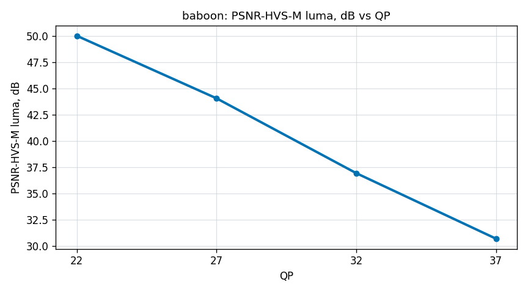 | **HaarPSI luma index**<br>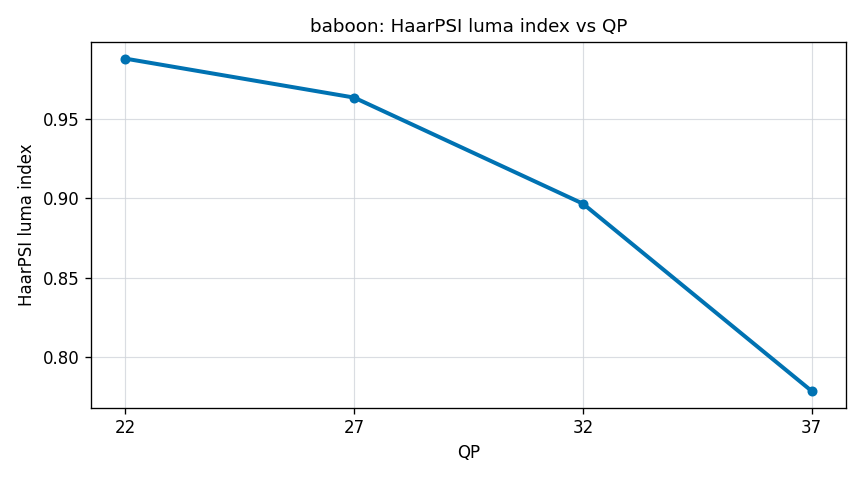 |

CU partition-map overlays:

| Overlay | Overlay |
| --- | --- |
| **QP 22**<br>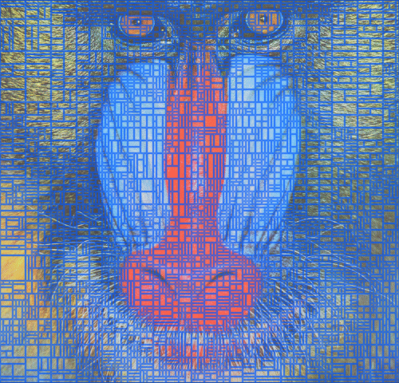 | **QP 27**<br>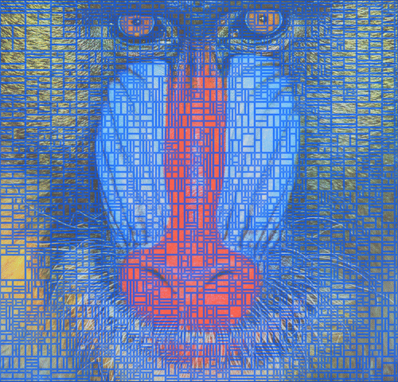 |
| **QP 32**<br>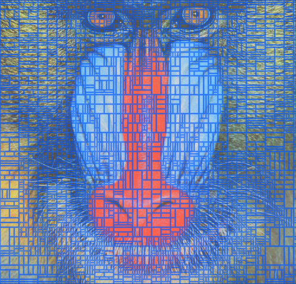 | **QP 37**<br>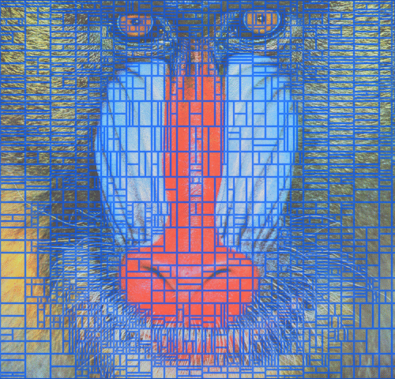 |

### Goldhill

Mode: VTM 23.0 `--ScalingList=1`.

Metric values by QP:

| QP | BPP | Bitstream bytes | PSNR-RGB | MS-SSIM-RGB | PSNR-HVS-M luma | HaarPSI luma |
| --- | --- | --- | --- | --- | --- | --- |
| 22 | 2.1323 | 110540 | 38.038 | 0.991907 | 47.814 | 0.985198 |
| 27 | 0.7558 | 39182 | 33.976 | 0.978994 | 40.369 | 0.944464 |
| 32 | 0.3315 | 17184 | 31.652 | 0.961985 | 34.522 | 0.868915 |
| 37 | 0.1492 | 7737 | 29.531 | 0.932319 | 29.817 | 0.756322 |

CU partition statistics by QP:

| QP | CU count | Min area | Max area | Mean area | Dominant CU sizes |
| --- | --- | --- | --- | --- | --- |
| 22 | 6519 | 16 | 1024 | 63.62 | 4x8:1354; 8x4:1257; 4x4:1130; 8x8:826; 4x16:476; 16x4:418 |
| 27 | 4603 | 16 | 1024 | 90.10 | 4x8:739; 8x4:688; 8x8:660; 4x4:490; 16x8:383; 4x16:374 |
| 32 | 3028 | 16 | 4096 | 136.96 | 8x8:402; 16x8:385; 8x16:301; 4x8:295; 4x16:283; 8x4:238 |
| 37 | 1823 | 16 | 4096 | 227.49 | 16x8:277; 8x16:224; 16x16:161; 8x8:151; 32x16:143; 4x16:136 |

QP metric curves:

| QP chart | QP chart |
| --- | --- |
| **PSNR-RGB, dB**<br>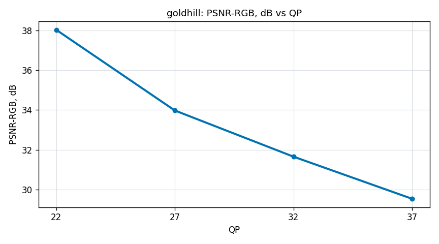 | **MS-SSIM-RGB index**<br>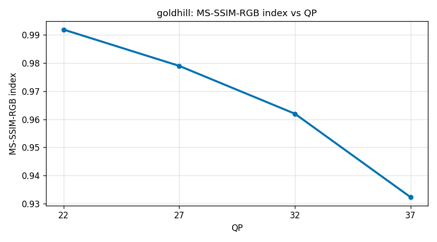 |
| **PSNR-HVS-M luma, dB**<br>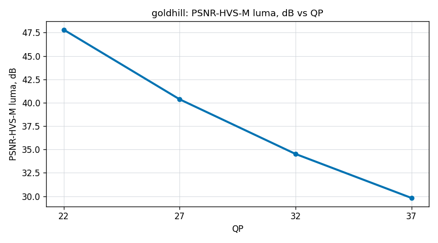 | **HaarPSI luma index**<br>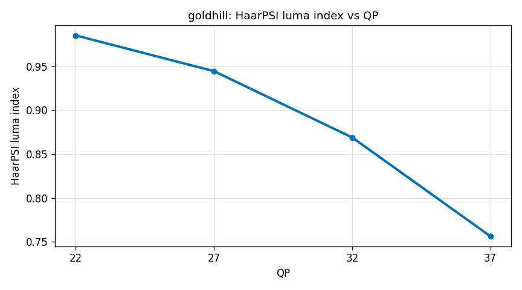 |

CU partition-map overlays:

| Overlay | Overlay |
| --- | --- |
| **QP 22**<br>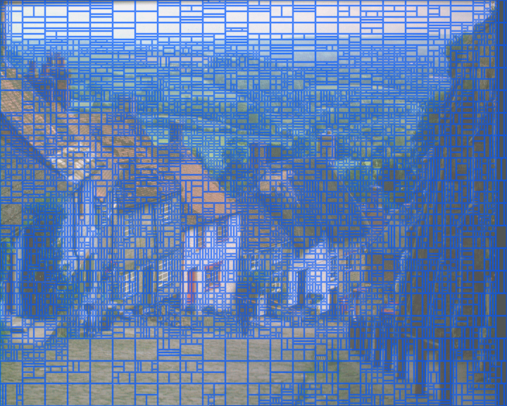 | **QP 27**<br>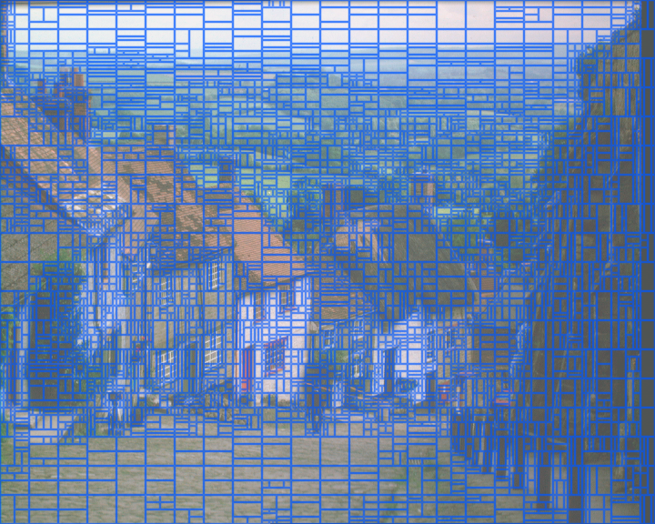 |
| **QP 32**<br>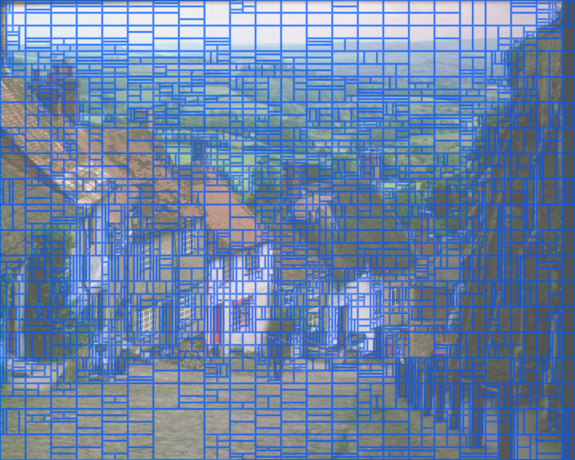 | **QP 37**<br>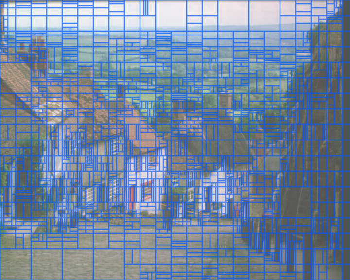 |

### Peppers

Mode: VTM 23.0 `--ScalingList=1`.

Metric values by QP:

| QP | BPP | Bitstream bytes | PSNR-RGB | MS-SSIM-RGB | PSNR-HVS-M luma | HaarPSI luma |
| --- | --- | --- | --- | --- | --- | --- |
| 22 | 2.3496 | 76993 | 36.784 | 0.989270 | 46.006 | 0.983649 |
| 27 | 0.8065 | 26426 | 33.552 | 0.977936 | 40.584 | 0.955072 |
| 32 | 0.3372 | 11049 | 31.869 | 0.966664 | 36.580 | 0.914669 |
| 37 | 0.1855 | 6078 | 30.468 | 0.953458 | 33.064 | 0.857913 |

CU partition statistics by QP:

| QP | CU count | Min area | Max area | Mean area | Dominant CU sizes |
| --- | --- | --- | --- | --- | --- |
| 22 | 3601 | 16 | 1024 | 72.80 | 8x4:671; 4x4:594; 4x8:586; 8x8:560; 16x8:265; 4x16:243 |
| 27 | 2712 | 16 | 1024 | 96.66 | 8x4:425; 8x8:396; 4x4:388; 4x8:383; 4x16:216; 16x4:195 |
| 32 | 2071 | 16 | 4096 | 126.58 | 8x8:323; 8x16:258; 4x8:218; 8x4:205; 16x8:199; 4x4:182 |
| 37 | 1384 | 16 | 4096 | 189.41 | 8x16:189; 8x8:170; 16x8:147; 16x16:139; 4x16:113; 8x4:91 |

QP metric curves:

| QP chart | QP chart |
| --- | --- |
| **PSNR-RGB, dB**<br>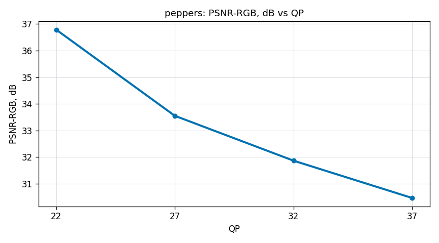 | **MS-SSIM-RGB index**<br>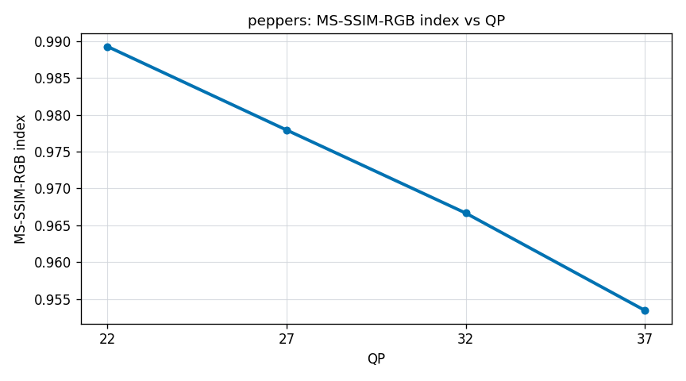 |
| **PSNR-HVS-M luma, dB**<br>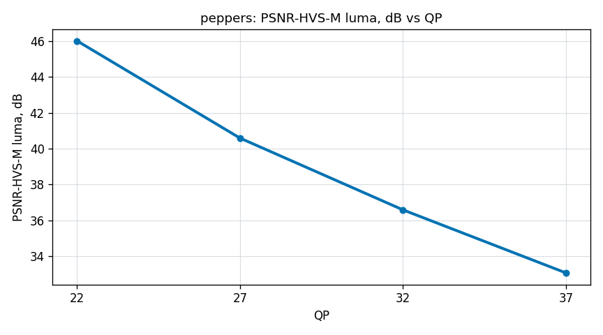 | **HaarPSI luma index**<br>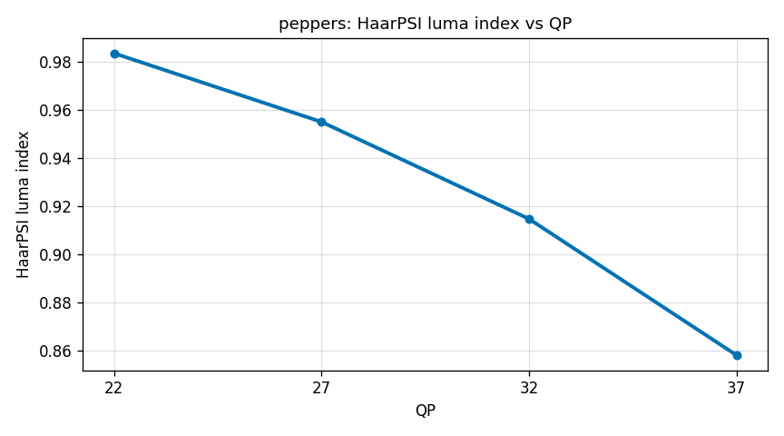 |

CU partition-map overlays:

| Overlay | Overlay |
| --- | --- |
| **QP 22**<br>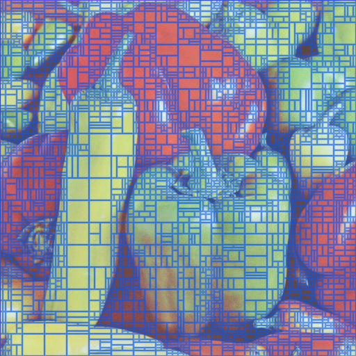 | **QP 27**<br>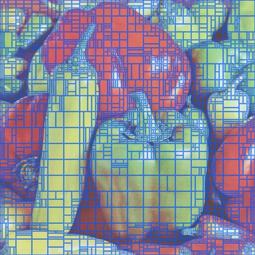 |
| **QP 32**<br>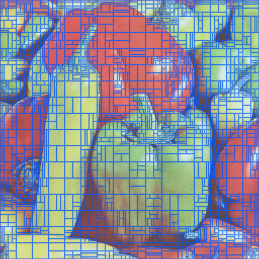 | **QP 37**<br>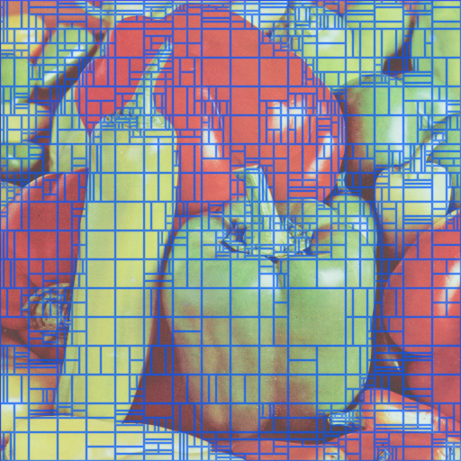 |
