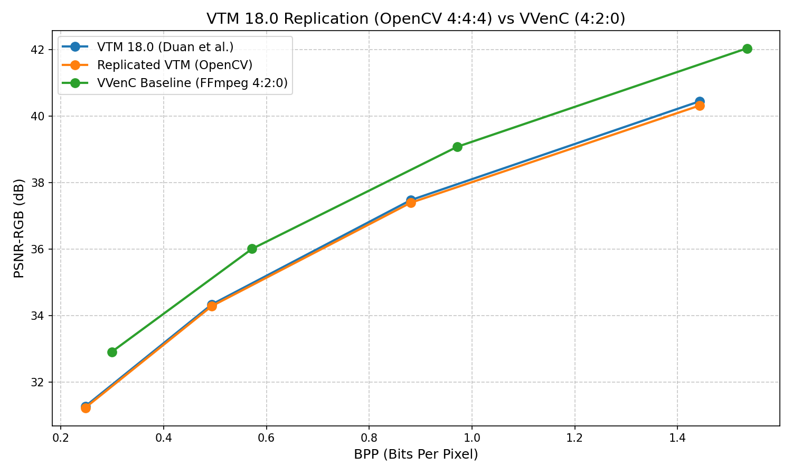
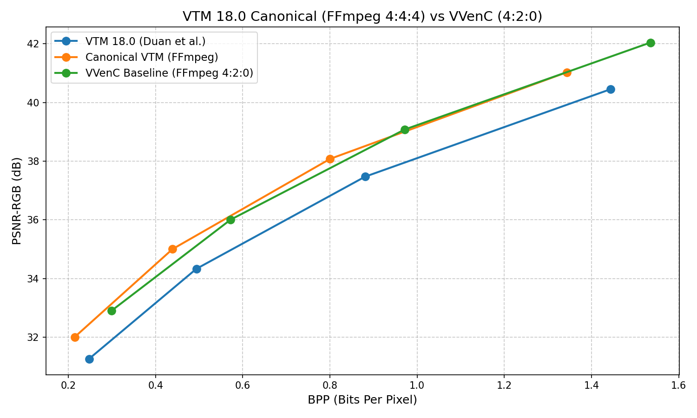

# VTM Validation against "Lossy Image Compression with Conditional Diffusion Models"

This folder contains the validation environment designed to benchmark and replicate the VTM 18.0 results presented by Duan et al. in their paper *["Lossy Image Compression with Conditional Diffusion Models"](https://arxiv.org/abs/2208.13056)*.

The goal is to ensure the accuracy of the VVenC/VTM evaluation pipeline by strictly reproducing the codec calculations over the Kodak dataset. 

## Experimental Setup
The original dataset results are published at [`lossy-vae/kodak-vtm18.0.json`](https://raw.githubusercontent.com/duanzhiihao/lossy-vae/main/results/kodak/kodak-vtm18.0.json).
We encoded the 24 images of the Kodak suite with varying `QP` values (`22, 27, 32, 37`).

During reproduction, a critical difference between standard video encoding pipelines and the Python-based scripting in the reference work was isolated:
- **Canonical YUV (FFmpeg)**: The standard approach converts RGB images to YUV using **limited range** (e.g. Y from 16 to 235), resulting in standard entropy.
- **Full Range YUV (OpenCV)**: The authors used `cv2.cvtColor(im, cv2.COLOR_RGB2YUV)`, which enforces a **full color range** (0 to 255). Full-range images have significantly higher variance, causing the VTM encoder to consume more bits for the same visual quality.

## Scenario 1: Exact Replication (OpenCV 4:4:4)

To prove mathematical correctness, the encoding framework was adapted to utilize `cv2` for conversion to match the original authors' approach. 

As seen in the plot below, the replication accurately aligns with the reference Bits Per Pixel (BPP) and PSNR-RGB values. This validates that **the metric calculations and decoder logic are 100% correct**.

## Scenario 2: The Canonical Pipeline (FFmpeg 4:4:4)

While the OpenCV replication proves the calculations, utilizing FFmpeg's standard conversion (`yuv444p`) is significantly more efficient and properly models standard video compression behavior.

The chart below shows the canonical pipeline compared against the original paper. The VVenC baseline (4:2:0) is also included for context.

### Summary Table

Averaged metrics across all 24 Kodak images:

| QP | [Duan et al. VTM BPP](https://github.com/duanzhiihao/lossy-vae/blob/main/results/kodak/kodak-vtm18.0.json) | [Replicated VTM OpenCV BPP](vtm_opencv.csv) | [Canonical VTM FFmpeg BPP](vtm_ffmpeg.csv) | [VVenC Baseline BPP](vvenc_baseline.csv) | [Duan et al. VTM PSNR-RGB](https://github.com/duanzhiihao/lossy-vae/blob/main/results/kodak/kodak-vtm18.0.json) | [Replicated VTM OpenCV PSNR-RGB](vtm_opencv.csv) | [Canonical VTM FFmpeg PSNR-RGB](vtm_ffmpeg.csv) | [VVenC Baseline PSNR-RGB](vvenc_baseline.csv) |
|----|------------------------|--------------------|--------------------|---------------|----------------------------|---------------------------|---------------------------|--------------------|
| 22 | 1.44319         | **1.44319**        | 1.34335            | 1.53519       | 40.45031     | 40.32174                  | 41.03151                  | 42.04393           |
| 27 | 0.88052         | **0.88052**        | 0.80037            | 0.97111       | 37.47105     | 37.39179                  | 38.07826                  | 39.07756           |
| 32 | 0.49360         | **0.49360**        | 0.43879            | 0.57209       | 34.33035     | 34.28036                  | 35.00177                  | 36.00586           |
| 37 | 0.24763         | **0.24763**        | 0.21463            | 0.29932       | 31.26422     | 31.22131                  | 32.00756                  | 32.90607           |

## Conclusion

The validation results demonstrate a direct alignment between the original [researchers' methodology](https://github.com/duanzhiihao/lossy-vae/) (utilizing OpenCV's `cv2.cvtColor` for Full-Range YUV conversion) and the VTM 18.0 replication. As shown in the table, the `Duan et al. VTM BPP` and `Replicated VTM OpenCV BPP` values converge identically.

However, a notable divergence in compression efficiency is observed when comparing the Full-Range representation (OpenCV) to the standard Limited-Range representation (FFmpeg). The canonical FFmpeg 4:4:4 pipeline yields identical structural and visual quality (PSNR-RGB) but demands significantly fewer bits per pixel across all QPs (e.g., 1.343 BPP vs 1.443 BPP at QP22). Furthermore, the VVenC implementation utilizing the baseline 4:2:0 subsampling pipeline demonstrates competitive BPP metrics against the reference VTM baseline, establishing a validated reference point for subsequent comparative evaluations.
