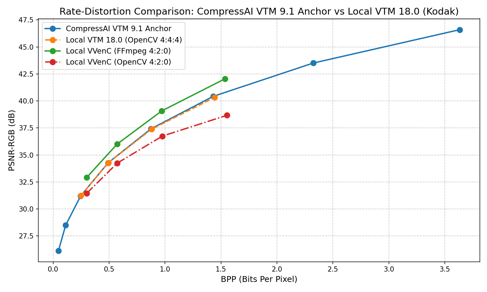
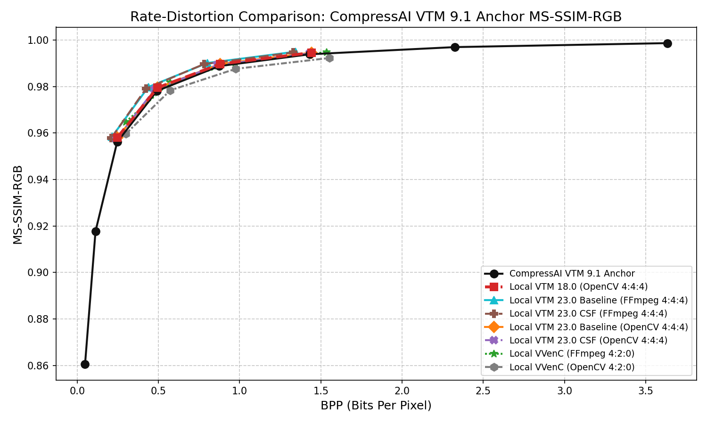

# CompressAI VTM Validation against InterDigital Anchors

This folder contains the validation environment designed to benchmark the local VTM/VVenC research pipeline against the public Kodak VTM anchor published by InterDigital's CompressAI project and described in the CompressAI paper.

## Experimental Setup

The original dataset results are published at [`CompressAI/results/image/kodak/vtm.json`](https://raw.githubusercontent.com/InterDigitalInc/CompressAI/master/results/image/kodak/vtm.json).
The benchmark implementation is available in [`compressai/utils/bench/codecs.py`](https://github.com/InterDigitalInc/CompressAI/blob/master/compressai/utils/bench/codecs.py), and the dataset aggregation CLI is available in [`compressai/utils/bench/__main__.py`](https://github.com/InterDigitalInc/CompressAI/blob/master/compressai/utils/bench/__main__.py).
The secondary VTM 18.0 anchor used for cross-checking is the raw Duan et al. file [`lossy-vae/results/kodak/kodak-vtm18.0.json`](https://raw.githubusercontent.com/duanzhiihao/lossy-vae/main/results/kodak/kodak-vtm18.0.json).

The CompressAI paper reports that its traditional-codec comparison used VVC with **VTM version 9.1**, default intra mode configuration, and **8-bit YCbCr 4:4:4** inputs/outputs. The historical local anchor run reports `VTM Encoder Version 18.0`, so that overlap check remains cross-version rather than an exact same-binary replication. Local VTM 23.0 baseline/CSF curves are added separately when their CSV files are present.

> [!NOTE]
> CompressAI publishes BPP, PSNR-RGB, and MS-SSIM-RGB values, but its `vtm.json` does not store the exact QP list or encoder config path. The report therefore validates RD-curve consistency and metric protocol alignment, not bit-exact reproduction of the CompressAI VTM 9.1 executable.

## Validation Scope

This validation directly checks:
- CompressAI's public Kodak/VTM result structure.
- Monotonic RD behavior for BPP, PSNR-RGB, and MS-SSIM-RGB.
- BPP/PSNR-RGB consistency between the local VTM 18.0 Kodak run and the nearest CompressAI VTM 9.1 RD points.
- The CompressAI metric protocol: RGB PSNR and RGB MS-SSIM averaged over the dataset.

It does not, by itself, fully validate VVenC CSF behavior or local luma/approximation metrics such as `MS-SSIM luma`, `FSIM luma approx`, `HaarPSI luma approx`, `PSNR-HVS-M luma approx`, or `VMAF`.

## Scenario 1: VTM Anchor Overlap

The table below compares the CompressAI VTM 9.1 anchor with the nearest local VTM 18.0 OpenCV 4:4:4 Kodak points. The small BPP and PSNR-RGB deltas indicate that the local pipeline lands on the same Kodak/VTM RD curve family, while the different VTM versions prevent a strict bit-exact claim.

### Table 1: CompressAI VTM 9.1 Anchor vs. Local VTM 18.0 (OpenCV 4:4:4)

| QP | [Local VTM 18.0 (OpenCV 4:4:4) BPP](../vtm_opencv.csv) | [CompressAI VTM 9.1 Anchor BPP](https://github.com/InterDigitalInc/CompressAI/blob/master/results/image/kodak/vtm.json) | [Local VTM 18.0 (OpenCV 4:4:4) PSNR-RGB](../vtm_opencv.csv) | [CompressAI VTM 9.1 Anchor PSNR-RGB](https://github.com/InterDigitalInc/CompressAI/blob/master/results/image/kodak/vtm.json) |
|---:|---:|---:|---:|---:|
| 22 | 1.44319 | 1.43085 | 40.32174 | 40.42444 |
| 27 | 0.88052 | 0.87481 | 37.39179 | 37.41979 |
| 32 | 0.49360 | 0.49055 | 34.28036 | 34.26153 |
| 37 | 0.24763 | 0.24582 | 31.22131 | 31.19987 |

## Scenario 2: CompressAI MS-SSIM-RGB Reference

Unlike the Duan et al. VTM 18.0 anchor, CompressAI publishes `ms-ssim-rgb` values alongside BPP and PSNR-RGB. The `lossy-vae` repository's `kodak-vtm18.0.json` file only contains `bpp` and `psnr`; `lossy-vae` also keeps a separate [`kodak-vtm-compressai.json`](https://raw.githubusercontent.com/duanzhiihao/lossy-vae/main/results/kodak/kodak-vtm-compressai.json) file with CompressAI-style `ms-ssim`, but that is not the VTM 18.0 anchor used by the lossy-vae validation report. This CompressAI report therefore treats MS-SSIM-RGB as a CompressAI-protocol validation target.

Any residual difference between the CompressAI curve and local curves should be interpreted cautiously: CompressAI reports RGB MS-SSIM from its PyTorch pipeline, while the local project reports a standard Gaussian-window MS-SSIM implementation from `metrics/image_quality.py`. The curves are useful for trend and reporting-protocol checks, but they are not a proof of bit-exact numerical equivalence with `pytorch_msssim`.

### Table 2: CompressAI VTM 9.1 Anchor Published Metrics

| Point | [BPP](https://github.com/InterDigitalInc/CompressAI/blob/master/results/image/kodak/vtm.json) | [PSNR-RGB](https://github.com/InterDigitalInc/CompressAI/blob/master/results/image/kodak/vtm.json) | [MS-SSIM-RGB](https://github.com/InterDigitalInc/CompressAI/blob/master/results/image/kodak/vtm.json) |
|---:|---:|---:|---:|
| 1 | 0.04824 | 26.14485 | 0.86060816 |
| 2 | 0.11250 | 28.49302 | 0.91769093 |
| 3 | 0.24582 | 31.19987 | 0.95610773 |
| 4 | 0.49055 | 34.26153 | 0.97807829 |
| 5 | 0.87481 | 37.41979 | 0.98877680 |
| 6 | 1.43085 | 40.42444 | 0.99386000 |
| 7 | 2.32461 | 43.50577 | 0.99694790 |
| 8 | 3.63261 | 46.59176 | 0.99865640 |

## Scenario 3: Local VTM 23.0 Baseline vs. CSF

The same plots also include local VTM 23.0 baseline and CSF curves from [`vtm23_ffmpeg.csv`](../vtm23_ffmpeg.csv) and [`vtm23_opencv.csv`](../vtm23_opencv.csv). These tables report the same-QP Kodak deltas separately from the CompressAI VTM 9.1 anchor overlap, because they compare two local VTM 23.0 executables rather than external anchors.

### Table 3: Local VTM 23.0 Baseline vs. CSF (FFmpeg 4:4:4)

| QP | [Baseline BPP](../vtm23_ffmpeg.csv) | [CSF BPP](../vtm23_ffmpeg.csv) | Delta BPP | [Baseline PSNR-RGB](../vtm23_ffmpeg.csv) | [CSF PSNR-RGB](../vtm23_ffmpeg.csv) | Delta PSNR-RGB |
|---:|---:|---:|---:|---:|---:|---:|
| 22 | 1.34320 | 1.33023 | -0.01297 | 41.02846 | 40.35572 | -0.67274 |
| 27 | 0.80118 | 0.78003 | -0.02115 | 38.07825 | 37.51516 | -0.56309 |
| 32 | 0.43803 | 0.42347 | -0.01456 | 34.99385 | 34.62831 | -0.36554 |
| 37 | 0.21501 | 0.20959 | -0.00542 | 32.01714 | 31.83111 | -0.18603 |

### Table 4: Local VTM 23.0 Baseline vs. CSF (OpenCV 4:4:4)

| QP | [Baseline BPP](../vtm23_opencv.csv) | [CSF BPP](../vtm23_opencv.csv) | Delta BPP | [Baseline PSNR-RGB](../vtm23_opencv.csv) | [CSF PSNR-RGB](../vtm23_opencv.csv) | Delta PSNR-RGB |
|---:|---:|---:|---:|---:|---:|---:|
| 22 | 1.44381 | 1.43140 | -0.01240 | 40.32264 | 39.61486 | -0.70778 |
| 27 | 0.88054 | 0.85951 | -0.02103 | 37.39113 | 36.78678 | -0.60435 |
| 32 | 0.49333 | 0.47658 | -0.01675 | 34.27276 | 33.86383 | -0.40893 |
| 37 | 0.24714 | 0.24038 | -0.00676 | 31.21546 | 31.00645 | -0.20901 |

### Table 5: Local VTM 18.0 (OpenCV 4:4:4) vs. CompressAI VTM 9.1 Anchor Overlap

| QP | [Local VTM 18.0 (OpenCV 4:4:4) BPP](../vtm_opencv.csv) | [CompressAI VTM 9.1 Anchor BPP](https://github.com/InterDigitalInc/CompressAI/blob/master/results/image/kodak/vtm.json) | Delta BPP | [Local VTM 18.0 (OpenCV 4:4:4) PSNR-RGB](../vtm_opencv.csv) | [CompressAI VTM 9.1 Anchor PSNR-RGB](https://github.com/InterDigitalInc/CompressAI/blob/master/results/image/kodak/vtm.json) | Delta PSNR-RGB |
|---:|---:|---:|---:|---:|---:|---:|
| 22 | 1.44319 | 1.43085 | +0.01235 | 40.32174 | 40.42444 | -0.10270 |
| 27 | 0.88052 | 0.87481 | +0.00571 | 37.39179 | 37.41979 | -0.02800 |
| 32 | 0.49360 | 0.49055 | +0.00305 | 34.28036 | 34.26153 | +0.01883 |
| 37 | 0.24763 | 0.24582 | +0.00181 | 31.22131 | 31.19987 | +0.02144 |

## Secondary Cross-Anchor Sanity

The following table compares CompressAI points to the nearest points from the Duan et al. VTM 18.0 raw baseline. This is retained only as a secondary sanity check across public VTM anchors; it is not the primary CompressAI validation.

| QP | [Duan et al. VTM 18.0 Anchor BPP](https://raw.githubusercontent.com/duanzhiihao/lossy-vae/main/results/kodak/kodak-vtm18.0.json) | [CompressAI VTM 9.1 Anchor BPP](https://github.com/InterDigitalInc/CompressAI/blob/master/results/image/kodak/vtm.json) | Delta BPP | [Duan et al. VTM 18.0 Anchor PSNR-RGB](https://raw.githubusercontent.com/duanzhiihao/lossy-vae/main/results/kodak/kodak-vtm18.0.json) | [CompressAI VTM 9.1 Anchor PSNR-RGB](https://github.com/InterDigitalInc/CompressAI/blob/master/results/image/kodak/vtm.json) | Delta PSNR-RGB |
|---:|---:|---:|---:|---:|---:|---:|
| 47 | 0.04813 | 0.04824 | +0.00012 | 26.15671 | 26.14485 | -0.01186 |
| 42 | 0.11299 | 0.11250 | -0.00050 | 28.53773 | 28.49302 | -0.04471 |
| 37 | 0.24763 | 0.24582 | -0.00181 | 31.26422 | 31.19987 | -0.06434 |
| 32 | 0.49360 | 0.49055 | -0.00305 | 34.33035 | 34.26153 | -0.06882 |
| 27 | 0.88052 | 0.87481 | -0.00571 | 37.47105 | 37.41979 | -0.05126 |
| 22 | 1.44319 | 1.43085 | -0.01235 | 40.45031 | 40.42444 | -0.02587 |
| 17 | 2.34387 | 2.32461 | -0.01927 | 43.43201 | 43.50577 | +0.07375 |
| 15 | 2.82161 | 3.63261 | +0.81100 | 44.56865 | 46.59176 | +2.02311 |

## Conclusion

The CompressAI anchor supports the correctness of the local research protocol for BPP, PSNR-RGB naming, MS-SSIM-RGB naming, RD-point ordering, and dataset-level averaging. It also provides an external reference for MS-SSIM-RGB reporting, which the Duan validation did not cover. Local luma and approximation metrics remain secondary diagnostics.

Exact same-binary VTM replication would require adding VTM 9.1 to the validation toolchain. Current monotonic checks: BPP `True`, PSNR-RGB `True`, MS-SSIM-RGB `True`.
