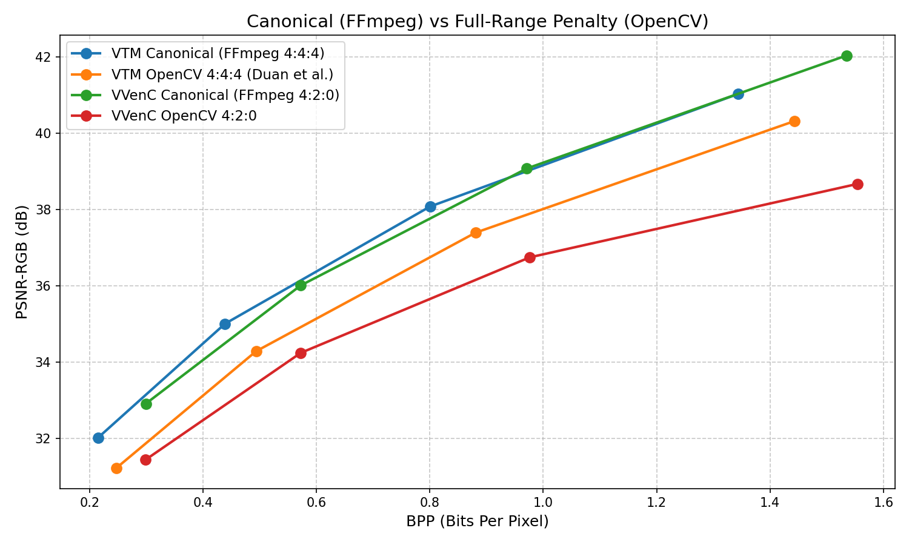

# VTM Validation against Duan et al. Anchors

This folder contains the validation environment designed to benchmark and replicate the VTM 18.0 anchor results published in the [official GitHub repository](https://github.com/duanzhiihao/lossy-vae) of the paper *["Lossy Image Compression with Conditional Diffusion Models"](https://arxiv.org/abs/2208.13056)* (Duan et al., 2023). (Note: The original paper published results for VTM 15.0, but the authors later updated their reference anchors to VTM 18.0 in their repository, which we use here).

The goal is to ensure the accuracy of the VVenC/VTM evaluation pipeline by strictly reproducing the codec calculations over the Kodak dataset. 

## Experimental Setup
The original dataset results are published at [`lossy-vae/kodak-vtm18.0.json`](https://raw.githubusercontent.com/duanzhiihao/lossy-vae/main/results/kodak/kodak-vtm18.0.json).
We encoded the 24 images of the Kodak suite with varying `QP` values (`22, 27, 32, 37`).

During reproduction, a critical difference between standard video encoding pipelines and the Python-based scripting in the reference work was isolated:
- **Canonical YUV (FFmpeg)**: The standard approach converts RGB images to YUV using **limited range** (e.g. Y from 16 to 235), resulting in standard entropy.
- **Full-Range YUV (OpenCV)**: The authors used `cv2.cvtColor(im, cv2.COLOR_RGB2YUV)`, which enforces a **full color range** (0 to 255). Full-range images have significantly higher variance, causing encoders to consume more bits for the same visual quality.

> [!NOTE]
> **Minor PSNR Deviations**: In our replicated OpenCV experiments, there is a tiny variance (~0.05-0.12 dB) in PSNR-RGB compared to the reference paper. This is strictly due to differing metric calculation libraries and floating-point precision during RGB/YUV conversion (e.g., PyTorch/PIL vs. OpenCV). The identical BPP values confirm that the encoded bitstreams are structurally exact.

## Validation Scope

This validation is designed to answer a narrow question first: whether the local Kodak/VTM evaluation pipeline reproduces an independent VTM 18.0 anchor under the same image conversion assumptions.

It directly validates:
- Kodak image selection, dimensions, and QP mapping.
- VTM encoder invocation and 4:4:4 OpenCV conversion for the replicated anchor.
- Bitstream-size and BPP calculation, which match the external reference to numerical precision.
- Decoder/reconstruction plumbing used by the benchmark pipeline.

It partially validates:
- PSNR-RGB calculation. The replicated values follow the external reference closely, but retain a small implementation-dependent offset of about 0.04-0.13 dB.

It does not, by itself, fully validate every local perceptual metric (`MS-SSIM`, `FSIM`, `HaarPSI`, `PSNR-HVS-M`, `VMAF`, or RGB-derived variants). Those metrics still need separate sanity checks and, where possible, comparison against independent reference implementations.

## Scenario 1: Exact Replication (OpenCV)

To reproduce the original authors' anchor, the encoding framework was adapted to use `cv2` conversion. As seen below, the replicated BPP values match the reference exactly, while PSNR-RGB remains within a small implementation-dependent tolerance. This confirms that the VTM encode path, bitstream accounting, and decoder plumbing are aligned with the external anchor.

### Table 1: VTM 18.0 (4:4:4) Replication

| QP | [Duan et al. VTM BPP](https://github.com/duanzhiihao/lossy-vae/blob/main/results/kodak/kodak-vtm18.0.json) | [Replicated VTM OpenCV BPP](../vtm_opencv.csv) | [Duan et al. VTM PSNR-RGB](https://github.com/duanzhiihao/lossy-vae/blob/main/results/kodak/kodak-vtm18.0.json) | [Replicated VTM OpenCV PSNR-RGB](../vtm_opencv.csv) |
|----|------------------------|--------------------|----------------------------|---------------------------|
| 22 | 1.44319         | **1.44319**        | 40.45031     | 40.32174                  |
| 27 | 0.88052         | **0.88052**        | 37.47105     | 37.39179                  |
| 32 | 0.49360         | **0.49360**        | 34.33035     | 34.28036                  |
| 37 | 0.24763         | **0.24763**        | 31.26422     | 31.22131                  |

## Scenario 2: Canonical Video Pipeline (FFmpeg)

While the OpenCV replication proves the structural correctness of the bits, utilizing FFmpeg's standard conversion (`yuv444p` and `yuv420p`) properly models standard video compression behavior. The Full-Range penalty inherently drops PSNR by ~0.7 to 1.0 dB. The table below illustrates the canonical FFmpeg performance vs. the artificial OpenCV approach for both VTM and our VVenC baseline.

### Table 2: Canonical vs. Full-Range Penalty

| QP | [VTM Canonical FFmpeg 4:4:4 BPP](../vtm_ffmpeg.csv) | [VTM OpenCV 4:4:4 BPP](../vtm_opencv.csv) | [VVenC Canonical FFmpeg 4:2:0 BPP](../vvenc_baseline.csv) | [VVenC OpenCV 4:2:0 BPP](../vvenc_opencv.csv) |
|----|-----------------------|-----------------------|-------------------------|--------------------------|
| 22 | 1.34335               | 1.44319               | 1.53519                 | 1.55370                  |
| 27 | 0.80037               | 0.88052               | 0.97111                 | 0.97610                  |
| 32 | 0.43879               | 0.49360               | 0.57209                 | 0.57260                  |
| 37 | 0.21463               | 0.24763               | 0.29932                 | 0.29880                  |

| QP | [VTM Canonical FFmpeg 4:4:4 PSNR-RGB](../vtm_ffmpeg.csv) | [VTM OpenCV 4:4:4 PSNR-RGB](../vtm_opencv.csv) | [VVenC Canonical FFmpeg 4:2:0 PSNR-RGB](../vvenc_baseline.csv) | [VVenC OpenCV 4:2:0 PSNR-RGB](../vvenc_opencv.csv) |
|----|----------------------------|----------------------------|------------------------------|-------------------------------|
| 22 | 41.03151                   | 40.32174                   | 42.04393                     | 38.67060                      |
| 27 | 38.07826                   | 37.39179                   | 39.07756                     | 36.74470                      |
| 32 | 35.00177                   | 34.28036                   | 36.00586                     | 34.23920                      |
| 37 | 32.00756                   | 31.22131                   | 32.90607                     | 31.43430                      |

## Conclusion

The validation results demonstrate direct alignment between the original researchers' methodology (utilizing OpenCV's `cv2.cvtColor` for Full-Range YUV conversion) and the local VTM 18.0 replication for bitstream generation and BPP accounting.

However, a notable divergence in compression efficiency is observed when comparing the Full-Range representation (OpenCV) to the standard Limited-Range representation (FFmpeg). The canonical FFmpeg pipeline yields significantly fewer bits per pixel across all QPs (e.g., 1.343 BPP vs 1.443 BPP at QP22 for VTM). We observe this identical Full-Range penalty across VVenC as well. By anchoring our comparisons on the Canonical FFmpeg results, we establish a robust and standard reference point for subsequent comparative evaluations.

The replicated VTM anchor therefore supports the correctness of the codec pipeline and BPP calculations. Full metric correctness is treated as a broader validation target and should be covered with dedicated metric-level checks.
